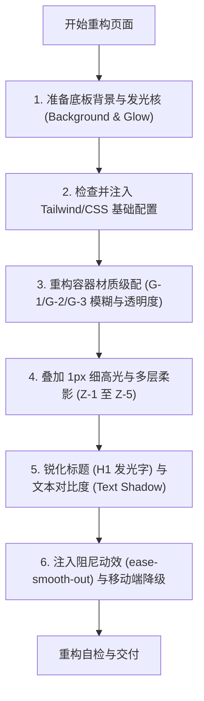

# 玻璃拟态重构技能 (Glassmorphism Transformer)

本技能提供了一套系统的重构方法论与代码范式，用于将普通的前端网页、面板、组件升级为极致通透的磨砂玻璃拟态与柔光发光的未来主义设计风格，同时严格对齐 [DESIGN.md](file:///Users/weixiaoyu/Desktop/practice/AI-aggregation/DESIGN.md) 全局设计规范。

---

## 1. 视觉哲学与应用边界

*   **轻盈通透**：打破传统实体块的沉重感，利用毛玻璃滤镜与半透明底色，使页面层级具有穿透性和流动感。
*   **极致未来感**：借助平滑渐变、柔和背光和微发光效果，营造出数字宇宙的科技与艺术质感。
*   **控制面积 (性能第一)**：大面积玻璃模糊会导致严重的 GPU 开销。仅在容器级元素（如侧边栏、卡片、浮动菜单、模态框）应用，大型滚动区域背景保持实体纯色或简单渐变。
*   **内容独立性**：大面积文本阅读区、复杂表单输入区**严禁**使用强透明玻璃，必须使用高对比度的实体背景，确保极佳的可读性。

---

## 2. 基础设施扩展

在重构任何页面之前，必须确保项目中已完成 TailwindCSS 的配置扩展和全局 CSS 的工具类注入。

*   **TailwindCSS 自定义主题扩展**：详见 [tailwind-config.js](file:///Users/weixiaoyu/Desktop/practice/AI-aggregation/.agents/skills/glassmorphism-transformer/references/tailwind-config.js)，包含三级玻璃模糊等级、五级柔光阴影系统和高级物理缓动函数。
*   **全局 CSS 适配与优雅降级**：详见 [global-styles.css](file:///Users/weixiaoyu/Desktop/practice/AI-aggregation/.agents/skills/glassmorphism-transformer/references/global-styles.css)，提供标准的玻璃控制类 `.glass-panel-standard`，以及 Safari 兼容（`-webkit-backdrop-filter`）与古老浏览器的优雅回退方案。

---

## 3. 重构工作流决策树

在对一个页面进行重构时，请遵循以下技术路径进行决策与改造：



---

## 4. 六步重构工作流详解

### 步骤 1：底板背景与流动发光设计 (Background & Glow)
玻璃拟态极度依赖底板背景的明暗对比。如果背景是纯色，玻璃效果会失去磨砂折射感。
1.  **大背景底色**：使用深邃暗底色 `#020617` (slate-950) 或科技渐变底色。
2.  **流动发光核 (Glows)**：在毛玻璃面板**下方**（即 Z 轴更低层）放置模糊的光晕流动层，使玻璃遮盖其上时折射出温和的色彩：
    ```tsx
    {/* 背景发光核示例 */}
    <div className="absolute top-0 right-0 w-64 h-64 bg-gradient-to-br from-blue-500/10 to-purple-500/10 blur-3xl rounded-full opacity-40 pointer-events-none" />
    ```

### 步骤 2：基础设施层配置与降级处理 (Infrastructure & Fallback)
确保项目已读取 [tailwind-config.js](file:///Users/weixiaoyu/Desktop/practice/AI-aggregation/.agents/skills/glassmorphism-transformer/references/tailwind-config.js) 和 [global-styles.css](file:///Users/weixiaoyu/Desktop/practice/AI-aggregation/.agents/skills/glassmorphism-transformer/references/global-styles.css) 的配置。

🔴 **CHECKPOINT · 基础设施就绪确认**：执行以下验证，任一失败则**终止后续步骤，先修复配置**：
1. `tailwind.config.js` 中 `backdropBlur['2xl']` / `boxShadow['2xl-glass']` / `transitionTimingFunction['smooth-out']` 三者均已合并
2. `globals.css` 中 `.glass-panel-standard` 工具类已注入且含 Safari `-webkit-` 回退方案
3. 验证通过后，才进入步骤 3

### 步骤 3：容器材质玻璃化 (Panels & Cards)
对照 [DESIGN.md](file:///Users/weixiaoyu/Desktop/practice/AI-aggregation/DESIGN.md) 的玻璃材质基础参数矩阵表，重构各容器의背景与模糊度：
*   **辅助元素 (G-1)**：`backdrop-blur-md` (8px)，背景 `bg-white/40` 或 `bg-slate-900/40`。适用于悬停状态行、侧边栏辅助项。
*   **侧边栏与输入框 (G-2)**：`backdrop-blur-xl` (20px)，背景 `bg-white/60` 或 `bg-slate-900/60`。
*   **大导航栏、模态框、Hero 卡片 (G-3)**：`backdrop-blur-2xl` (40px)，背景 `bg-white/70` 或 `bg-slate-950/75`。

### 步骤 4：1px 高光与柔影层级叠加 (Shadows & Highlighting)
为防止半透明材质在暗背景下死板，必须叠加物理微细节：
1.  **顶部 1px 细高光线**：在容器最顶部添加一根极细的上发光线：
    ```tsx
    <span className="absolute inset-x-0 top-0 h-px bg-white/20 dark:bg-white/10 pointer-events-none"></span>
    ```
2.  **柔光阴影 (Z-1 至 Z-5)**：根据 Z 轴层级为组件应用 `shadow-sm-glass` 至 `shadow-2xl-glass`。杜绝脏黑的单层投影，必须使用多层漫反射复合投影。

### 步骤 5：排版与指尖发光标题 (Typography & Glow H1)
1.  **H1 顶级发光标题**：字间距 `tracking-tighter`，行高 `leading-[1.10]`。使用双色/三色高对比渐变字，并赋予其文字发光阴影 `drop-shadow-[0_4px_12px_rgba(59,130,246,0.25)]`。
2.  **玻璃上字体的可读性优化**：对于磨砂玻璃上的白色正文文字，使用 `text-shadow` 做边缘锐化处理，确保不受下方背景光圈干扰：
    ```css
    .glass-text-sharp {
      text-shadow: 0 1px 2px rgba(0, 0, 0, 0.15);
    }
    ```
3.  **对比度自检**：普通正文在浅色玻璃上必须不低于 `slate-700`，深色玻璃不低于 `slate-200`，字重不低于 Medium (500)。

### 步骤 6：物理阻尼微动效与响应式降级 (Motion & Performance)
1.  **高级阻尼曲线**：交互动效均使用持续时间 `200ms`，缓动曲线 `cubic-bezier(0.2, 0.8, 0.2, 1)`（即 `ease-smooth-out`）。
2.  **按压物理反馈**：可交互卡片 Hover 时向上微升、尺寸缩放 `scale-105`、阴影递增一级。点击瞬间通过 `active:scale-98` 缩小、投影收敛，建立闭环手感。
3.  **大面积滚动降级**：
    *   在移动端（屏幕宽度 `< 1024px`），去除小卡片的 `backdrop-blur`，替换为 `bg-white/90` 或 `bg-slate-900/90` 以免滚屏卡顿。
    *   禁止在滚动容器本身上加 `backdrop-blur`。

---

## 5. 核心组件重构模板参考

在重构常见组件时，可直接查阅 [components.md](file:///Users/weixiaoyu/Desktop/practice/AI-aggregation/.agents/skills/glassmorphism-transformer/references/components.md) 以获取如下 5 大核心组件的完整 React / Tailwind 实现范式与 Before/After 修改参考：
1.  **Header 导航栏** (阻尼融合模糊)
2.  **Button 按钮** (1px 顶部发光微凸起 + 按压手感)
3.  **Input 输入框** (下凹微阴影 + 呼吸落焦圈)
4.  **FeatureCard 卡片** (流光右上角发光核)
5.  **Modal 弹窗** (Z-5 顶级漂浮舱)

---

## 6. 设计禁忌自检表

🛑 **STOP · 交付前强制核验**：重构完成后，AI 必须逐项核对以下 5 条设计禁忌。**任一项不通过 → 回到对应的步骤修复，不得直接交付**。全部通过后才可输出最终代码。

| 校验类别 | 自检核对项 | 不通过时 → 回退步骤 |
| :--- | :--- | :--- |
| **禁忌一** | **玻璃套玻璃（套娃）**：大玻璃面板里是否又塞入了同样开启了 `backdrop-blur` 的小卡片？ | → 回到步骤 3：内部小卡片改为仅半透明底色 + 1px 细微框，去除内部 `backdrop-blur` |
| **禁忌二** | **嘈杂高频对比背景**：在复杂且多色彩、多线条的背景上，文字是否未加处理导致看不清？ | → 回到步骤 1：降低背景图对比度 / 回到步骤 5：文字后加 20% 透明度纯色底盘或使用 `glass-text-sharp` |
| **禁忌三** | **单一粗糙脏黑阴影**：是否使用了 `shadow-[0_4px_10px_rgba(0,0,0,0.5)]` 类的重影？ | → 回到步骤 4：改为三合一柔光阴影（定向主阴影 + 环境漫反射 + 边缘高光层） |
| **禁忌四** | **丢失聚焦状态**：键盘 Tab 聚焦可交互元素时，是否丢失了描边？ | → 回到步骤 5/步骤 6：为所有可交互元素添加 `focus:ring-2 focus:ring-blue-500` |
| **禁忌五** | **滚动列表卡顿**：大面积长滚动容器上是否添加了 `backdrop-filter: blur`？ | → 回到步骤 3/步骤 6：移除滚动容器本身的模糊，移动端强制降级为实体半透明色 |

---

## 7. 关联参考资源列表

*   全局设计规范源头：[DESIGN.md](file:///Users/weixiaoyu/Desktop/practice/AI-aggregation/DESIGN.md)
*   TailwindCSS 自定义主题代码片段：[tailwind-config.js](file:///Users/weixiaoyu/Desktop/practice/AI-aggregation/.agents/skills/glassmorphism-transformer/references/tailwind-config.js)
*   全局 CSS 工具类与降级代码：[global-styles.css](file:///Users/weixiaoyu/Desktop/practice/AI-aggregation/.agents/skills/glassmorphism-transformer/references/global-styles.css)
*   5 大核心组件重构模板：[components.md](file:///Users/weixiaoyu/Desktop/practice/AI-aggregation/.agents/skills/glassmorphism-transformer/references/components.md)
