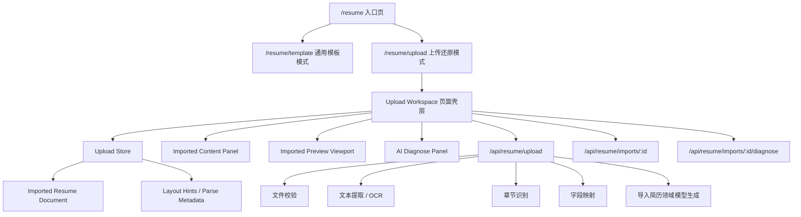

# 设计文档 - 简历上传功能

## 概述

本文档描述“简历上传还原”功能的技术设计方案。该功能与现有“通用模板创建/编辑”是两个独立工作流：

- 通用模板模式：由固定数据结构 `ResumeDocument` 和模板配置驱动。
- 上传还原模式：由用户上传的原始简历内容、章节结构和布局线索驱动。

设计目标不是把上传简历强行转换成现有模板结构，而是建立一套独立的“导入简历领域模型”和“导入简历编辑工作区”，在此基础上尽可能保留原文表达、章节顺序和展示方式，同时允许局部复用已有输入组件、保存状态组件、AI 诊断能力和响应式布局壳层。

## 设计目标

1. 上传简历和通用模板是两个独立入口、独立状态、独立渲染链路。
2. 上传后的内容以原始文档结构为主，不强制压缩为固定字段集合。
3. 解析结果必须支持动态模块、自定义标题、原始顺序、多页内容。
4. 预览渲染必须能根据内容长度和分页变化动态重排。
5. 允许复用现有基础设施，但不得复用通用模板的数据假设。

## UI 参考设计

### 上传解析阶段界面

参考第一张截图（AI ARCHITECT 解析界面）：

**视觉特征**

- 居中卡片式布局，背景使用柔和的渐变色（浅蓝到浅紫）
- 顶部圆形图标区域，使用浅蓝色背景 + 文档图标
- 主标题："正在深度解析您的职业 DNA..."，使用较大字号和深色文字
- 副标题说明文案，使用较小字号和灰色文字
- 进度条使用蓝色渐变，带有百分比数字（69%）显示在右侧
- 底部三个解析步骤状态指示器：
  - 已完成：绿色圆点 + "文本提取完成"
  - 进行中：蓝色圆点 + "技能标签提取中..."
  - 待处理：灰色圆点 + "行业匹配补充"
- 底部提示文案："基于隐私保护协议，您的信息数据将被加密处理"

**交互要求**

- 进度条动画流畅，从 0% 到 100% 平滑过渡
- 步骤状态实时更新，完成时有视觉反馈
- 整体动画效果柔和，避免突兀的状态切换

### 上传完成后编辑界面

参考第二张截图（AI Resume Builder 编辑界面）：

**布局结构（三栏设计）**

1. **左侧编辑面板（约 25% 宽度）**
   - 顶部标题："解析内容" + "塌陷/展开"按钮
   - 模块列表：
     - 个人信息（姓名输入框）
     - 专业经历（工作经历卡片，可展开/折叠）
     - 教育背景（教育经历卡片）
   - 底部："+ 添加新模块"按钮（虚线边框）
   - 使用白色卡片背景，圆角设计
   - 模块之间有清晰的分隔

2. **中间预览区（约 50% 宽度）**
   - 顶部工具栏：缩放按钮、导出按钮
   - A4 尺寸的简历预览
   - 实时渲染用户编辑的内容
   - 包含完整的简历布局：
     - 个人信息区（姓名、职位、联系方式）
     - 工作经历区（公司、职位、时间、描述）
     - 教育背景区（学校、专业、时间）
   - 使用白色背景，带有阴影效果

3. **右侧 AI 诊断面板（约 25% 宽度）**
   - 顶部标题："AI 诊断报告"
   - 质量评分环形图（65/100）
   - 简历质量评估："简历质量：简洁有序开阔"
   - 优化建议列表（至少 3 条）：
     - 带有蓝色圆点标记
     - 每条建议包含具体问题和改进方向
   - "AI 智能一键优化"按钮
   - 目标职位匹配度：
     - 职位名称 + 匹配百分比（82% 匹配）
     - 绿色进度条
     - 匹配度说明文案
   - 使用浅蓝色背景，圆角卡片设计

**视觉风格**

- 整体使用浅色系，主色调为蓝色和白色
- 卡片式设计，圆角和阴影营造层次感
- 图标使用线性风格，简洁现代
- 文字层次清晰：标题深色、正文中灰色、辅助信息浅灰色
- 交互元素（按钮、输入框）有明确的视觉反馈

**响应式适配**

- 桌面端（≥1440px）：全局左侧边栏 + 三栏布局（编辑面板/预览区/AI 诊断面板）
- 平板端（1024-1439px）：全局左侧边栏 + 左侧编辑 + 中间预览，AI 诊断以抽屉形式显示
- 移动端（<1024px）：全局左侧边栏可收起 + 标签页切换（编辑/预览/诊断）

**重要说明**：三栏布局是指在保留现有全局左侧边栏的基础上，主内容区域内的三栏结构。全局左侧边栏包含应用导航、用户信息等全局功能，不应被移除或替换。

**动画与交互**

- 模块展开/折叠动画流畅
- 编辑内容后预览区 300ms 内更新
- 拖拽排序时有视觉引导
- 保存状态有明确提示

## 非目标

1. 不要求在第一期完全像素级还原原始 PDF/Word 版式。
2. 不要求第一期支持任意复杂表格的可视化编辑。
3. 不要求在解析完成后自动转换为通用模板。
4. 不要求修改现有 `ResumeDocument` 以兼容所有导入场景。

## 现有系统基线

当前仓库中已存在的能力：

- 入口页 [page.tsx](/Users/weixiaoyu/Desktop/practice/AI-aggregation/apps/web/src/app/resume/page.tsx) 已将“使用通用模板”和“上传已有简历”分成两个按钮，上传按钮跳转 `/resume/upload`。
- 模板编辑页 [page.tsx](/Users/weixiaoyu/Desktop/practice/AI-aggregation/apps/web/src/app/resume/template/page.tsx) 已具备三栏/双栏/移动端标签页布局。
- 模板模式的状态由 [resume-editor-store.ts](/Users/weixiaoyu/Desktop/practice/AI-aggregation/apps/web/src/stores/resume-editor-store.ts) 管理，其文档结构固定为 [resume-editor.ts](/Users/weixiaoyu/Desktop/practice/AI-aggregation/apps/web/src/types/resume-editor.ts) 中的 `ResumeDocument`。
- 自动保存能力已由 [use-auto-save.ts](/Users/weixiaoyu/Desktop/practice/AI-aggregation/apps/web/src/hooks/use-auto-save.ts) 提供。
- 模板预览容器和工具栏由 [preview-viewport.tsx](/Users/weixiaoyu/Desktop/practice/AI-aggregation/apps/web/src/app/resume/template/_components/preview-viewport.tsx) 提供。

结论：

- 响应式布局、保存状态、AI 抽屉、基础输入组件可以复用。
- `ResumeDocument`、`ContentPanel`、`ResumePreview` 这类“固定模块结构”不可直接作为上传模式的核心模型。

## 总体架构



### 关键设计决策

1. 新建独立领域模型 `ImportedResumeDocument`，不污染现有 `ResumeDocument`。
2. 新建独立 Zustand Store，避免模板模式和上传模式状态耦合。
3. 新建独立预览渲染器 `ImportedResumePreview`，避免模板预览的固定模块判断逻辑。
4. 新建“结构化块 + 自由文本块”的混合模型，处理解析成功和部分失败两种场景。
5. 将“转换为模板模式”设计成可选桥接能力，而不是主流程。

## 路由与页面设计

### 路由规划

- `GET /resume`
  - 现有入口页，继续保留双入口。
- `GET /resume/upload`
  - 上传还原模式主页面。
- `POST /api/resume/upload`
  - 接收文件并启动上传解析。
- `GET /api/resume/imports/:id`
  - 获取某次导入的完整结果。
- `PATCH /api/resume/imports/:id`
  - 保存编辑后的导入文档。
- `POST /api/resume/imports/:id/diagnose`
  - 对当前导入文档执行诊断。
- `POST /api/resume/imports/:id/convert-to-template`
  - 用户明确触发时，将导入文档转换为模板模式数据。

### 页面结构

建议新增：

- `apps/web/src/app/resume/upload/page.tsx`
- `apps/web/src/app/resume/upload/_components/upload-dropzone.tsx`
- `apps/web/src/app/resume/upload/_components/import-progress.tsx`
- `apps/web/src/app/resume/upload/_components/imported-content-panel.tsx`
- `apps/web/src/app/resume/upload/_components/imported-preview-viewport.tsx`
- `apps/web/src/app/resume/upload/_components/imported-resume-preview.tsx`
- `apps/web/src/app/resume/upload/_components/imported-ai-drawer.tsx`

页面壳层可以参考模板页的布局逻辑，但内容区域需要替换成上传模式专用组件。

## 数据模型设计

### 为什么不能复用 `ResumeDocument`

现有 `ResumeDocument` 的结构固定为：

- `personalInfo`
- `workExperiences`
- `educations`
- `projects`
- `skills`

这不满足以下场景：

- 自定义章节标题
- 多个同类分组
- 自由文本段落
- 解析失败后的降级保留
- 布局线索和页级信息保存

因此需要独立模型。

### 核心类型

```ts
type ImportedSectionKind =
  | 'personal'
  | 'work'
  | 'education'
  | 'project'
  | 'skills'
  | 'custom'
  | 'raw-text';

interface ImportedResumeDocument {
  id: string;
  schemaVersion: 'imported-v1';
  sourceFile: {
    fileName: string;
    mimeType: string;
    size: number;
    uploadedAt: string;
  };
  parseStatus: 'idle' | 'uploading' | 'parsing' | 'ready' | 'partial' | 'failed';
  sections: ImportedSection[];
  layoutHints: ImportedLayoutHints;
  parseMeta: ImportedParseMeta;
  updatedAt: string;
}

interface ImportedSection {
  id: string;
  kind: ImportedSectionKind;
  title: string;
  originalTitle?: string;
  order: number;
  blocks: ImportedBlock[];
  sourceAnchors?: SourceAnchor[];
  collapsed?: boolean;
}

type ImportedBlock = ImportedKeyValueBlock | ImportedListBlock | ImportedRichTextBlock;

interface ImportedKeyValueBlock {
  id: string;
  type: 'key-value';
  fields: Array<{
    id: string;
    key: string;
    label: string;
    value: string;
    confidence?: number;
  }>;
}

interface ImportedListBlock {
  id: string;
  type: 'list';
  itemType: 'work' | 'education' | 'project' | 'skill' | 'custom';
  items: ImportedListItem[];
}

interface ImportedRichTextBlock {
  id: string;
  type: 'rich-text';
  text: string;
  paragraphs: string[];
  confidence?: number;
}

interface ImportedListItem {
  id: string;
  title?: string;
  subtitle?: string;
  period?: string;
  fields: Record<string, string>;
  bullets?: string[];
  rawText?: string;
}

interface ImportedLayoutHints {
  pageCount: number;
  pageBreaks: number[];
  readingDirection: 'top-down' | 'two-column' | 'mixed';
  sectionOrder: string[];
}

interface ImportedParseMeta {
  parserVersion: string;
  warnings: string[];
  unresolvedBlocks: string[];
  confidenceScore: number;
}

interface SourceAnchor {
  page: number;
  bbox?: { x: number; y: number; width: number; height: number };
}
```

### 模型设计说明

1. `sections` 是顶层真相来源，预览和编辑都基于它渲染。
2. `kind` 用于识别常见模块，但 `title` 不受固定枚举限制。
3. `blocks` 允许同一章节内混合“结构化字段”和“自由文本”。
4. `layoutHints` 保存页数、阅读顺序、分页信息，供预览排版使用。
5. `parseMeta` 用于错误提示、低置信度标记和后续排查。

## 解析管线设计

### 处理流程

```text
1. 前端选择文件
2. 客户端执行格式/大小校验
3. 上传至 /api/resume/upload
4. 服务端保存临时文件
5. 根据 MIME 类型选择提取器
6. 文本提取 / OCR
7. 章节识别与阅读顺序恢复
8. 字段映射与块级建模
9. 生成 ImportedResumeDocument
10. 返回导入结果 ID 与初始文档
```

### 提取器策略

- PDF：优先文本层提取，缺失时回退 OCR。
- DOC/DOCX：提取段落、标题、列表层级。
- JPG/PNG：走 OCR，并通过视觉块检测补充阅读顺序。

建议使用适配器模式：

```ts
interface ResumeExtractor {
  supports(mimeType: string): boolean;
  extract(file: ArrayBuffer): Promise<ExtractedDocument>;
}
```

### 章节识别策略

使用启发式规则和模型输出组合：

1. 标题字体、位置、分隔线、编号等特征识别标题。
2. 时间区间、公司名、学校名等特征识别列表型条目。
3. 对无法结构化的文本保留为 `rich-text` 块。
4. 对低置信度字段打标签，不阻断整体导入。

## 前端工作区设计

### 页面状态机

```text
idle
 -> selecting_file
 -> uploading
 -> parsing
 -> ready
 -> saving
 -> saved
 -> partial_failure
 -> fatal_error
```

### 状态管理

建议新增：

- `apps/web/src/stores/imported-resume-store.ts`
- `apps/web/src/types/imported-resume.ts`

Store 结构建议：

```ts
interface ImportedResumeState {
  document: ImportedResumeDocument | null;
  activeSectionId: string | null;
  selectedBlockId: string | null;
  saveStatus: 'idle' | 'saving' | 'saved' | 'error';
  aiStatus: 'idle' | 'loading' | 'ready' | 'error';
  score: number | null;
  suggestions: ResumeSuggestion[];
  uploadProgress: number;
  parseStep: 'upload' | 'extract' | 'structure' | 'map' | 'preview';

  setDocument: (doc: ImportedResumeDocument) => void;
  updateSection: (sectionId: string, updater: Partial<ImportedSection>) => void;
  updateBlock: (sectionId: string, blockId: string, payload: unknown) => void;
  reorderSections: (from: number, to: number) => void;
  addSection: (section: ImportedSection) => void;
  removeSection: (sectionId: string) => void;
}
```

### 编辑面板设计

`ImportedContentPanel` 的设计原则：

1. 顶层按 `sections` 顺序渲染，而不是按固定模块 tab 渲染。
2. 常见模块尽量复用现有基础输入组件，如：
   - `ResumeInput`
   - `ResumeTextarea`
   - `ModuleCard`
3. 自定义模块和解析失败模块使用通用块编辑器：
   - `RichTextBlockEditor`
   - `KeyValueBlockEditor`
   - `ListBlockEditor`
4. 支持拖拽排序章节。
5. 低置信度字段显示警示标记，但不阻止用户编辑。

### 添加模块交互设计

**场景说明**：用户上传的简历可能缺少某些模块（如教育经历、项目经历等），或用户希望补充额外的自定义模块。

**交互流程**：

1. **触发入口**
   - 编辑面板底部固定显示"+ 添加新模块"按钮（虚线边框样式）
   - 点击后弹出模块类型选择器

2. **模块类型选择器**
   - 显示常见模块类型：
     - 个人信息
     - 工作经历
     - 教育背景
     - 项目经历
     - 专业技能
     - 自我评价
     - 证书资质
     - 语言能力
     - 获奖经历
     - 自定义模块
   - 每个选项显示图标 + 名称 + 简短描述
   - 支持搜索过滤模块类型

3. **模块插入位置**
   - 默认插入到当前模块列表末尾
   - 支持拖拽调整到指定位置
   - 插入后自动展开该模块并聚焦到第一个输入框

4. **模块初始化**
   - 常见模块：提供预设字段结构（如教育背景包含学校、专业、学历、时间等字段）
   - 自定义模块：提供空白的富文本编辑器，用户可自由输入内容和自定义标题

5. **模块管理**
   - 每个模块右上角提供操作菜单：
     - 重命名模块标题
     - 复制模块
     - 删除模块
   - 删除前显示确认对话框

**技术实现**：

```ts
// Store 中的 addSection 方法
addSection: ((section: ImportedSection) => {
  set((state) => ({
    document: {
      ...state.document,
      sections: [...state.document.sections, section],
      updatedAt: new Date().toISOString(),
    },
  }));
},
  // 添加预设模块的辅助函数
  function createEducationSection(): ImportedSection {
    return {
      id: generateId(),
      kind: 'education',
      title: '教育背景',
      order: 999, // 将在添加后重新排序
      blocks: [
        {
          id: generateId(),
          type: 'list',
          itemType: 'education',
          items: [
            {
              id: generateId(),
              title: '', // 学校名称
              subtitle: '', // 专业
              period: '', // 时间
              fields: {
                degree: '', // 学历
                gpa: '', // GPA
              },
              bullets: [],
            },
          ],
        },
      ],
    };
  });
```

**用户体验优化**：

- 添加模块后立即触发自动保存
- 预览区实时显示新增模块
- 新增模块使用动画效果（淡入 + 滑入）
- 如果用户添加的是已存在的模块类型，提示"该模块已存在，是否添加第二个？"

## 预览渲染设计

### 关键原则

1. 复用预览容器能力，不复用固定模板内容渲染逻辑。
2. 预览必须以 `ImportedResumeDocument.sections` 为驱动源。
3. 版面根据内容量动态计算分页，不能假定单页。

### 组件划分

- `ImportedPreviewViewport`
  - 负责缩放、滚动、多页容器和导出按钮。
- `ImportedResumePreview`
  - 负责渲染页内内容。
- `ImportedSectionRenderer`
  - 按章节类型或通用块渲染。
- `ImportedPageFlow`
  - 根据内容高度和 `layoutHints` 计算分页。

### 预览布局策略

1. 默认单列流式排版，保证稳定性和编辑一致性。
2. 如果解析明确识别为双栏且置信度足够高，可开启双栏布局提示。
3. 分页以可读性优先，不追求源文档绝对像素还原。
4. 当用户编辑导致高度变化时，重新计算页断点。

### 为什么不直接复用 `ResumePreview`

现有 `ResumePreview` 依赖模板结构和模板样式配置，无法处理：

- 动态章节数量
- 自定义标题
- 原始页序
- 自由文本块和未结构化块

因此仅复用外围容器、导出按钮、缩放逻辑是合理方案。

## 自动保存与持久化设计

### 保存策略

上传模式应单独保存，不与模板模式共用 `resume-editor:v1`。

建议持久化键：

- `resume-import-editor:v1:${importId}`

保存内容包括：

- `ImportedResumeDocument`
- 当前章节顺序
- 折叠状态
- 布局线索
- 诊断结果缓存

### 自动保存复用策略

现有 [use-auto-save.ts](/Users/weixiaoyu/Desktop/practice/AI-aggregation/apps/web/src/hooks/use-auto-save.ts) 的防抖和保存状态管理思路可复用，但不建议直接绑死模板 Store。

建议抽象为：

```ts
function useDocumentAutoSave<T>({
  document,
  storageKey,
  onSaving,
  onSaved,
  onError,
}: {
  document: T;
  storageKey: string;
  onSaving: () => void;
  onSaved: () => void;
  onError: (error: unknown) => void;
}) {}
```

模板模式和上传模式各自传入不同的文档类型和存储 key。

## AI 诊断集成设计

### 设计原则

1. AI 诊断能力可以复用现有右侧面板交互框架。
2. 诊断输入需要从 `ImportedResumeDocument` 归一化生成。
3. AI 输出只能作为建议，不能直接改写上传文档结构。

### 归一化层

在调用诊断 API 前，新增一层转换：

```ts
interface DiagnosePayload {
  summaryText: string;
  sections: Array<{
    title: string;
    text: string;
    kind: string;
  }>;
}
```

该转换只用于 AI 分析，不改变前端主文档。

## 模式切换设计

### 默认行为

- 用户从 `/resume` 点击“上传已有简历”后进入 `/resume/upload`。
- 全流程停留在上传还原模式。

### 显式转换

如果用户主动选择“转换到通用模板”：

1. 前端展示确认提示。
2. 系统将 `ImportedResumeDocument` 映射到 `ResumeDocument`。
3. 无法映射的模块进入“附加信息”或提示用户手动处理。
4. 跳转到 `/resume/template`。

该能力属于桥接能力，不是默认路径。

## 错误处理与降级

### 错误等级

1. `fatal`
   - 文件损坏
   - 不支持格式
   - 上传失败
2. `partial`
   - OCR 成功但章节识别不完整
   - 部分字段低置信度
3. `recoverable`
   - 诊断失败
   - 自动保存失败

### 降级策略

1. 结构化失败时保留为 `rich-text` 块。
2. 章节无法识别时生成 `custom` 章节。
3. 页级坐标缺失时回退到顺序流式布局。
4. AI 诊断失败不影响编辑和导出。

## 与现有代码的集成边界

### 可直接复用

- `AppLayout`
- 保存状态展示组件
- `AIDrawer` 的布局思想
- `MobileTabs` 的响应式导航模式
- 基础输入组件 `ResumeInput`、`ResumeTextarea`

### 需要新建

- 上传模式专用 Store
- 上传模式专用文档类型
- 上传模式专用编辑面板
- 上传模式专用预览渲染器
- 上传解析 API

### 不应直接复用为核心模型

- `ResumeDocument`
- `useResumeEditorStore`
- `ContentPanel`
- `ResumePreview`

## 实施建议

### Phase 1

1. 建立 `/resume/upload` 页面壳层。
2. 建立 `ImportedResumeDocument` 与 Store。
3. 打通文件上传、进度展示、解析结果回填。
4. 先实现单列预览与动态章节编辑。

### Phase 2

1. 增加多页预览。
2. 增加低置信度标记和降级文本块。
3. 接入 AI 诊断。
4. 抽象通用自动保存 Hook。

### Phase 3

1. 增加双栏识别后的可选布局提示。
2. 增加“转换为通用模板”桥接流程。
3. 优化导出和分页质量。

## 风险与权衡

1. 如果继续复用现有模板数据结构，后续会持续出现“解析有了但显示不出来”的结构性问题。
2. 如果追求完全还原原始版式，复杂度会迅速上升，并影响编辑一致性。
3. 独立建模会带来一次性实现成本，但这是把“上传还原模式”做成独立功能的必要前提。
4. 第一阶段采用“结构保真优先，像素还原次之”的策略，能更快交付且更稳。

## 技能与最佳实践

本功能开发过程中将遵循以下技能指南和最佳实践：

### 前端设计技能

参考：`.kiro/skills/frontend-design/SKILL.md`

- 创建独特的、生产级的前端界面，具有高设计质量
- 生成富有创意、精致的代码和 UI 设计，避免通用的 AI 美学风格
- 确保上传进度界面、解析状态展示、编辑面板等组件具有专业视觉效果
- 使用现代化的交互模式和动画效果提升用户体验

### UI/UX 设计智库

参考：`.kiro/skills/ui-ux-pro-max/SKILL.md`

本功能将应用以下 UI/UX 设计原则：

**配色方案**

- 使用专业的配色方案确保界面和谐统一
- 上传进度界面使用渐变色和动态效果
- 编辑面板和预览区使用清晰的视觉层次

**布局设计**

- 响应式布局：桌面端三栏（编辑/预览/诊断）、平板双栏、移动端标签页
- 使用 Bento Grid 或卡片式布局组织内容模块
- 确保合理的间距和留白

**交互设计**

- 拖拽排序章节时提供清晰的视觉反馈
- 折叠/展开动画流畅自然
- 悬停效果和状态变化明确
- 低置信度字段使用警示标记但不阻断操作

**可访问性**

- 确保键盘导航支持
- 提供适当的 ARIA 标签
- 颜色对比度符合 WCAG 标准
- 错误提示清晰易懂

### React 和 Next.js 最佳实践

参考：`.kiro/skills/vercel-react-best-practices/SKILL.md`

**性能优化**

- 使用 React Server Components 处理静态内容
- 客户端组件仅用于交互部分（编辑面板、拖拽、实时预览）
- 使用 `use client` 指令明确标记客户端组件
- 避免不必要的重渲染，使用 `useMemo` 和 `useCallback` 优化

**数据获取**

- 使用 Next.js App Router 的数据获取模式
- 上传 API 使用 Route Handlers
- 实现适当的加载状态和错误边界
- 使用 SWR 或 React Query 管理客户端数据缓存

**代码组织**

- 组件按功能模块组织在 `_components` 目录
- 共享类型定义在 `src/types` 目录
- Store 定义在 `src/stores` 目录
- API 路由在 `app/api` 目录
- 使用 TypeScript 严格模式确保类型安全

**状态管理**

- 使用 Zustand 管理全局状态（`ImportedResumeStore`）
- 本地状态使用 `useState` 和 `useReducer`
- 避免 prop drilling，合理使用 Context
- 状态更新保持不可变性

**Bundle 优化**

- 动态导入大型组件（如 PDF 预览器、OCR 库）
- 使用 Next.js 自动代码分割
- 优化图片和字体加载
- 避免在客户端组件中导入大型服务端依赖

**错误处理**

- 使用 Error Boundaries 捕获组件错误
- API 错误提供友好的用户提示
- 实现重试机制和降级策略
- 记录错误日志便于排查

### 实施检查清单

开发过程中需要确保：

- [ ] 所有组件使用 TypeScript 并提供完整类型定义
- [ ] 客户端组件明确标记 `'use client'`
- [ ] 使用 Tailwind CSS 实现响应式设计
- [ ] 实现加载状态、错误状态和空状态
- [ ] 提供键盘导航和无障碍支持
- [ ] 优化首屏加载性能
- [ ] 实现自动保存和数据持久化
- [ ] 添加适当的动画和过渡效果
- [ ] 确保移动端触摸操作友好
- [ ] 编写清晰的代码注释（中文）
