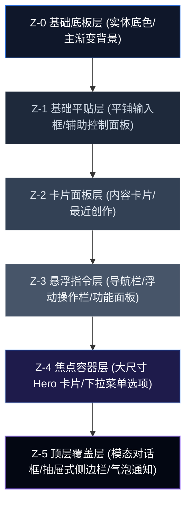

# AI-Aggregation 项目设计系统规范 (DESIGN.md)

本规范定义了 AI-Aggregation 产品的视觉语言、交互标准与前端工程化实现。作为项目前端开发人员的唯一设计与工程实现标准，本规范旨在确保全平台界面在极致未来感、轻盈通透度以及严谨的视觉层级上保持高度统一。

---

## 1. 设计系统概览

### 1.1 项目设计理念与核心价值观
AI-Aggregation 是一款致力于为创作者提供沉浸式体验的智能工作空间。我们的视觉理念基于以下四个核心价值观：
*   **轻盈通透 (Transparency)**：通过磨砂玻璃面板与半透明材质，打破实体层级的沉重感，使界面充满流动性。
*   **极致未来感 (Futuristic Quality)**：结合平滑渐变、柔和背光和微发光效果，营造出数字宇宙的科技与艺术质感。
*   **克制秩序 (Disciplined Order)**：所有的视觉光效和玻璃反射均服务于功能，不干扰信息本身，避免无意义的装饰。
*   **层级深邃 (Depth Hierarchy)**：借助精密的 Z 轴阴影系统和多层遮罩，建立直观的三维空间深度。

### 1.2 玻璃拟态应用边界与原则
玻璃拟态（Glassmorphism）极具现代感，但若无节制使用会导致渲染性能严重下降，或者导致视觉混杂。因此我们确立以下应用原则：
1.  **控制面积**：仅在容器级元素（如侧边栏、卡片、浮动菜单、模态框）上应用玻璃效果，大型滚动区域背景保持实体纯色或简单渐变，以保障滚屏流畅度。
2.  **内容独立性**：大面积文本展示区、长文阅读区、复杂表单输入区**严禁**使用强透明玻璃，必须使用高对比度的实体背景，确保极佳的可读性。
3.  **背景依赖性**：玻璃拟态的效果极度依赖背景图案的明暗变化。若背景为单调纯色，必须在玻璃组件后方放置模糊的光晕流动层（背光圈），以显现磨砂质感。

### 1.3 柔光阴影系统的设计哲学
在本设计系统中，阴影不只是“让元素浮起来”的装饰，它是**空间 Z 轴高度**的数学表达。
*   **阴影即高度**：阴影的扩散范围（Blur）和偏移距离（Offset）正比于元素在 Z 轴上的物理高度。
*   **柔光物理模型**：避免单一不透明度过高的“脏黑”阴影。采用“主阴影 + 环境漫反射阴影 + 内发光”的多层叠加，模拟真实物理世界中半透明物体对光线的折射与遮挡。

### 1.4 整体视觉层级架构
以下是系统各层级（从最底层 Z-0 到最顶层 Z-5）的材质与空间拓扑关系：



---

## 2. 玻璃拟态设计规范

### 2.1 玻璃材质基础参数
玻璃材质的质感由 **背景模糊度**、**背景混合透明度**、**半透明边框**、**内发光** 与 **磨砂感（噪声或颗粒层，可选）** 五个维度共同决定。本系统对其进行了严格的标准化和量化。

#### 玻璃材质基础参数矩阵表
| 级别 / 参数 | 背景模糊度 (`backdrop-filter: blur()`) | 背景透明度 (`background: rgba()`) | 边框透明度与规格 | 内发光效果参数 (`box-shadow: inset`) | 磨砂感/质感控制 | 适用场景说明 |
| :--- | :--- | :--- | :--- | :--- | :--- | :--- |
| **G-1 轻量级** | `8px` (`backdrop-blur-md`) | 浅色: `rgba(255,255,255,0.40)`<br>深色: `rgba(15,23,42,0.40)` | `1px solid`<br>浅色: `rgba(255,255,255,0.40)`<br>深色: `rgba(255,255,255,0.05)` | 无 | 无 | 侧边栏辅助功能按钮、常用工具面板、表格行悬停 |
| **G-2 标准级** | `20px` (`backdrop-blur-xl`) | 浅色: `rgba(255,255,255,0.60)`<br>深色: `rgba(15,23,42,0.60)` | `1px solid`<br>浅色: `rgba(255,255,255,0.60)`<br>深色: `rgba(255,255,255,0.10)` | 浅色: `inset 0 1px 0 0 rgba(255,255,255,0.25)`<br>深色: `inset 0 1px 0 0 rgba(255,255,255,0.05)` | 无 | 主侧边栏容器、输入框背景、基础交互卡片 |
| **G-3 深度级** | `40px` (`backdrop-blur-2xl`) | 渐变透明:<br>浅色: `white/60` 至 `white/20`<br>深色: `slate-900/60` 至 `slate-900/20` | `1px solid`<br>浅色: `rgba(255,255,255,0.80)`<br>深色: `rgba(255,255,255,0.15)` | 浅色: `inset 0 1px 1px 0 rgba(255,255,255,0.40)`<br>深色: `inset 0 1px 1px 0 rgba(255,255,255,0.08)` | 双层渐变遮罩与顶部1px高光波叠加 | 主视觉 Hero 区域大卡片、浮动导航栏、模态框 |

### 2.2 玻璃拟态组件分类应用

#### 1. 导航栏 (Navbar)
*   **模糊度级别**：G-3 深度级 (`backdrop-blur-2xl`)。
*   **透明度**：浅色 `rgba(255, 255, 255, 0.7)` / 深色 `rgba(2, 6, 23, 0.7)`，保证滚动时下方元素被完美虚化。
*   **边框**：底部 `border-b`，浅色 `border-slate-200/50` / 深色 `border-slate-800/50`。

#### 2. 侧边栏 (Sidebar)
*   **模糊度级别**：G-2 标准级 (`backdrop-blur-xl`)。
*   **透明度**：浅色 `rgba(255, 255, 255, 0.6)` / 深色 `rgba(15, 23, 42, 0.6)`。
*   **边框**：右侧 `border-r`，浅色 `border-slate-200/50` / 深色 `border-slate-800/50`。

#### 3. 内容卡片 (Card)
*   **模糊度级别**：对于普通创作卡片，为了滑动性能建议**不开启** `backdrop-blur`，直接使用背景色 `bg-white` / `bg-slate-900`。
*   **高阶卡片/Hero 卡片**：使用 G-3 级，通过 `bg-gradient-to-b from-white/60 via-white/20 to-transparent backdrop-blur-2xl`，创造边缘半消融、融入背景的顶级视觉观感。

#### 4. 模态框与抽屉 (Modal & Drawer)
*   **模糊度级别**：G-3 深度级 (`backdrop-blur-2xl`)。
*   **透明度**：浅色 `rgba(255, 255, 255, 0.8)` / 深色 `rgba(3, 7, 18, 0.85)`。
*   **内发光**：使用较粗的内高光，例如 `inset 0 0 40px 0 rgba(59, 130, 246, 0.05)`。

#### 5. 按钮 (Buttons)
*   **状态设计**：
    *   **正常态**：使用高对比度底色。
    *   **悬浮态 (Hover)**：放大 1.05 倍，在玻璃按钮边缘产生淡淡的科技蓝外发光 `shadow-[0_0_15px_rgba(59,130,246,0.35)]`。
    *   **点击态 (Active)**：微缩小至 0.98 倍，外发光收敛。
    *   **禁用态 (Disabled)**：透明度降为 40%，去除所有模糊与投影。

---

## 3. 柔光阴影系统规范

### 3.1 阴影层级体系 (Z-Index 0-5)
我们的阴影系统采用多层叠加结构，利用一组定义好的关键像素点来逼真地表达物理空间中的深度差。

#### 6级阴影层级精准 CSS/Tailwind 参数表
| 层级 (Z) | 物理含义与定位 | 精确 CSS 参数 (主阴影 + 环境光阴影 + 发光层) | 对应 Tailwind 自定义配置名称 |
| :--- | :--- | :--- | :--- |
| **Z-0** | 紧贴底板，无悬浮度 | `box-shadow: none;` | `shadow-none` |
| **Z-1** | 平贴微悬。侧边栏按钮、输入框。 | `box-shadow: 0 1px 2px 0 rgba(0, 0, 0, 0.03), 0 1px 1px 0 rgba(0, 0, 0, 0.02);` | `shadow-sm` |
| **Z-2** | 正常悬起。常规内容卡片、文件项目。 | `box-shadow: 0 4px 12px -2px rgba(15, 23, 42, 0.04), 0 2px 6px -1px rgba(15, 23, 42, 0.03);` | `shadow-md` |
| **Z-3** | 中度浮空。推荐指令卡、悬浮小部件。 | `box-shadow: 0 12px 20px -8px rgba(15, 23, 42, 0.08), 0 4px 10px -2px rgba(15, 23, 42, 0.04);` | `shadow-lg` |
| **Z-4** | 深度悬浮。Hero 卡片、下拉选择框。 | `box-shadow: 0 20px 40px -15px rgba(59, 130, 246, 0.12), 0 8px 20px -10px rgba(0, 0, 0, 0.05);` | `shadow-xl` |
| **Z-5** | 顶级悬浮。模态框、通知弹出气泡。 | `box-shadow: 0 30px 60px -20px rgba(15, 23, 42, 0.25), 0 10px 30px -15px rgba(59, 130, 246, 0.15), inset 0 1px 0 0 rgba(255, 255, 255, 0.1);` | `shadow-2xl` |

### 3.2 多层阴影叠加技巧与设计指南
如上述表格，高级柔光阴影采用三合一模型构建：
$$\text{Shadow}_{\text{Total}} = \text{Shadow}_{\text{Directional}} + \text{Shadow}_{\text{Ambient}} + \text{Glow}_{\text{Inner}}$$
*   **第一层：定向主阴影**：偏移较大、模糊半径适中，表达光源方向。
*   **第二层：环境漫反射阴影**：无偏置（Offset Y近于0）、模糊半径极大、极淡，表达物体的存在感。
*   **第三层：边缘高光/发光层**：如 `inset 0 1px 0`，用于打破半透明物体在暗处的死板感。

---

## 4. 色彩与渐变系统

本项目的色彩系统提取自 `home-content.tsx` 的主流应用，并加入了玻璃拟态下的对比度延伸，以确立优雅协调的品牌面貌。

### 4.1 色彩调色板
```
■ 科技蓝 (Technology Blue):  #3B82F6 (blue-500) | #2563EB (blue-600)  [主色调/发光核]
■ 梦幻紫 (Dream Violet):      #8B5CF6 (violet-500) | #7C3AED (purple-600) [辅助色/艺术质感]
■ 玫瑰粉 (Rose Pink):         #EC4899 (pink-500) | #F43F5E (rose-500)    [渐变高光/图形色]
■ 靛青色 (Indigo Blue):       #6366F1 (indigo-500)                        [渐变过渡色]
■ 极光绿 (Aurora Green):      #10B981 (emerald-500)                       [状态成功色]
■ 警示黄 (Warning Yellow):    #F59E0B (amber-500)                         [收藏与警告]
■ 浅底色 (Light Base):        #F3F5FA                                     [背景板底色]
■ 暗底色 (Dark Base):         #020617 (slate-950)                         [深色板底色]
```

### 4.2 渐变色彩规范
为了营造极致的未来感，我们规范了三种官方渐变组合：
1.  **科技宇宙流 (Tech Cosmic)**：`from-blue-600 via-indigo-500 to-cyan-500`（用于产品大标题、核心高光视觉文本）。
2.  **艺术霓虹流 (Art Neon)**：
    *   智能对话：`from-blue-500/20 to-cyan-500/20` (背光)，`text-blue-600`。
    *   语音转写：`from-purple-500/20 to-pink-500/20` (背光)，`text-purple-600`。
    *   灵感绘图：`from-pink-500/20 to-rose-500/20` (背光)，`text-pink-600`。
3.  **每日灵感渐变**：`from-white to-blue-50`（浅色模式）/ `from-slate-800 to-slate-800/50`（深色模式），带来柔和的边缘内凹卡片感。

### 4.3 玻璃背景上的文字对比度标准 (WCAG 2.1)
在磨砂玻璃背景上，必须保证文字信息清晰可见：
*   **普通段落文本 (Body Text)**：最小字号为 14px，字重不低于 Medium (500)。前景色在浅色玻璃上必须使用 `slate-700` 或更高，深色玻璃上使用 `slate-200` 或更高。
*   **重要文本 (Crucial Text)**：字重为 Bold (700) 或 Semibold (600)。
*   **装饰性辅助字**：字号小于 12px 时，对比度必须至少达到 4.5:1，若无法达到，**必须**在文字背后加垫一层 20% 透明度的深色/浅色纯色底板。

---

## 5. 排版系统

为了实现严谨的版面秩序感，系统字体及文字规范设定如下：

### 5.1 字体家族与字重
*   **字体家族**：`font-sans`（默认使用 `system-ui, -apple-system, BlinkMacSystemFont, "Segoe UI", Roboto, "Helvetica Neue", Arial, sans-serif`）。
*   **字重分级**：
    *   `font-black` (900)：用于 Hero 级大标题，如 60px。
    *   `font-bold` (700)：用于功能卡片标题、页面大分类标题。
    *   `font-semibold` (600)：用于小卡片标题、按钮文字。
    *   `font-medium` (500)：用于主体标签、表单项文字、侧边栏文字。
    *   `font-normal` (400)：用于大部分正文和辅助段落。

<!-- 修改开始 -->
<!-- 
### 5.2 字体大小与行高标准
| 类别 | 样式类名称 | 大小 (Size) | 行高 (Leading) | 适用层级与场景 |
| :--- | :--- | :--- | :--- | :--- |
| **Hero 标题** | `text-6xl` | `60px` (`3.75rem`) | `1.15` (`leading-tight`) | 极简风格大标题、Slogan |
| **页面主标题**| `text-3xl` | `30px` (`1.875rem`) | `1.25` (`leading-snug`) | 侧边栏标题、功能首屏标题 |
| **功能标题**  | `text-2xl` | `24px` (`1.5rem`) | `1.35` | 模块级大卡片标题 |
| **卡片标题**  | `text-lg` | `18px` (`1.125rem`) | `1.4` | 文件卡片标题、侧边大分类 |
| **正文主字**  | `text-sm` | `14px` (`0.875rem`) | `1.6` (`leading-relaxed`) | 正文、侧边二级子栏目 |
| **辅助微字**  | `text-xs` | `12px` (`0.75rem`) | `1.5` | 最近文件、辅助说明、每日灵感副标题 |
| **状态微标**  | `text-[10px]`| `10px` | `1.0` | 状态标签、微标（Badge） |
-->
### 5.2 字体大小与行高标准及 H1-H6 标题系统

为了规避不同开发实现标题样式的碎片化，下面确立了精密量化的标题阶梯与排版系统。

#### 5.2.1 H1 Hero 标题系统（顶级视觉焦点）
*   **设计意图**：H1 是首屏视觉的核心发光核。借助平滑的多色渐变和微弱的背发光阴影，传达极强的未来主义科技感，同时在复杂磨砂玻璃背景上保持绝对边缘对比度。
*   **字间距与行高**：字距 `tracking-tighter` (-0.05em)，行高精确为 `1.10` (`leading-[1.10]`)。
*   **玻璃文字发光与阴影 (量化参数)**：
    *   文字阴影：`text-shadow: 0 4px 12px rgba(59, 130, 246, 0.25), 0 1px 2px rgba(0, 0, 0, 0.1);`
    *   文字描边效果（在背景极复杂时使用）：`-webkit-text-stroke: 1px rgba(255, 255, 255, 0.1);`
*   **响应式断点与字号矩阵**：
    | 设备断点 | Tailwind 样式 | 字体大小 (px) | 行高 (em) | 字间距 (em) |
    | :--- | :--- | :--- | :--- | :--- |
    | **Mobile (<640px)** | `text-4xl` | `36px` | `1.15` | `-0.03` |
    | **Tablet (>=768px)** | `text-5xl` | `48px` | `1.12` | `-0.04` |
    | **Desktop (>=1024px)** | `text-6xl` | `60px` | `1.10` | `-0.05` |
    | **Wide (>=1280px)** | `text-7xl` | `72px` | `1.08` | `-0.05` |
*   **主色与渐变色彩值**：
    *   浅色模式：从 `blue-600` (`#2563EB`) 渐变至 `indigo-500` (`#6366F1`) 再到 `cyan-500` (`#06B6D4`)。
    *   深色模式：从 `blue-400` (`#60A5FA`) 渐变至 `indigo-400` (`#818CF8`) 再到 `cyan-400` (`#22D3EE`)。
*   **完整可执行 HTML/Tailwind 代码示例**：
    ```html
    <h1 class="text-4xl sm:text-5xl lg:text-6xl xl:text-7xl font-black tracking-tighter leading-[1.10] bg-gradient-to-r from-blue-600 via-indigo-500 to-cyan-500 dark:from-blue-400 dark:via-indigo-400 dark:to-cyan-400 bg-clip-text text-transparent drop-shadow-[0_4px_12px_rgba(59,130,246,0.25)] select-none">
      开启您的 AI 创作宇宙
    </h1>
    ```

#### 5.2.2 H2-H6 标题系统
各级标题在玻璃背景与实体背景下需要通过不透明度及前景色建立视觉呼吸：

| 标题级别 | 字体大小 (Size) | 字重 (Weight) | 字间距 (Tracking) | 底部外边距 (Margin-Bottom) | 浅色模式颜色 (实体 / 玻璃) | 深色模式颜色 (实体 / 玻璃) |
| :--- | :--- | :--- | :--- | :--- | :--- | :--- |
| **H2 页面大标题** | `30px` (`text-3xl`) | `font-bold` (700) | `-0.03em` | `24px` (`mb-6`) | `slate-900` / `slate-800` | `white` / `slate-100` |
| **H3 模块级标题** | `24px` (`text-2xl`) | `font-bold` (700) | `-0.02em` | `16px` (`mb-4`) | `slate-800` / `slate-700` | `slate-100` / `slate-200` |
| **H4 卡片/子功能标题** | `18px` (`text-lg`) | `font-semibold` (600) | `-0.015em` | `12px` (`mb-3`) | `slate-800` / `slate-700` | `slate-200` / `slate-300` |
| **H5 表单/区块子标题** | `14px` (`text-sm`) | `font-semibold` (600) | `0em` | `8px` (`mb-2`) | `slate-700` / `slate-600` | `slate-300` / `slate-400` |
| **H6 超微级标题** | `12px` (`text-xs`) | `font-semibold` (600) | `0.05em` (`wide`) | `8px` (`mb-2`) | `slate-500` / `slate-400` | `slate-400` / `slate-500` |

*   **标题与图标组合规范**：当标题左侧或右侧带有 Lucide 图标时，必须使用弹性容器居中对齐 `flex items-center`，图标与文字的 Gap 精确为：
    *   H2/H3 图标 Gap: `8px` (`gap-2`)，图标尺寸 `w-5 h-5` / `w-6 h-6`。
    *   H4/H5 图标 Gap: `6px` (`gap-1.5`)，图标尺寸 `w-4 h-4`。
*   **避坑指南**：
    1.  严禁在 H1-H3 标题中使用 `font-normal`（400）字重，会导致标题在毛玻璃折射下轮廓发虚。
    2.  标题底部外边距必须严格遵循 8px 网格体系（mb-2/4/6），禁止出现 mb-5 或 mb-7 等非标准外边距。

### 5.3 玻璃背景上的可读性优化方案
多变背景下的白色文字极易受底层高光影响而看不清，我们可以采用 **CSS 文字轮廓（Text Shadow）** 技术来提供微妙的文字暗影，边缘锐化文字：
```css
.glass-text-sharp {
  /* 在不影响文字本色的情况下，在文字背后投射极淡的扩散纯黑阴影，增强文字轮廓清晰度 */
  text-shadow: 0 1px 2px rgba(0, 0, 0, 0.15);
}
```
<!-- 修改结束 -->

---

## 6. 间距与布局系统

我们采用严密的以 8 像素（`8px`）为基础单元的增量网格系统，用以实现完美的对称和韵律感。

### 6.1 8px 网格与间距分级
所有内边距（Padding）、外边距（Margin）、组件高度及间隙（Gap）必须为 `8px` 的整数倍。

*   **2px / 4px (`space-0.5 / space-1`)**：极细微的线框外距、按钮内图标与文字的微距。
*   **8px (`space-2`)**：紧邻文件项间距、状态微标内边距。
*   **12px (`space-3`)**：小型列表项高度、CommandCard 内边距。
*   **16px (`space-4`)**：大部分中型卡片内边距、侧边栏内容外边距。
*   **24px (`space-6`)**：大卡片内边距、页面内容区分段。
*   **32px (`space-8`)**：主要大功能卡片内边距（FeatureCard）。
*   **48px / 64px / 96px (`space-12 / space-16 / space-24`)**：Hero 区域的内边距、页头大留白。

### 6.2 容器宽度与响应式断点
*   **主框架最大宽度 (Max-Width Container)**：`max-w-[1400px]`，保证在大屏显示器下排版不至于过度拉伸。
*   **响应式断点标准**：
    *   `sm`: `640px` — 适用于大屏手机及超小折叠屏。
    *   `md`: `768px` — 适用于标准平板竖屏。
    *   `lg`: `1024px` — 适用于标准平板横屏与中等笔记本。主界面侧边栏在此时完成从横屏顶部折叠到底部侧边栏的响应式布局切换。
    *   `xl`: `1280px` — 适用于大屏笔记本与台式显示器。

---

## 7. 交互与动效规范

动效是玻璃拟态的核心灵魂。由于玻璃材质没有实体背景的厚重感，动效的连贯性与物理质感决定了最终的整体高级度。

### 7.1 缓动函数与过渡时间
我们严禁使用死板的线性过渡（Linear），所有过渡动效均应采用高级物理缓动：
*   **快速交互动效 (Hover/Active)**：
    *   持续时间：`200ms` (`duration-200`)。
    *   缓动曲线：`cubic-bezier(0.2, 0.8, 0.2, 1)`（超快速响应，随后平滑匀速收尾）。
*   **大面积容器展开/折叠 (Drawer/Modal)**：
    *   持续时间：`300ms` (`duration-300`)。
    *   缓动曲线：`cubic-bezier(0.4, 0, 0.2, 1)`（标准 ease-in-out，顺滑饱满）。

### 7.2 悬浮态 (Hover) 核心特效
当鼠标划过任何可交互的卡片和按钮时，必须伴随微小而精致的状态改变：
1.  **尺寸反馈**：卡片悬停向上微升，缩放至 `1.02` 至 `1.05` 倍。
2.  **高光流动效果**：内部光圈随鼠标动向显示高对比度显色（如 `opacity` 从 50% 渐变为 100%）。
3.  **阴影递进**：阴影层级自动递增一级（如 Z-2 变为 Z-3）。

### 7.3 加载动画设计规范 (Loading)
摒弃传统的死板旋转圆圈，使用**光晕呼吸效果**：
*   **流光占位符 (Shimmer)**：在骨架屏中使用从左至右不断扫过的半透明流光，流光颜色为 `linear-gradient(90deg, transparent, rgba(255,255,255,0.1), transparent)`。
*   **状态点闪烁**：10px 大小的圆形指示器使用 `animate-pulse`，带有 `shadow-[0_0_8px_rgba(59,130,246,0.5)]`。

---

<!-- 修改开始 -->
<!-- 
## 8. 核心组件设计规范

### 8.1 按钮组件 (Button)
按钮包含主按钮（填充）、次按钮（玻璃态）和文字按钮。

[此处为原有的 HTML 示例，已保留并作为注释]
-->
## 8. 核心组件设计规范

### 8.1 按钮组件 (Button)

#### 8.1.1 设计意图与视觉哲学
按钮是界面上最核心的物理接触触点。我们希望赋予按钮一种“微凸起实体按键”的触感。通过 1px 的顶部微高光线、微微外扩的发光投影（Z-3）以及悬停时平滑的 Scale 放大效果，使用户产生强烈的点击欲望。点击瞬间通过按压反馈（Scale 缩小与发光收敛），确立逻辑闭环。

#### 8.1.2 5种官方按钮类型体系
1.  **主按钮 (Primary)**：填充科技渐变背景（`bg-gradient-to-r from-blue-600 to-indigo-600`），辅以 Z-3 级蓝色发光悬浮投影，是视觉核心。
2.  **次按钮 (Secondary / 玻璃态)**：采用 G-2 级磨砂玻璃材质，顶部高光线，轻微的白灰色半透明描边，用于辅助操作。
3.  **文字按钮 (Ghost)**：完全透明，无背景无边框，Hover 时平滑浮现出 G-1 级极淡磨砂背景。
4.  **图标按钮 (Icon)**：正方形，内含图标居中，Hover 时伴随图标轻微缩放或旋转。
5.  **危险按钮 (Danger)**：填充红色渐变（`from-rose-500 to-red-600`），发光背光为浅红色。

#### 8.1.3 6种状态样式规范
*   **正常态 (Normal)**：尺寸比例 100%。
*   **悬浮态 (Hover)**：尺寸微升 `scale-105`，过渡时间 `duration-200`，缓动曲线 `ease-smooth-out`。主按钮外发光增强，次按钮背景不透明度提升。
*   **点击态 (Active)**：尺寸微降 `scale-98`，外发光瞬间收回，呈现按压反馈。
*   **聚焦态 (Focus)**：键盘 `Tab` 聚焦时，必须强制渲染 2px 粗的可见蓝色描边 `ring-2 ring-blue-500 ring-offset-2 dark:ring-offset-slate-950`。
*   **禁用态 (Disabled)**：透明度降为 40% (`opacity-40`)，指针样式变为 `cursor-not-allowed`，去除所有 Hover 和 Scale 效果。
*   **加载态 (Loading)**：文字前置渲染 14px 宽度滚动 Spinner，指针锁定为 `pointer-events-none`，避免高频连击。

#### 8.1.4 3种标准尺寸规范
*   **大尺寸 (Large)**：高度 52px，内边距 `px-8 py-4`，字号 `text-base font-semibold`，图标尺寸 `w-5 h-5`。
*   **中尺寸 (Medium / 默认)**：高度 44px，内边距 `px-6 py-3`，字号 `text-sm font-semibold`，图标尺寸 `w-4 h-4`。
*   **小尺寸 (Small)**：高度 32px，内边距 `px-4 py-1.5`，字号 `text-xs font-medium`，图标尺寸 `w-3.5 h-3.5`。

#### 8.1.5 避坑指南
1.  严禁在次按钮中去掉 `backdrop-blur` 滤镜只保留透明色，这会导致按钮在复杂背景下字迹模糊。
2.  按钮内文本与图标必须严格居中对齐 `items-center justify-center`。

#### 8.1.6 完整可执行代码示例（React / Tailwind）
```tsx
import React from 'react';
import { Sparkles, Loader2 } from 'lucide-react';

interface ButtonProps extends React.ButtonHTMLAttributes<HTMLButtonElement> {
  variant?: 'primary' | 'secondary' | 'ghost' | 'icon' | 'danger';
  size?: 'sm' | 'md' | 'lg';
  isLoading?: boolean;
}

export const Button: React.FC<ButtonProps> = ({
  children,
  variant = 'primary',
  size = 'md',
  isLoading = false,
  className = '',
  disabled,
  ...props
}) => {
  // 1. 基础尺寸与样式映射 (量化参数)
  const sizeClasses = {
    sm: 'h-8 px-4 py-1.5 text-xs rounded-lg gap-1.5',
    md: 'h-11 px-6 py-3 text-sm rounded-xl gap-2',
    lg: 'h-[52px] px-8 py-4 text-base rounded-2xl gap-2.5',
  };

  const iconSizes = {
    sm: 'w-3.5 h-3.5',
    md: 'w-4 h-4',
    lg: 'w-5 h-5',
  };

  // 2. 5种按钮类型的玻璃拟态与阴影层级配置 (Z-3 / G-2)
  const variantClasses = {
    primary: 'text-white bg-gradient-to-r from-blue-600 to-indigo-600 shadow-md shadow-blue-500/10 hover:shadow-lg hover:shadow-blue-500/20 active:scale-98',
    secondary: 'text-slate-800 dark:text-slate-200 bg-white/40 dark:bg-slate-900/40 backdrop-blur-xl border border-slate-200/50 dark:border-slate-800/50 hover:bg-white/60 dark:hover:bg-slate-800/60 active:scale-98 shadow-sm-glass',
    ghost: 'text-slate-700 dark:text-slate-300 bg-transparent hover:bg-white/20 dark:hover:bg-slate-800/20 active:scale-98',
    icon: 'p-0 items-center justify-center text-slate-600 dark:text-slate-400 bg-white/30 dark:bg-slate-900/30 backdrop-blur-md border border-slate-200/50 dark:border-slate-800/50 hover:bg-white/50 dark:hover:bg-slate-800/50 active:scale-95',
    danger: 'text-white bg-gradient-to-r from-rose-500 to-red-600 shadow-md shadow-rose-500/10 hover:shadow-lg hover:shadow-rose-500/20 active:scale-98',
  };

  const baseClasses = 'relative overflow-hidden inline-flex items-center justify-center font-semibold tracking-wide transition-all duration-200 ease-smooth-out select-none outline-none focus:ring-2 focus:ring-blue-500 focus:ring-offset-2 dark:focus:ring-offset-slate-950 disabled:opacity-40 disabled:pointer-events-none';

  return (
    <button
      disabled={disabled || isLoading}
      className={`${baseClasses} ${sizeClasses[size]} ${variantClasses[variant]} ${className}`}
      {...props}
    >
      {/* 按钮顶部 1px 精细的上发光边缘高光线（主/次/危险按钮专属） */}
      {(variant === 'primary' || variant === 'secondary' || variant === 'danger') && (
        <span className="absolute inset-x-0 top-0 h-px bg-white/20 dark:bg-white/10 pointer-events-none"></span>
      )}
      
      {isLoading ? (
        <Loader2 className={`animate-spin ${iconSizes[size]}`} />
      ) : null}
      
      {children}
    </button>
  );
};
```

---

### 8.2 输入框组件 (Input)

#### 8.2.1 设计意图与视觉物化
输入框是引导用户将视线落焦的区域。我们采用“向内凹陷”的微阴影视觉隐喻，使用户产生空间下陷的安全感。输入框默认使用 G-2 级磨砂玻璃以隐现下方壁纸背景；当聚焦时，背景透明度变小、四周亮起温和的呼吸发光光晕，实现高度的落焦反馈。

#### 8.2.2 5种官方输入框类型变体
1.  **文本输入框 (Text Input)**：标准磨砂底板，用于标准短文本录入。
2.  **密码输入框 (Password Input)**：附带右侧一键“显示/隐藏”的 G-1 级磨砂图标按钮。
3.  **搜索输入框 (Search Input)**：左侧嵌套 Search 图标，右侧配备小尺寸清除（Clear）图标。
4.  **文本域 (Textarea)**：支持纵向自适应伸展，底部右下角预留精致的防冲突磨砂缩放抓手。
5.  **下拉选择框 (Select Input)**：右侧嵌入箭头图标，聚焦时向下方弹出一层 Z-4 级重度模糊的玻璃选项卡面板。

#### 8.2.3 6种状态样式量化参数
*   **正常态 (Normal)**：浅色 `bg-white/80`，深色 `bg-slate-900/80`，描边浅色 `border-slate-200/50`，深色 `border-slate-800/50`。
*   **悬浮态 (Hover)**：描边颜色加深，浅色变为 `border-slate-300`，深色变为 `border-slate-700`。
*   **聚焦态 (Focus)**：背光起效（`bg-blue-500/10` 环绕模糊 6px 扩散圈），浅色背景微凹至 `bg-white/95`，深色背景变为 `bg-slate-950/90`，描边变为 `border-blue-500/50`。
*   **禁用态 (Disabled)**：透明度衰减至 40%，背景去除一切模糊，指针变为 `cursor-not-allowed`。
*   **错误态 (Error)**：描边替换为红色半透明 `border-rose-500/60`，聚焦时背光变为红色 `bg-rose-500/10`。
*   **成功态 (Success)**：描边替换为绿色半透明 `border-emerald-500/60`，聚焦时背光为 `bg-emerald-500/10`。

#### 8.2.4 尺寸与结构规范
*   **标准高度**：大尺寸 52px，中尺寸 44px，小尺寸 32px。
*   **标签与辅助文**：标签置于输入框顶部上方 8px，为 `text-xs font-semibold text-slate-400`。辅助或错误文置于输入框底部下方 6px，为 `text-xs mt-1 text-slate-500`（报错时为 `text-rose-500`）。
*   **前后缀图标**：距离两侧边缘必须为 `16px` (`pl-11` 或 `pr-11`)，图标尺寸严格限制为 `w-4 h-4`。

#### 8.2.5 完整可执行代码示例（React / Tailwind）
```tsx
import React, { useState } from 'react';
import { Search, Eye, EyeOff, AlertCircle } from 'lucide-react';

interface InputProps extends React.InputHTMLAttributes<HTMLInputElement> {
  label?: string;
  helperText?: string;
  error?: boolean;
  success?: boolean;
  iconType?: 'search' | 'password' | 'none';
}

export const Input = React.forwardRef<HTMLInputElement, InputProps>(
  ({ label, helperText, error = false, success = false, iconType = 'none', className = '', type = 'text', disabled, ...props }, ref) => {
    const [showPassword, setShowPassword] = useState(false);

    // 1. 根据状态配置描边与聚焦背光参数 (量化)
    let borderClass = 'border-slate-200/50 dark:border-slate-800/50';
    let focusRingClass = 'focus-within:border-blue-500/50 focus-within:ring-2 focus-within:ring-blue-500/10';
    
    if (error) {
      borderClass = 'border-rose-500/60';
      focusRingClass = 'focus-within:border-rose-500/50 focus-within:ring-2 focus-within:ring-rose-500/10';
    } else if (success) {
      borderClass = 'border-emerald-500/60';
      focusRingClass = 'focus-within:border-emerald-500/50 focus-within:ring-2 focus-within:ring-emerald-500/10';
    }

    const inputType = iconType === 'password' && showPassword ? 'text' : type;

    return (
      <div className="w-full flex flex-col items-start select-none">
        {/* 输入框顶部标签 (Label) */}
        {label && (
          <label className="text-xs font-semibold text-slate-400 mb-2 uppercase tracking-wider">
            {label}
          </label>
        )}

        <div className="relative w-full group">
          {/* 输入框主玻璃容器 (G-2标准玻璃材质) */}
          <div className={`flex items-center w-full h-11 bg-white/80 dark:bg-slate-900/80 backdrop-blur-xl border rounded-xl shadow-sm transition-all duration-200 ${borderClass} ${focusRingClass} ${disabled ? 'opacity-40 cursor-not-allowed bg-slate-50 dark:bg-slate-950 backdrop-blur-none' : 'hover:border-slate-300 dark:hover:border-slate-700'}`}>
            
            {/* 前置搜索图标 (Search Input 专属) */}
            {iconType === 'search' && (
              <Search className="absolute left-4 w-4 h-4 text-slate-400 pointer-events-none" />
            )}

            <input
              type={inputType}
              disabled={disabled}
              className={`w-full h-full bg-transparent text-sm text-slate-800 dark:text-slate-200 placeholder:text-slate-400 outline-none pr-4 ${iconType === 'search' ? 'pl-11' : 'pl-4'} ${disabled ? 'cursor-not-allowed' : ''} ${className}`}
              ref={ref}
              {...props}
            />

            {/* 后置密码眼睛图标 (Password Input 专属) */}
            {iconType === 'password' && !disabled && (
              <button
                type="button"
                onClick={() => setShowPassword(!showPassword)}
                className="p-1.5 mr-2 rounded-lg text-slate-400 hover:text-slate-600 dark:hover:text-slate-200 hover:bg-slate-100 dark:hover:bg-slate-800/50 transition-colors"
              >
                {showPassword ? <EyeOff className="w-4 h-4" /> : <Eye className="w-4 h-4" />}
              </button>
            )}

            {/* 错误提示小图标 */}
            {error && iconType !== 'password' && (
              <AlertCircle className="w-4 h-4 text-rose-500 mr-4" />
            )}
          </div>
        </div>

        {/* 底部辅助文字与报错信息 */}
        {helperText && (
          <span className={`text-[11px] mt-1.5 ml-1 ${error ? 'text-rose-500 font-medium' : 'text-slate-400'}`}>
            {helperText}
          </span>
        )}
      </div>
    );
  }
);

Input.displayName = 'Input';
```

---

### 8.3 高级卡片组件 (FeatureCard & CreationCard)
本系统最具代表性的高级玻璃容器。

```html
<!-- 顶级玻璃卡片：带渐变遮罩与内部发光 -->
<div class="relative overflow-hidden bg-white/50 dark:bg-slate-900/50 backdrop-blur-2xl rounded-[32px] p-8 shadow-xl border border-white/60 dark:border-white/10 group transition-all duration-300 hover:shadow-2xl hover:border-white/80 dark:hover:border-white/20">
  
  <!-- 鼠标悬浮时隐现的右上角背光圈 -->
  <div class="absolute top-0 right-0 w-64 h-64 bg-gradient-to-br from-blue-500/10 to-purple-500/10 blur-3xl rounded-full translate-x-12 -translate-y-12 opacity-40 group-hover:opacity-100 group-hover:scale-110 transition-all duration-500 pointer-events-none"></div>
  
  <!-- 顶部高光切割线 -->
  <div class="absolute top-0 inset-x-0 h-px bg-gradient-to-r from-transparent via-white/80 to-transparent opacity-50"></div>
  
  <!-- 卡片内容区域 -->
  <div class="relative z-10">
    <div class="w-12 h-12 rounded-xl bg-blue-500/10 flex items-center justify-center mb-6 text-blue-600 dark:text-blue-400 group-hover:scale-110 transition-transform duration-300">
      <!-- 示例图标 (Sparkles) -->
      <svg class="w-6 h-6" fill="none" viewBox="0 0 24 24" stroke="currentColor">
        <path stroke-linecap="round" stroke-linejoin="round" stroke-width="2" d="M5 3v4M3 5h4M6 17v4m-2-2h4m5-16l2.286 6.857L21 12l-5.714 2.143L13 21l-2.286-6.857L5 12l5.714-2.143L13 3z" />
      </svg>
    </div>
    
    <h3 class="text-xl font-bold text-slate-900 dark:text-white mb-2">智能助理卡片</h3>
    <p class="text-sm text-slate-500 dark:text-slate-400 leading-relaxed mb-6">利用新一代逻辑大模型，能够实现上下文连贯推理与全场景代码生成，提高十倍生产力。</p>
    
    <a href="#" class="inline-flex items-center gap-1.5 text-xs font-bold text-blue-600 dark:text-blue-400 group/btn">
      <span>立即体验</span>
      <svg class="w-3.5 h-3.5 group-hover/btn:translate-x-0.5 transition-transform" fill="none" viewBox="0 0 24 24" stroke="currentColor">
        <path stroke-linecap="round" stroke-linejoin="round" stroke-width="2" d="M9 5l7 7-7 7" />
      </svg>
    </a>
  </div>
</div>
```

---

<!-- 新增开始 -->
### 8.4 Header 导航栏组件

#### 8.4.1 设计意图与动态阻尼感
Header 导航栏承载着全局跳转的重要职能（Z-3 层级）。为了打破常规导航栏沉重的分界感，本组件使用了一种**阻尼感动态融合玻璃**设计。当页面静止位于最顶端时，导航栏呈完全透明状态，与渐变背景融为一体；当页面开始向下滚动时，随着滚动距离拉开，背景色透明度、毛玻璃模糊滤镜与投影层平滑浮现，宛如页面流体折射形成的实体薄板。

#### 8.4.2 结构与规格参数 (严格量化)
*   **标准高度**：桌面端标准高度为 `72px` (`h-18`)，移动端标准高度为 `60px` (`h-15`)。
*   **内边距 (Padding)**：桌面端左右内边距 `px-8`，上下内边距 `py-4`；移动端左右内边距 `px-4`。
*   **Logo 区域**：最大限制高度为 `32px`，与导航链接容器采用 `justify-between` 双翼两端对齐。
*   **导航项间距**：导航链接使用 flex 水平排列，导航项之间间距为 `space-x-1` (4px)。单个导航项采用高呼吸内边距 `px-4 py-2` (16px * 8px)。

#### 8.4.3 动态玻璃模糊激活阀值与过度曲线
*   **状态切换阀值**：滚动监听激活点为 `scrollY > 10px`。
*   **非滚动态（距顶0）**：`bg-transparent`，无背景模糊，底部边框不显示（`border-transparent`），投影不显示。
*   **滚动激活态**：激活 G-3 级深度背景模糊 `backdrop-blur-2xl`，背景变更为浅色 `bg-white/70`，深色 `bg-slate-950/75`；激活 Z-3 级柔光阴影 `shadow-md-glass`；底部边框半透明呈现（浅色 `border-b border-slate-200/40`，深色 `border-b border-white/5`）。
*   **过渡曲线**：`transition-all duration-300 ease-smooth-out`（200ms 高度阻尼响应）。

#### 8.4.4 导航项4态规格与指示器
*   **正常态 (Normal)**：文字 `text-slate-600 dark:text-slate-300 text-sm font-medium`。
*   **悬浮态 (Hover)**：文字显色提亮（浅色 `text-blue-600`，深色 `text-blue-400`），悬浮项背景显示 G-1 级磨砂底盘 `bg-slate-100/50 dark:bg-slate-800/30 backdrop-blur-md rounded-lg`。
*   **激活态 (Active)**：文字高对比度呈现（浅色 `text-slate-900`，深色 `text-white`）。在选项正下方 2px 处渲染一条 `w-4 h-0.5 rounded-full bg-blue-500` 的精致小横杠，并且给横杠附加 `shadow-[0_0_8px_rgba(59,130,246,0.5)]` 外发光。
*   **禁用态 (Disabled)**：`opacity-40 pointer-events-none`。

#### 8.4.5 响应式大屏幕折叠
移动端下，由于横向空间不足，链接容器全部隐藏，折叠为一个 40px * 40px 的正方形 G-2 级玻璃汉堡按钮。点击后从右侧拉出宽度为 `280px` 的 G-3 级深度玻璃抽屉侧边栏，背景配合 `backdrop-blur-md` 黑色遮罩遮蔽下方主内容。

#### 8.4.6 完整可执行组件代码示例（React / Tailwind）
```tsx
import React, { useState, useEffect } from 'react';
import { Sparkles, Menu, X, ArrowRight } from 'lucide-react';

export const Header: React.FC = () => {
  const [isScrolled, setIsScrolled] = useState(false);
  const [mobileMenuOpen, setMobileMenuOpen] = useState(false);

  // 1. 监听滚动，动态控制玻璃体透明度与模糊激活 (量化阀值: 10px)
  useEffect(() => {
    const handleScroll = () => {
      if (window.scrollY > 10) {
        setIsScrolled(true);
      } else {
        setIsScrolled(false);
      }
    };
    window.addEventListener('scroll', handleScroll);
    return () => window.removeEventListener('scroll', handleScroll);
  }, []);

  return (
    <header
      className={`fixed top-0 left-0 right-0 z-40 h-[72px] flex items-center justify-between px-6 sm:px-8 border-b transition-all duration-300 ease-smooth-out select-none ${
        isScrolled
          ? 'bg-white/70 dark:bg-slate-950/75 backdrop-blur-2xl border-white/40 dark:border-white/5 shadow-md-glass'
          : 'bg-transparent border-transparent'
      }`}
    >
      {/* 顶部微弱的 1px 上高光切线 */}
      {isScrolled && (
        <span className="absolute inset-x-0 top-0 h-px bg-white/20 dark:bg-white/5"></span>
      )}

      {/* 2. Logo 区域 */}
      <div className="flex items-center gap-2">
        <div className="w-8 h-8 rounded-lg bg-blue-600 flex items-center justify-center text-white shadow-md shadow-blue-500/20">
          <Sparkles className="w-4.5 h-4.5" />
        </div>
        <span className="font-bold text-lg text-slate-900 dark:text-white tracking-tight">
          AI<span className="text-blue-500">.Suite</span>
        </span>
      </div>

      {/* 3. 桌面端导航链接与导航状态 */}
      <nav className="hidden lg:flex items-center gap-1">
        <a href="#" className="relative px-4 py-2 text-sm font-semibold text-slate-900 dark:text-white">
          发现
          {/* 激活指示器：下划线发光横线 */}
          <span className="absolute bottom-0 left-1/2 -translate-x-1/2 w-4 h-0.5 rounded-full bg-blue-500 shadow-[0_0_8px_rgba(59,130,246,0.5)]"></span>
        </a>
        <a href="#" className="px-4 py-2 text-sm font-medium text-slate-600 dark:text-slate-300 hover:text-slate-900 dark:hover:text-white hover:bg-slate-100/50 dark:hover:bg-slate-800/30 rounded-lg transition-all">
          对话
        </a>
        <a href="#" className="px-4 py-2 text-sm font-medium text-slate-600 dark:text-slate-300 hover:text-slate-900 dark:hover:text-white hover:bg-slate-100/50 dark:hover:bg-slate-800/30 rounded-lg transition-all">
          语音
        </a>
        <a href="#" className="px-4 py-2 text-sm font-medium text-slate-600 dark:text-slate-300 hover:text-slate-900 dark:hover:text-white hover:bg-slate-100/50 dark:hover:bg-slate-800/30 rounded-lg transition-all">
          绘图
        </a>
      </nav>

      {/* 4. 右侧控制区与按钮 */}
      <div className="hidden lg:flex items-center gap-4">
        <button className="text-sm font-medium text-slate-600 dark:text-slate-300 hover:text-slate-900 dark:hover:text-white transition-colors">
          登录
        </button>
        <button className="relative overflow-hidden inline-flex items-center gap-1.5 h-10 px-5 text-xs font-semibold text-white bg-blue-600 hover:bg-blue-700 active:scale-95 rounded-lg shadow-sm shadow-blue-500/10 transition-all duration-200">
          <span>开始创作</span>
          <ArrowRight className="w-3.5 h-3.5" />
        </button>
      </div>

      {/* 5. 移动端折叠汉堡按钮 */}
      <button
        onClick={() => setMobileMenuOpen(!mobileMenuOpen)}
        className="lg:hidden p-2 rounded-xl bg-white/40 dark:bg-slate-900/40 backdrop-blur-md border border-slate-200/50 dark:border-slate-800/50 text-slate-700 dark:text-slate-300 hover:bg-white/60 dark:hover:bg-slate-800/60 transition-all"
      >
        {mobileMenuOpen ? <X className="w-5 h-5" /> : <Menu className="w-5 h-5" />}
      </button>

      {/* 6. 移动端展开侧拉抽屉 (G-3级玻璃抽屉) */}
      {mobileMenuOpen && (
        <div className="fixed inset-0 top-[72px] z-30 lg:hidden w-full h-[calc(100vh-72px)] bg-slate-950/40 backdrop-blur-md transition-all duration-300">
          <div className="absolute right-0 w-[280px] h-full bg-white/90 dark:bg-slate-900/90 backdrop-blur-2xl border-l border-slate-200/50 dark:border-slate-800/50 p-6 flex flex-col justify-between shadow-2xl-glass animate-in slide-in-from-right duration-200">
            <div className="space-y-4">
              <span className="text-xs font-bold text-slate-400 uppercase tracking-wider block mb-2">主菜单</span>
              <a href="#" className="block py-2.5 px-4 text-sm font-semibold text-blue-600 bg-blue-50/50 dark:bg-blue-900/20 rounded-xl">发现</a>
              <a href="#" className="block py-2.5 px-4 text-sm font-medium text-slate-700 dark:text-slate-300 hover:bg-slate-50 dark:hover:bg-slate-800/50 rounded-xl">对话</a>
              <a href="#" className="block py-2.5 px-4 text-sm font-medium text-slate-700 dark:text-slate-300 hover:bg-slate-50 dark:hover:bg-slate-800/50 rounded-xl">语音</a>
              <a href="#" className="block py-2.5 px-4 text-sm font-medium text-slate-700 dark:text-slate-300 hover:bg-slate-50 dark:hover:bg-slate-800/50 rounded-xl">绘图</a>
            </div>
            <div className="flex flex-col gap-3">
              <button className="w-full py-2.5 text-sm font-medium text-slate-600 dark:text-slate-400 hover:text-slate-900 border border-slate-200 dark:border-slate-800 rounded-xl">
                登录
              </button>
              <button className="w-full py-2.5 text-sm font-semibold text-white bg-blue-600 rounded-xl shadow-md">
                开始创作
              </button>
            </div>
          </div>
        </div>
      )}
    </header>
  );
};
```

---

### 8.5 Modal 弹框与 Drawer 抽屉组件

#### 8.5.1 设计意图与空间深度表达 (Z-5层级)
Modal 与 Drawer 属于界面拓扑结构的最高覆盖层（Z-5）。为了使用户完全剥离外部干扰，我们将背景遮罩 (Backdrop) 的模糊度调高，并让弹窗底板带有微弱的紫色/蓝色内霓虹发光 (`inset 0 0 40px rgba(59, 130, 246, 0.05)`)。这种由深模糊与边缘散射形成的设计，完美构建出了独立悬起的“漂浮舱”空间质感。

#### 8.5.2 Modal 弹框组件量化规范
*   **标准宽度规格**：
    *   `sm`: `400px` — 表单单项校验、简易询问、安全提示。
    *   `md`: `600px` — 标准文件属性配置、复杂表单。
    *   `lg`: `800px` — 音频编辑面板、图片查看器、详细对比数据表。
    *   `full`: `100vw * 100vh` — 全屏沉浸式工作区。
*   **圆角半径 (Border Radius)**：桌面端为 `rounded-[24px]`；移动端自底部滑入时自动转变为 `rounded-t-[20px] rounded-b-none` 以贴合指尖边界。
*   **内边距 (Padding)**：头部 `p-6`，内容体 `px-6 pb-6 pt-2`，尾部按钮栏 `p-6 bg-slate-50/50 dark:bg-slate-950/30 border-t border-slate-100 dark:border-slate-800/50`。
*   **背景遮罩 (Backdrop)**：`bg-slate-950/50 backdrop-blur-md`（50%透明度黑底结合 8px 背景深度模糊）。
*   **打开/关闭动效**：入场使用 `scale-95 opacity-0 -> scale-100 opacity-100`，持续时间 `200ms`，缓动曲线为 `cubic-bezier(0.2, 0.8, 0.2, 1)`（平滑阻尼感缩放）。

#### 8.5.3 Drawer 抽屉组件量化规范
*   **标准宽度/高度**：左/右侧滑入抽屉宽度固定为 `380px`；底部滑出高度最大为屏幕高度的 `85%`。
*   **玻璃材质区别**：抽屉属于长边贴墙容器，因此只在非贴墙的自由长边缘渲染 `1px border-r` 并在该长边缘投射 Z-5 级指向性侧边阴影。
*   **滑入滑出动画**：右侧抽屉滑入：`translate-x-full opacity-0 -> translate-x-0 opacity-100`，持续时间 `300ms`，缓动曲线 `cubic-bezier(0.4, 0, 0.2, 1)`。

#### 8.5.4 完整可执行组件代码示例（React / Tailwind / Lucide）
```tsx
import React, { useEffect } from 'react';
import { X, Sparkles } from 'lucide-react';

interface ModalProps {
  isOpen: boolean;
  onClose: () => void;
  title: string;
  size?: 'sm' | 'md' | 'lg';
  children: React.ReactNode;
}

export const Modal: React.FC<ModalProps> = ({
  isOpen,
  onClose,
  title,
  size = 'md',
  children,
}) => {
  // 监听 ESC 键盘按键以支持键盘焦点可访问性
  useEffect(() => {
    const handleKeyDown = (e: KeyboardEvent) => {
      if (e.key === 'Escape') onClose();
    };
    if (isOpen) {
      window.addEventListener('keydown', handleKeyDown);
      document.body.style.overflow = 'hidden'; // 锁定底部页面滚屏
    }
    return () => {
      window.removeEventListener('keydown', handleKeyDown);
      document.body.style.overflow = '';
    };
  }, [isOpen, onClose]);

  if (!isOpen) return null;

  const sizeClasses = {
    sm: 'max-w-[400px]',
    md: 'max-w-[600px]',
    lg: 'max-w-[800px]',
  };

  return (
    <div className="fixed inset-0 z-50 flex items-center justify-center p-4">
      {/* 1. Backdrop 黑色柔和遮罩 (高毛玻璃虚化) */}
      <div
        className="absolute inset-0 bg-slate-950/50 backdrop-blur-md animate-in fade-in duration-200"
        onClick={onClose}
      />

      {/* 2. Modal 玻璃材质漂浮舱主体 (G-3级深度玻璃 + Z-5级强漫反阴影 + 内发光) */}
      <div
        className={`relative w-full overflow-hidden bg-white/80 dark:bg-slate-900/85 backdrop-blur-2xl rounded-[24px] shadow-2xl-glass border border-white/60 dark:border-white/10 flex flex-col ${sizeClasses[size]} animate-in zoom-in-95 duration-200 ease-smooth-out`}
      >
        {/* 顶部微弱的上发光线 */}
        <span className="absolute inset-x-0 top-0 h-px bg-white/30 dark:bg-white/10"></span>

        {/* 3. 头部 Header */}
        <div className="flex items-center justify-between p-6 pb-2">
          <div className="flex items-center gap-2">
            <div className="w-6 h-6 rounded-md bg-blue-500/10 flex items-center justify-center text-blue-500">
              <Sparkles className="w-3.5 h-3.5" />
            </div>
            <h3 className="font-bold text-base text-slate-900 dark:text-white">
              {title}
            </h3>
          </div>
          <button
            onClick={onClose}
            className="p-1.5 rounded-lg text-slate-400 hover:text-slate-600 dark:hover:text-slate-200 hover:bg-slate-100 dark:hover:bg-slate-800/50 transition-colors"
          >
            <X className="w-4 h-4" />
          </button>
        </div>

        {/* 4. 内容主体区域 (确保复杂表单对比度) */}
        <div className="px-6 py-4 overflow-y-auto max-h-[70vh] text-sm text-slate-600 dark:text-slate-300 leading-relaxed">
          {children}
        </div>

        {/* 5. 底部按钮底座栏 (浅色模式下内凹微暗色) */}
        <div className="p-6 bg-slate-50/50 dark:bg-slate-950/20 border-t border-slate-100 dark:border-slate-800/40 flex items-center justify-end gap-3">
          <button
            onClick={onClose}
            className="h-10 px-5 text-xs font-semibold text-slate-600 dark:text-slate-300 bg-white/40 dark:bg-slate-900/40 backdrop-blur-xl border border-slate-200/50 dark:border-slate-800/50 hover:bg-white/60 dark:hover:bg-slate-800/60 rounded-xl transition-all"
          >
            取消
          </button>
          <button
            onClick={onClose}
            className="h-10 px-5 text-xs font-semibold text-white bg-blue-600 hover:bg-blue-700 active:scale-95 rounded-xl shadow-sm transition-all"
          >
            确认提交
          </button>
        </div>
      </div>
    </div>
  );
};
```

---

### 8.6 组件一致性检查清单

为了保证全团队产出样式百分百统一，开发人员必须对照下表完成自检：

| 校验类别 | 自检核对项 (Checklist) | 状态 | 规范标准关联 |
| :--- | :--- | :---: | :--- |
| **模糊滤镜** | 大尺寸弹窗、侧边栏容器是否配置了 `backdrop-blur-2xl`，普通小按钮是否移除了模糊以维护滚动性能？ | `[ ]` | 见第 2.1 节玻璃级配 |
| **顶部高光** | 主按钮、次按钮、弹窗面板的顶部是否叠加了 `1px` 半透明白色高光切线？ | `[ ]` | 见第 8.1 / 8.5 节高光规范 |
| **聚焦边框** | 输入框、可点击按钮是否具有键盘 Tab 聚焦的 `ring-2 ring-blue-500 ring-offset-2` 规范？ | `[ ]` | 见第 10.2 节可访问性要求 |
| **多层柔影** | 悬浮卡片是否使用了 `shadow-md-glass` 或 `shadow-xl-glass` 的多层复合阴影，是否杜绝了生硬脏黑投影？ | `[ ]` | 见第 3.1 节阴影矩阵配置 |
| **网格间距** | 组件的行高、内外边距、按钮高度是否为 8 像素的整数倍？是否避开了非标像素？ | `[ ]` | 见第 6.1 节 8px 网格规范 |
| **可读性字字**| 磨砂玻璃上的白色辅助字或弱对比字，是否叠加了 `text-shadow` 边缘描边以对抗高对比杂乱底色？ | `[ ]` | 见第 5.3 节可读性优化 |
| **状态回退** | CSS 内是否写齐了 `@supports` 分支以支持 Safari 浏览器和旧型号设备的实体纯色降级回退？ | `[ ]` | 见第 9.2 节工程兼容策略 |
<!-- 新增结束 -->


### 8.3 高级卡片组件 (FeatureCard & CreationCard)
本系统最具代表性的高级玻璃容器。

```html
<!-- 顶级玻璃卡片：带渐变遮罩与内部发光 -->
<div class="relative overflow-hidden bg-white/50 dark:bg-slate-900/50 backdrop-blur-2xl rounded-[32px] p-8 shadow-xl border border-white/60 dark:border-white/10 group transition-all duration-300 hover:shadow-2xl hover:border-white/80 dark:hover:border-white/20">
  
  <!-- 鼠标悬浮时隐现的右上角背光圈 -->
  <div class="absolute top-0 right-0 w-64 h-64 bg-gradient-to-br from-blue-500/10 to-purple-500/10 blur-3xl rounded-full translate-x-12 -translate-y-12 opacity-40 group-hover:opacity-100 group-hover:scale-110 transition-all duration-500 pointer-events-none"></div>
  
  <!-- 顶部高光切割线 -->
  <div class="absolute top-0 inset-x-0 h-px bg-gradient-to-r from-transparent via-white/80 to-transparent opacity-50"></div>
  
  <!-- 卡片内容区域 -->
  <div class="relative z-10">
    <div class="w-12 h-12 rounded-xl bg-blue-500/10 flex items-center justify-center mb-6 text-blue-600 dark:text-blue-400 group-hover:scale-110 transition-transform duration-300">
      <!-- 示例图标 (Sparkles) -->
      <svg class="w-6 h-6" fill="none" viewBox="0 0 24 24" stroke="currentColor">
        <path stroke-linecap="round" stroke-linejoin="round" stroke-width="2" d="M5 3v4M3 5h4M6 17v4m-2-2h4m5-16l2.286 6.857L21 12l-5.714 2.143L13 21l-2.286-6.857L5 12l5.714-2.143L13 3z" />
      </svg>
    </div>
    
    <h3 class="text-xl font-bold text-slate-900 dark:text-white mb-2">智能助理卡片</h3>
    <p class="text-sm text-slate-500 dark:text-slate-400 leading-relaxed mb-6">利用新一代逻辑大模型，能够实现上下文连贯推理与全场景代码生成，提高十倍生产力。</p>
    
    <a href="#" class="inline-flex items-center gap-1.5 text-xs font-bold text-blue-600 dark:text-blue-400 group/btn">
      <span>立即体验</span>
      <svg class="w-3.5 h-3.5 group-hover/btn:translate-x-0.5 transition-transform" fill="none" viewBox="0 0 24 24" stroke="currentColor">
        <path stroke-linecap="round" stroke-linejoin="round" stroke-width="2" d="M9 5l7 7-7 7" />
      </svg>
    </a>
  </div>
</div>
```

---

## 9. 技术实现与工程化指南

为了方便团队成员直接应用，请将以下扩展配置完整粘贴至项目中对应的配置文件中。

### 9.1 Tailwind CSS 自定义配置代码
在项目根目录（或 `apps/web/tailwind.config.js`）的 `module.exports` 中，扩展如下主题属性：

```javascript
// tailwind.config.js
module.exports = {
  theme: {
    extend: {
      // 扩展背景模糊级别，定义三级标准的玻璃模糊参数
      backdropBlur: {
        xs: '4px',
        md: '8px',     // 对应轻量级玻璃 (G-1)
        xl: '20px',    // 对应标准级玻璃 (G-2)
        '2xl': '40px',  // 对应深度级玻璃 (G-3)
      },
      // 扩展多层柔光阴影体系 (Z-0 至 Z-5)
      boxShadow: {
        'sm-glass': '0 1px 2px 0 rgba(0, 0, 0, 0.03), 0 1px 1px 0 rgba(0, 0, 0, 0.02)', // Z-1 微悬浮
        'md-glass': '0 4px 12px -2px rgba(15, 23, 42, 0.04), 0 2px 6px -1px rgba(15, 23, 42, 0.03)', // Z-2 标准卡片
        'lg-glass': '0 12px 20px -8px rgba(15, 23, 42, 0.08), 0 4px 10px -2px rgba(15, 23, 42, 0.04)', // Z-3 中度浮空
        'xl-glass': '0 20px 40px -15px rgba(59, 130, 246, 0.12), 0 8px 20px -10px rgba(0, 0, 0, 0.05)', // Z-4 深度悬浮
        '2xl-glass': '0 30px 60px -20px rgba(15, 23, 42, 0.25), 0 10px 30px -15px rgba(59, 130, 246, 0.15), inset 0 1px 0 0 rgba(255, 255, 255, 0.1)', // Z-5 顶级模态框
      },
      // 自定义渐变与发光过渡曲线
      transitionTimingFunction: {
        'smooth-out': 'cubic-bezier(0.2, 0.8, 0.2, 1)', // 超快速反馈与自然平收
      }
    },
  },
  plugins: [],
}
```

### 9.2 全局 CSS 工具类扩展 (global.css)
将以下核心类写入全局 CSS 文件中。它完整封装了对不同浏览器的兼容性处理（尤其是 Safari 的 `-webkit-backdrop-filter` 适配）以及回退显示策略：

```css
/* apps/web/src/app/globals.css */

/* 通用高级玻璃控制类 */
@layer utilities {
  .glass-panel-standard {
    /* 针对现代标准浏览器的模糊配置 */
    backdrop-filter: blur(20px);
    background-color: rgba(255, 255, 255, 0.6);
    box-shadow: var(--shadow-md-glass);
    border: 1px solid rgba(255, 255, 255, 0.5);
  }

  .dark .glass-panel-standard {
    background-color: rgba(15, 23, 42, 0.60);
    border: 1px solid rgba(255, 255, 255, 0.08);
  }

  /* 针对 Safari 浏览器的前缀兼容性回退适配 */
  @supports (-webkit-backdrop-filter: none) {
    .glass-panel-standard {
      -webkit-backdrop-filter: blur(20px);
      /* Safari 下通常需要略微降低背景色透明度以保障清晰呈现 */
      background-color: rgba(255, 255, 255, 0.5);
    }
    .dark .glass-panel-standard {
      -webkit-backdrop-filter: blur(20px);
      background-color: rgba(15, 23, 42, 0.55);
    }
  }

  /* 针对完全不支持模糊滤镜的古老浏览器（或低端移动端性能降级模式）的优雅回退 */
  @supports not ((backdrop-filter: none) or (-webkit-backdrop-filter: none)) {
    .glass-panel-standard {
      background-color: rgba(255, 255, 255, 0.95);
      border: 1px solid #e2e8f0;
    }
    .dark .glass-panel-standard {
      background-color: #0f172a;
      border: 1px solid #1e293b;
    }
  }
}
```

### 9.3 移动端与低端设备性能优化
大面积开启 `backdrop-filter: blur` 是一项极其昂贵的 GPU 渲染操作。在移动端及小屏幕设备下，我们实施以下性能降级策略：
1.  **媒体查询降级**：在屏幕宽度小于 `1024px` (`lg` 断点) 时，对非必要组件（如普通小卡片）直接去除 `backdrop-blur`，代之以 `bg-white/90` 或 `bg-slate-900/90` 的高遮罩实体色。
2.  **避免混合滚屏模糊**：严禁在一个长列表或频繁滚动的页面容器本身上叠加 `backdrop-blur`，这会导致严重的滚屏卡顿。

---

## 10. 设计禁忌与最佳实践

### 10.1 玻璃拟态常见错误用法 (设计禁忌)
*   **⚠️ 禁忌一：玻璃套玻璃（多重套娃）**：严禁在一个已经带有 `backdrop-blur` 的大玻璃面板内，塞入数个同样开启了 `backdrop-blur` 的小卡片。这不仅会导致视觉极其混乱，还会造成 GPU 瞬间超载。
    *   *改正*：大面板使用 `backdrop-blur`，内部小卡片保持不模糊，采用纯色半透明，仅以微弱边框和阴影区分。
*   **⚠️ 禁忌二：在嘈杂的高频对比背景上使用玻璃**：如果界面底部的背景图包含了极其复杂的交错黑白线或高对比度插画，磨砂玻璃上的白色正文将彻底失明。
    *   *改正*：对嘈杂背景区域的上方加设一层纯白/纯黑的高透明度实体遮罩板，或降低背景图片的对比度。
*   **⚠️ 禁忌三：使用过深、不透明的单一阴影**：类似 `shadow-[0_4px_10px_rgba(0,0,0,0.5)]` 的重影会破坏玻璃面板的通透感，使材质看起来像“带阴影的塑料板”。

### 10.2 可访问性与最佳实践
*   **焦点状态 (Focus States)**：所有可交互的玻璃输入框与按钮，在被键盘 `Tab` 键聚焦时，必须呈现至少 `2px` 粗的可见蓝色描边 `ring-2 ring-blue-500`，不可仅依靠模糊度做区分。
*   **明暗对比度 (Contrast Ratio)**：对于提示与通知气泡（Toast），其背景在深色模式下即使应用玻璃，其底板透明度也必须控制在 `85%` 以上（如 `bg-slate-950/85`），并辅以高反差文字色，确保弱视群体也能无障碍辨识。
