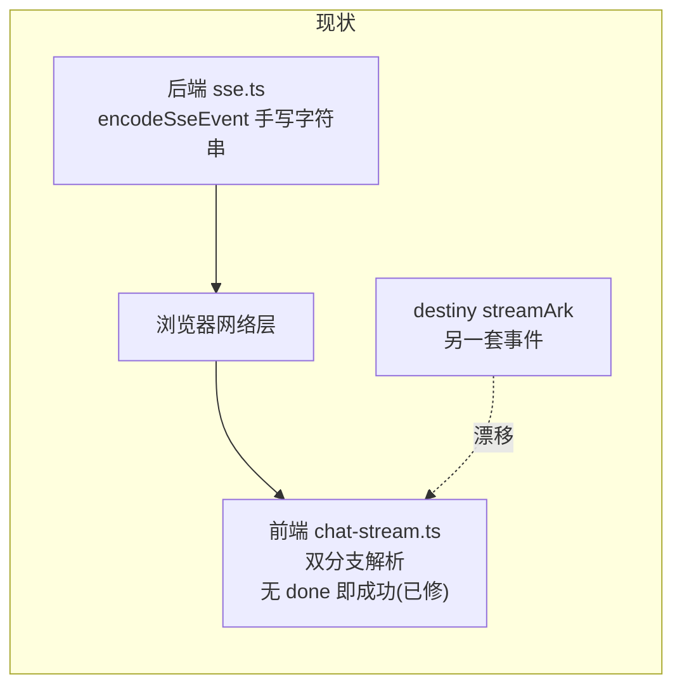
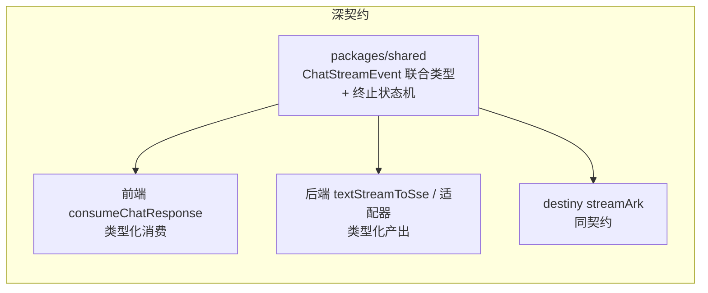
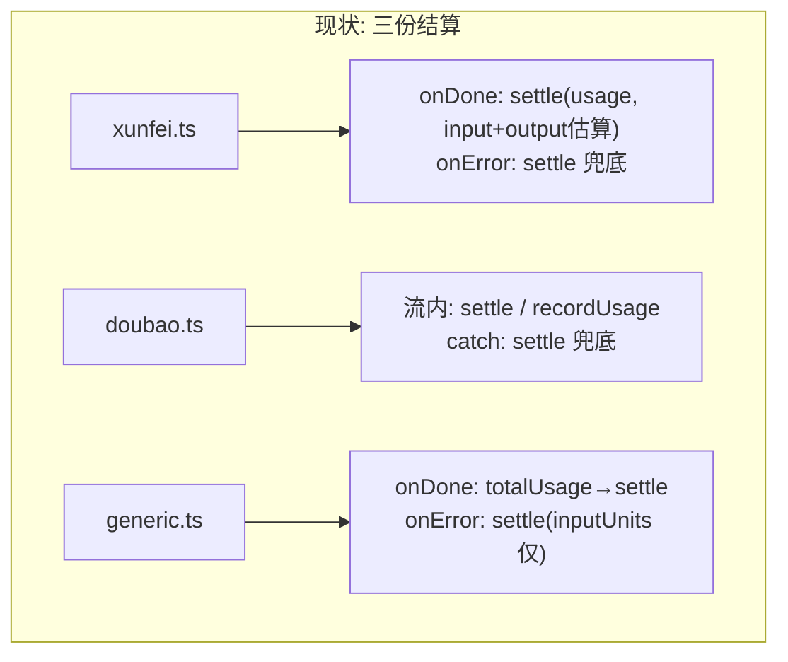
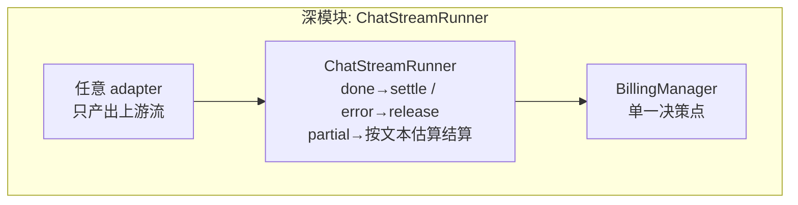
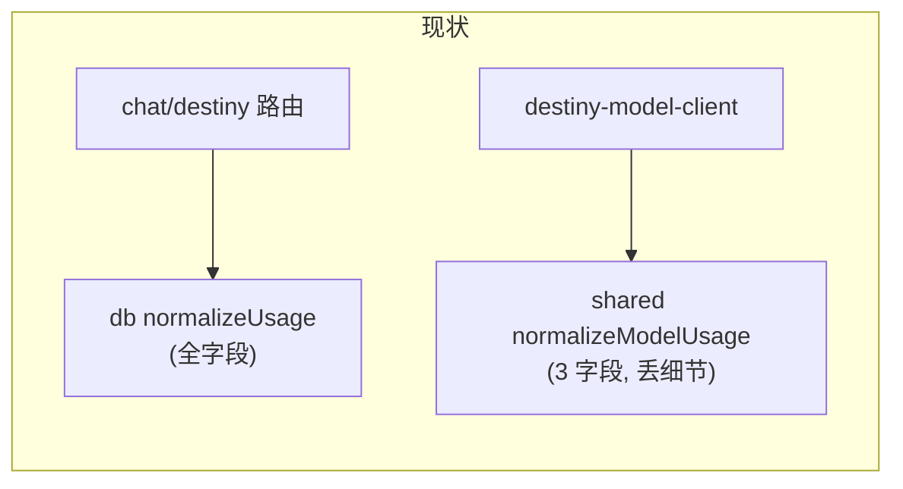
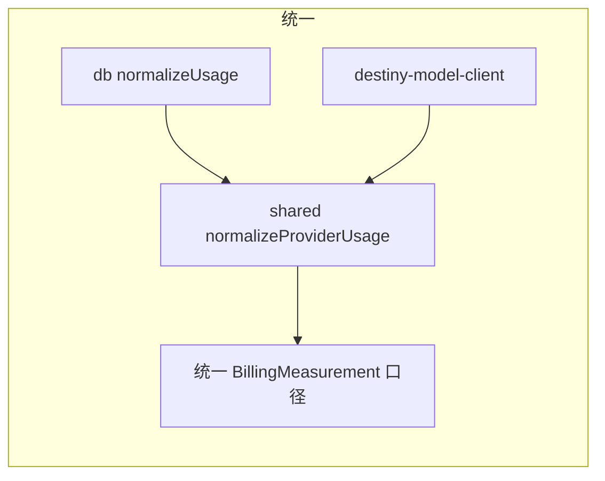
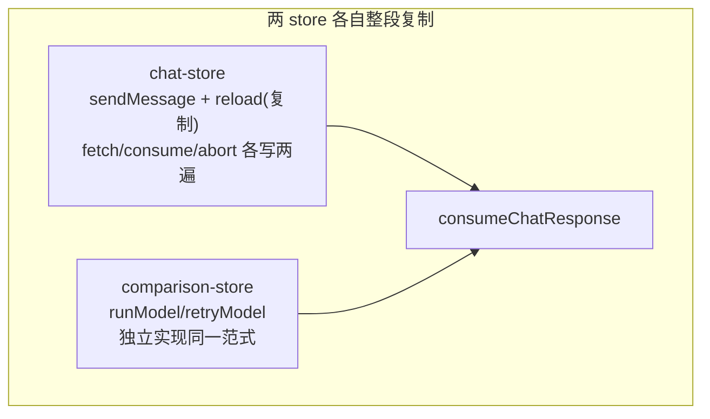
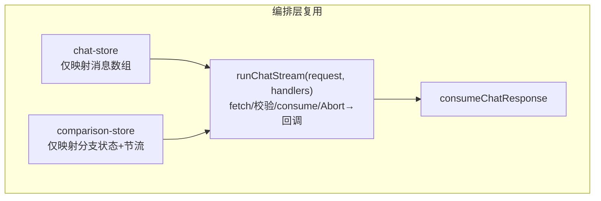
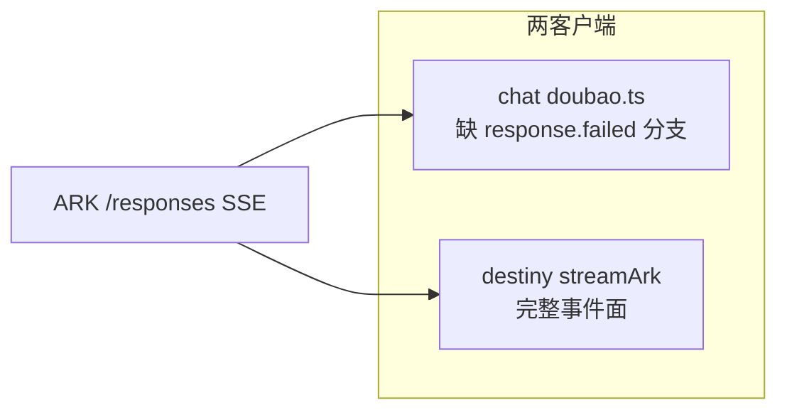
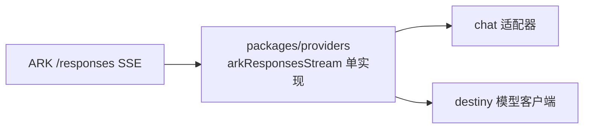

# AI 聚合平台 — 架构深模块审查报告（第二轮）

> 日期：2026-08-27
> 审查框架：深模块设计（模块 / 接口 / 深度 / 接缝 / 适配器 / 杠杆 / 局部性）
> 范围：chat 流式链路 + 配额生命周期热区（上轮 `docs/codebase-design-report.md` 的 P0/P1 已于 87ef793 落地，本报告不再重复）

---

## 一、本轮语境

近两周热区提交：`87ef793`（chat 路由拆分适配器架构 + 统一配额会话管理）、`207fd69`（豆包适配器异常处理与超时配置）、`bb3359e/b57b4f4/7dd976a`（web 分包）。今日排查「并行模式 doubao-seed-evolving 无内容」时，SSE 契约问题的根因正是在本轮热区——本轮审查据此收敛候选。

## 二、候选

### C1. 聊天 SSE 事件契约双端漂移 — Strong

**Files**：`apps/web/src/lib/utils/chat-stream.ts`、`apps/web/src/app/api/chat/_lib/sse.ts`、`apps/web/src/app/api/chat/_lib/adapters/*.ts`、定点 `packages/shared/src/destiny-model-client.ts`

**Problem**：前后端之间的事件协议没有任何单一权威定义。
- 前端 `consumeChatResponse` 同时解析 `text-delta` 与 `response.output_text.delta` 两种 delta（chat-stream.ts:52-60）——后者当前**无任何后端输出方**（全仓库仅 3 处出现，sse.ts 只产出 `text-delta/done/error/warning`），是死兼容分支。
- 完成语义靠惯例：EOF 未收到 done/[DONE]/error 会被当作成功（今日「调用成功但无内容」的直接成因，已修复为抛错，但契约仍未类型化）。
- 事件类型在 `encodeSseEvent`（后端）与 `consumeChatResponse`（前端）两侧各自手写字符串，无重叠校验。

**Solution**：在 `packages/shared` 定义 `ChatStreamEvent` 联合类型（text-delta / done / warning / error，含「流终止必须收到终止事件」的状态机约束），前后端共用；`consumeChatResponse` 与 `textStreamToSse` 的产物类型即契约。删除死兼容分支。

**Benefits**：
- **Locality**：SSE 语义一处定义，协议演进（新增 reasoning 事件、截断语义）只改一处。
- **Leverage**：destiny 三路由、chat 三 adapter、前端两 store 全部落到同一契约。
- **测试**：契约可被 100% 单测（今日已补 4 个用例，类型化后还需校验「未知事件类型必须显式处理」）。

**Before / After**：

---

### C2. 结算生命周期三重复（含 release 缺失） — Strong

**Files**：`apps/web/src/app/api/chat/_lib/adapters/{xunfei,doubao,generic}.ts`、`apps/web/src/app/api/chat/_lib/billing-manager.ts`

**Problem**：`reserve → 流式 → settle/recordUsage` 的结算链在三个 adapter 各写一遍，且时序不同：

| 维度 | xunfei.ts | doubao.ts | generic.ts |
|---|---|---|---|
| 结算位置 | 回调（onDone） | 流内（主循环后） | 回调（onDone） |
| 错误时 | settle（fallback 含输出估算） | settle（fallback 含输出估算） | settle（仅 inputUnits） |
| admin 无预留 | recordUsage | recordUsage | recordUsage |
| **release 未结算分支** | **无** | **无** | **无** |

- 三个 adapter **从不调用 `billing.release`**——错误/中断路径也一律 settle 扣费，用户额度被截留，「取消应退款」语义缺失。
- fallback 口径不一致（xunfei/doubao 含输出估算，generic 不含）。
- `xunfei.ts:50` 的 `const status = text ? 'partial' : 'failed'` 是死变量（settle 签名不含 status 参数）。

**Solution**：把「流式 + 结算」封装为一个深模块 `ChatStreamRunner`：接口 = 上游流 + 消费回调；内部统一完成 done→settle / error→release / partial→按文本估算结算 三态决策。三个 adapter 只负责「取到上游流」，不再写任何结算代码。

**Benefits**：
- **Locality**：结算策略（含 release 语义修复、fallback 口径统一）改一处。
- **Leverage**：新增第四个 provider 适配器零结算代码。
- **测试**：用 FakeStream + FakeBillingManager 单测三态决策矩阵（今日 doubao 修复时已尝到三处都要同步改的苦头）。

**Before / After**：

---

### C3. usage 归一化双实现并存 — Worth exploring

**Files**：`packages/db/src/ai-usage.ts`（`normalizeUsage`，144-212 行）、`packages/shared/src/destiny-model-client.ts`（`normalizeModelUsage`，160-174 行）

**Problem**：两个函数都在做「供应商 raw usage → 统一结构」，但字段面不同：
- db 版：`inputTokens/input_tokens/promptTokens/prompt_tokens` + `output*` + `total*` + **cached/reasoning 细节**，空值返回「全 null + taskCount」。
- shared 版：仅 `prompt_tokens ?? input_tokens`、`completion_tokens ?? output_tokens`、`total_tokens`，空返回 null，无 camelCase/cached/reasoning。
- destiny 域经它取数，**丢掉了 cached/reasoning 维度**（计费口径与 chat 域不一致的隐患）；注释自述「兼容 ARK 与 DeepSeek」——与 db 版职责重叠。

**Solution**：把 db 版 `normalizeUsage` 的协议感知逻辑提升为 `packages/shared` 的单一 `normalizeProviderUsage`，db/shared 两处委托它；destiny 链路自动获得 cached/reasoning 口径。

**Benefits**：计费口径单点；destiny 与 chat 用量数据可比；删除 shared 窄实现。

**Before / After**：

---

### C4. 前端双 store 会话编排重复 — Worth exploring

**Files**：`apps/web/src/stores/{chat-store,comparison-store}.ts`、`apps/web/src/lib/utils/chat-stream.ts`

**Problem**：单聊与并行对比两条链路各自实现同一套「authFetch → !ok 抛错 → consumeChatResponse → AbortError 分类」编排：
- `chat-store.ts` 的 `sendMessage`（218-325 行）与 `reload`（381-448 行）**整段重复**，且 reload 处注释自认：`// 为了减少代码重复，可以将 fetch 逻辑抽离，但这里直接写吧`。
- `comparison-store.ts`（runModel 165-226 行）同样的响应/错误/中止语义，仅多一层 RAF 节流。
- 两 store 的不同语义（单聊 toast vs 对比分支 failed）只体现在 catch 分支的映射上——正是这块**无任何测试**（两个 store 均无 *.test.ts），今日 SSE 契约 bug 若在 store 有测试即可先红。

**Solution**：抽一个可测编排层 `runChatStream(request, handlers)`：内部完成 fetch/校验/consume/AbortError 归一，暴露 chunk/warning/done/aborted 四个回调；两个 store 只保留各自的语义映射（chat-store→消息数组，comparison-store→RAF 节流+分支状态）。

**Benefits**：删除 ~180 行重复；Abort/done/error 单点测试；store 状态机瘦身后各自可测。

**Before / After**：

---

### C5. ARK responses 协议双客户端 — Speculative

**Files**：`apps/web/src/app/api/chat/_lib/adapters/doubao.ts`、`packages/shared/src/destiny-model-client.ts`

**Problem**：同一上游协议（ARK `/responses` SSE）在两个包各自解析：
- 共同手写 `split('\n\n')` 帧切割 + `data:` 提取。
- 事件支持不对称：destiny `streamArk` 处理 `response.failed/error` 分支（461-471 行）；**doubao 解析器没有该分支**——上游失败事件落入 `SyntaxError → continue` 被静默吞掉，最后落入「截断」兜底（今日已补 error/warning 出口，但语义被当作「截断」而非「响应失败」）。

**Solution**：在 `packages/providers`（或 shared 的模型客户端层）沉淀单一 `arkResponsesStream` 解析器 + 错误映射；chat 与 destiny 都退化为「取流 + 映射业务事件」。

**Benefits**：协议演进（新增 reasoning 透传、失败码映射）改一处；doubao 自动获得 `failed/error` 细粒度处理。

**注**：跨包重构风险高（shared 无 providers 依赖，需先立方向）；且 C2 的 ChatStreamRunner 落地后，适配器内解析器可独立演进，本候选可延后。

---

## 三、首选建议

**先做 C1，紧接着 C2**。理由：

1. **C1 是今日线上事故（并行下「调用成功但无内容」）的直接后验**——契约类型化后，这类「协议漂移型」bug 从「运行时才暴露」变成「编译期拦截」；成本最低（一个联合类型 + 删除死分支）。
2. **C2 是三处重复的最痛处**，且它顺带修复真实计费缺陷（错误路径从不 release）。C1 的契约事件类型（尤其 warning/error/截断三态）恰好是 C2 的 `ChatStreamRunner` 三态决策的输入——先立契约，再建运行器，顺序自然。
3. C3/C4 是同一「重复实现」病根的不同切片，收益真实但优先级低于前两者；C5 待 C1+C2 落地后由 ARK 协议客户端自然收敛，不建议现在立项。

---

## 四、上轮验证（不再建议项）

| 上轮候选 | 现状 |
|---|---|
| P0 chat/route.ts 910 行拆分 | ✅ 87ef793 已实施（chat-handler + ChatProviderAdapter） |
| P1 配额生命周期封装 | ✅ 部分落地（createBillingManager），当前缺口即本报告 C2 的三重复 |
| P2 providers 空壳类清理 | ✅ 87ef793 已删除 dashscope/deepseek/types/zhipu 空壳；`createProvider` 现仅 generic.ts 一处调用 |

> ADR：`docs/adr/` 目录不存在，本轮无 ADR 冲突项。
