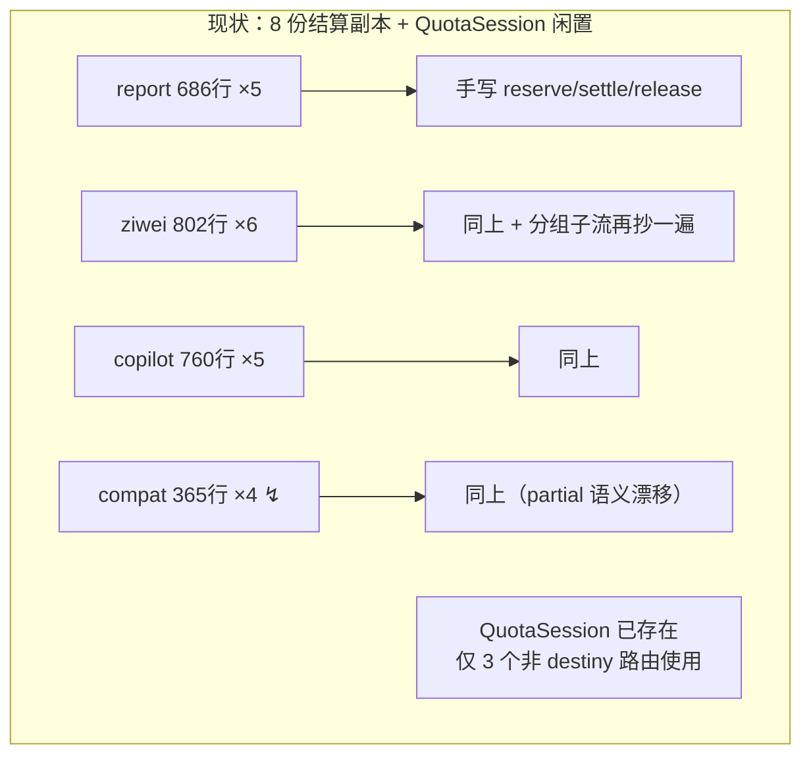
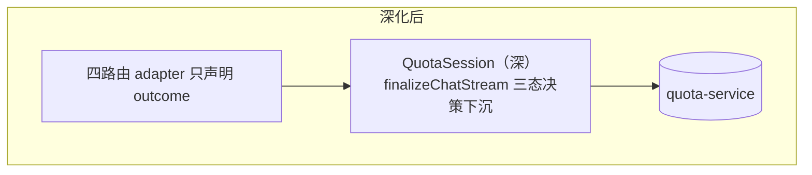

# AI 聚合平台 — 架构深模块审查报告（第三轮）

> 日期：2026-08-28
> 审查框架：深模块设计（模块 / 接口 / 深度 / 接缝 / 适配器 / 杠杆 / 局部性）
> 范围：destiny 命理域（近 20 条提交热区）+ 结算生命周期全景核查
> 前序：第一轮 `docs/codebase-design-report.md`（2026-08-23）、第二轮 `docs/architecture-review-2026-08-27.md`（chat 热区）

---

## 一、本轮语境与前序落地确认

第二轮的 chat 候选已全部落地，本轮**不再重复**：

| 第二轮候选 | 现状 | 证据 |
|---|---|---|
| C1 SSE 契约双端漂移 | ✅ 已落地 | `packages/shared/src/chat-stream-contract.ts`；`consumeChatResponse` 用 `parseChatStreamEvent` 逐帧消费（chat-stream.ts:100）；死兼容分支已删 |
| C2 结算生命周期三重复 | ✅ 已落地 | `billing-manager.ts:89` `finalizeChatStream` 三态决策唯一入口；三 adapter 均经由它结算（doubao.ts:252-308）；release 闭环已通（chat-handler.ts:95） |
| providers 三个空壳类 | ✅ 已删除 | `packages/providers/src/` 仅剩 factory.ts / index.ts / xunfei.ts，无 "Not implemented" |

第一轮的另一条正面线索：Redis 连接管理已收敛为深模块 `packages/shared/src/redis-config.ts`（含 BullMQ 专用模式、Vercel 占位符防护），三次修复（1d28e2c / 33309cf / 36584a1）各改一处即全局生效——这就是深度带来的局部性，可作为后续深化的参照样本。

**本轮热区**：近 20 条提交集中在 destiny 命理域（八字/奇门/紫微、合盘缘分卡），而第二轮的结算深化**未惠及该域**。另确认：第一轮诊断的「两套账」口径问题（quota-billing-logic-diagnosis.md）不在本轮范围。

---

## 二、候选

### C1. destiny 四路由迁移 QuotaSession — 结算生命周期最后一次收敛 — **Strong**

**Files**：
- `apps/web/src/lib/billing/quota-session.ts`（181 行，**已存在**）
- `apps/web/src/app/api/destiny/report/route.ts`（686 行，5 处结算调用）
- `apps/web/src/app/api/destiny/ziwei-report/route.ts`（802 行，6 处，含分组子流 runPalaceGroup 560-649）
- `apps/web/src/app/api/destiny/copilot/route.ts`（760 行，5 处）
- `apps/web/src/app/api/destiny/compatibility-report/route.ts`（365 行，4 处）

**Problem**：深模块 `QuotaSession`（reserve→settle/release 生命周期封装，quota-session.ts:1-20 即为文档）已经建好，`video/optimize-prompt`、`resume/polish`、`resume/diagnose`、`voice/translate` 四个路由已迁移。但 destiny 四路由共 **20 处**手写 reserve→settle/release，每路由 2-3 个流，实际 **8 份结算副本**，且错误路径语义漂移：

| 路由 | 成功 | 有部分输出时出错 | 无输出时出错 |
|---|---|---|---|
| ziwei-report（425-442、639-644） | settle | partial settle | release ✓ |
| copilot（346-369） | settle | settle status='partial' ✓ | release ✓ |
| report（422-444） | settle | settle status='partial' ✓ | release ✓ |
| compatibility-report（350-357） | settle | **↯ release（有输出也全额退款）** | release ✓ |
| chat（已深化，参照系） | `finalizeChatStream` 三态决策一处定义 | | |

**↯ 漂移证据**：compatibility-report/route.ts:350 — 用户已收到大段报告文本后流中断，预留仍全额释放（reason='合盘流式失败'），而 copilot/report 同场景按 partial 扣费。合盘恰是付费最敏感的**视角补生成**场景（CONTEXT.md：「与首开合盘一样消耗额度；已缓存视角的纯切换不请求、不扣费」）。

**Solution**：四路由迁移到 `QuotaSession`；将 chat 侧 `finalizeChatStream` 的三态决策表（success→settle / partial→按输出估算结算 / failed→release）**下沉为 QuotaSession 的共享实现**（而非再复制一份），adapter 只声明 outcome，不写分支。

**Benefits**：
- **Locality**：结算语义改一处，8 份副本消失；与 chat 共用同一决策表，双向不再漂移。
- **Leverage**：第四个 destiny 路由（及未来算法定制报告）零结算代码。
- **修复真实漂移**：合盘 partial 语义对齐，用户不再因中断白嫖或被多扣。
- **测试**：打在 QuotaSession 接口上，FakeQuotaService 一次覆盖三态矩阵。
- 路由瘦身：四路由合计约 **-600 行**，report-generation.ts 的「quota 由 adapter 自行管理」注释（:6）随之删除。

**Before / After**：

---

### C2. DestinyStreamEvent 契约迁出 UI 层 — 与 ChatStreamEvent 同居 @repo/shared — **Worth exploring**

**Files**：
- `apps/web/src/app/destiny/_components/types.ts:286-308`（BaziStreamEvent / ZiweiStreamEvent 现居地）
- `apps/web/src/app/api/destiny/report/route.ts:2-9`、`ziwei-report/route.ts`（API 路由反向 import UI 组件目录）
- `apps/web/src/lib/utils/sse.ts:24-34`（encodeSseEvent 泛型版 vs encodeChatSseEvent 契约版）
- 定点：`packages/shared/src/chat-stream-contract.ts`（chat 侧样板）

**Problem**：chat 的流契约已收进 `@repo/shared`，前端逐帧类型化解析；destiny 三套流事件的类型仍住在 **UI 组件目录**（`_components/types.ts`），API 路由反向引用——接缝倒挂。通用 `encodeSseEvent<T>` 对 destiny 事件零校验，双端字符串约定退回 chat 修复前的状态。八字与紫微两个事件联合类型结构相同（status / section-final / complete / error），仅 payload 键不同，是没被合并的伪差异。

**Solution**：在 `@repo/shared` 定义参数化 `DestinyStreamEvent<SectionKey, PayloadMap>`（四态 + 「complete 或 error 必达」终止约束），八字/紫微/合盘实例化；UI 层 types.ts 删除联合类型改为 re-export。契约与 ChatStreamEvent 并排，一份目录讲清全站流协议。

**Benefits**：
- **Locality**：协议演进（如新增 progress 事件）一处改动。
- 层次正向：UI→API 反向依赖消除。
- 八字/紫微伪差异合并，interface 缩小。
- destiny 事件获得与 chat 同级的 parse 层校验。

**边界提示**：奇门走 jobId 轮询（qimen/analyze/*，非 SSE），契约只覆盖流式三术数，不要为奇门硬造流事件。

---

### C3. ModelStream — 「调模型 + usage 挖取 + 超时 + measurement 组装」收成一个深模块 — **Speculative**

**Files**：
- `@repo/shared` `streamModel`（4 个 destiny 路由引用）+ `_lib/ark-response.ts:55` `extractArkUsage`
- 各路由手写 timeout 治理：`report/route.ts:446` clearTimeout、ziwei ×2 处、copilot
- 「结算三件套」重复 import ×4：`createTokenMeasurement` + `estimateOutputTokens` + `normalizeUsage`

**Problem**：「调一次模型」的真实 interface 远比 streamModel 参数宽——调用方还必须知道 usage 藏在 Ark raw 响应里要用 extractArkUsage 挖、超时要自己 setTimeout/clearTimeout、结算要自带 measurement 三件套。这些从 interface 漏到了每个 caller——**streamModel 是浅模块**，省下的复杂度没消失，只是搬进了 4 个路由。

**Solution**：在 `@repo/shared` 深化为 `streamBillableModel(config, messages, budget)` → `{ text, usage, measurement }`，超时治理内置。

**标 Speculative 的原因**：单独做收益中等；价值在 C1 落地后顺势收敛（同批触碰相同代码段）。不建议单独开工。

---

## 三、首选建议

**C1**。理由：这是全场唯一「补完既有模式」而非「发明新模式」的候选——深模块已存在（QuotaSession）、同型深化已在 chat 侧验证（finalizeChatStream）、三个路由已迁移证明可行。leverage 最高、风险最低，且修掉一个真实的计费漂移（合盘 partial 退款）。C1 完成后顺手摘 C2（同批触碰相同文件），C3 随 C1 的移动再决定是否值得。

## 四、本轮未列入候选的观察

- **四视角视图组件**（compatibility/report/{romance,marriage,friendship,partnership}-view.tsx，合计 1054 行）：共享层 `shared.tsx`（1628 行）已抽走大部分重复，剩余差异是真实的视觉设计意图（各视角主题色/文案/版式），强行合并反而伤表现力。不动。
- **destiny-workspace-store**（246 行）：三术数 workspace cache 已用 `BaseWorkspaceCache` 泛型收敛，结构健康。
- **Redis**：已是正面样本，无需动作。
- **chat 链路**：第二轮后已是深模块样板，无需动作。

---

*佐证均以 文件:行号 标注，核查日期 2026-08-28。HTML 版：`$TMPDIR/architecture-review-20260828-143153.html`。*
