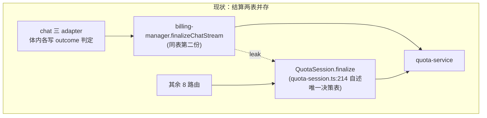
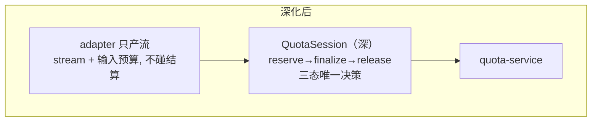

# AI 聚合平台 — 架构深模块审查报告（第四轮）

> 日期：2026-09-02
> 审查框架：深模块设计（模块 / 接口 / 深度 / 接缝 / 适配器 / 杠杆 / 局部性）
> 范围：全仓热区核查（chat/billing、destiny、前端 stores、worker/packages）
> 前序：R1 `docs/codebase-design-report.md`（2026-08-23）、R2 `docs/architecture-review-2026-08-27.md`（chat 热区）、R3 `docs/architecture-review-2026-08-28.md`（destiny 命理域 + 结算生命周期）

---

## 一、前三轮候选落地核查

第四轮的地基：先确认哪些肩担已放下，哪些缺口仍在。

| 前轮候选 | 状态 | 证据 |
|---|---|---|
| R2-C1 · SSE 契约双端漂移 | ✅ 已落地 | `chat-stream-contract.ts` 前后端共用；`consumeChatResponse` 类型化消费 |
| R2-C2 · 结算生命周期三重复 | ✅ 已落地 | `billing-manager.ts:92` `finalizeChatStream` 三态唯一决策；三 adapter 均经其结算 |
| R2-C3 · usage 归一化双实现 | ✅ 已落地 | `normalizeUsage` 收敛 `shared/usage-normalize.ts`；destiny 的 `normalizeModelUsage` 委托它（destiny-model-client.ts:164） |
| R2-C4 · 前端双 store 会话编排重复 | ❌ 未落地 | `chat-store` sendMessage/reload 仍整段重复；`comparison-store` runModel 另写一份 → 本轮 C6 |
| R2-C5 · ARK responses 协议双客户端 | ❌ 未落地 | doubao `parseDoubaoSseStream` 与 destiny `streamArk` 仍各自解析；`extractJsonBlock` 双份逐字节相同 → 并入 C2 |
| R3-C1 · destiny 四路由迁移 QuotaSession | ✅ 已落地 | report/ziwei/copilot/compat 四路由均已用 `quota-session` |
| R3-C1 后半 · chat 并入 + 三态决策下沉 | ❌ 未落地 | `billing-manager` 仍在；`quota-session.ts:214` 自述「与 chat 侧 finalizeChatStream 对齐」，两表并存 → 本轮 C1 |
| R3-C2 · Destiny 流契约迁出 UI 层 | ⚠️ 部分 | 八字/紫微已入 `shared/destiny-stream-contract.ts`；合盘 `CompatibilityStreamEvent` 仍在前端组件 types → 并入 C2 |
| R3-C3 · ModelStream 深化 | ❌ 未落地 | 仓库无 `streamBillableModel`；保持 Speculative，不单独立项 |

---

## 二、候选

### C1. 结算生命周期闭环：chat 并入 QuotaSession，adapter 只产流 — **Strong**

**Files**：
- `apps/web/src/lib/billing/quota-session.ts`（深模块，:214/:223 finalize 三态）
- `apps/web/src/app/api/chat/_lib/billing-manager.ts`（:92 `finalizeChatStream`，同表第二份）
- `apps/web/src/app/api/chat/_lib/adapters/{generic,doubao,xunfei}.ts`（各持 `BillingManager`）
- `apps/web/src/app/api/chat/_lib/types.ts`（:36 `ChatProviderAdapter` 仅 `stream()`）
- `apps/web/src/app/api/chat/_lib/chat-handler.ts`（:129-189 instanceof 链；:19 反引 doubao 错误类型）

**Problem**：8 个路由已迁到 QuotaSession，chat 是唯一旁路：`billing-manager` 与 `QuotaSession` 是同一 reserve→finalize 决策表的两份实现，billing 细节（outcome 判定、估算兜底）泄漏进三个 adapter 体内，doubao 甚至在 finalize 前先自判一层（doubao.ts:250-297）。这是 R3-C1 后半段的遗留缺口——决策表收敛了一半就停下。

**Solution**：chat-handler 改用 QuotaSession；三态决策收敛为 `QuotaSession.finalize` 唯一实现，删除 `billing-manager.ts`；`ChatProviderAdapter` 接口窄化为「只产流」（stream + 输入预算），adapter 不再持有 `BillingManager`、不再写任何结算分支。

**Benefits**：
- **Locality**：结算语义一处定义，删一个模块（删除测试成立——复杂度集中而非搬走）。
- **Leverage**：接口缩小后 adapter 变深，新增 provider 零结算代码。
- 修复 doubao 在 finalize 前的重复 outcome 判定，空流/截断/成功各判一次。
- **测试**：三态决策矩阵打在 QuotaSession 接口，一处覆盖全部链路。

**Before / After**：

---

### C2. destiny 规范化边界三份拷贝 → 单一「raw→报告」接口 — **Worth exploring**

**Files**：
- `apps/web/src/app/api/destiny/_lib/report-normalizer.ts`（880 行，`convertLooseRaw`:56 别名吸收）
- `apps/web/src/app/api/destiny/_lib/compatibility-normalizer.ts`（472 行，scrub/relationDefaults）
- `apps/web/src/app/api/destiny/_lib/bazi-section-payload.ts`（607 行，流式 JSON → SectionPayloadMap）
- `apps/web/src/app/api/destiny/_lib/ark-response.ts:48` 与 `packages/shared/src/qimen-analysis.ts:1119`（`extractJsonBlock` 逐字节相同）
- `apps/web/src/app/api/destiny/compatibility-report/route.ts:79`（手写 `extractJsonObject`，**第三份** JSON 抽取；另有 :89 绕过 `createReportHandler` 工厂）

**Problem**：三套 normalizer 各自实现同一个接缝（AI 输出 → 域报告，八字 / 合盘适配分 / section），解析/清洗/别名吸收机械重复 ≥3 份；`extractJsonBlock` 两处逐字节拷贝、合盘路由又手写第三份。接口各形态（`normalizeDestinyReport` 接收 4 位置参数 + options），没沉淀可复用的边界抽象。R3-C2 的部分落地（合盘流契约仍在 UI 层）同样指向这一处接缝的未统一。

**Solution**：一条 schema 驱动的「raw→typed」规范化接口；parse/scrub/别名吸收下沉为内部共享实现；八字/合盘（适配分/缘分卡）/section 只声明映射形状。需在 grilling 中确认三形状差异 vs 机械重复的真实占比——若别名表确属各域异构，则收敛范围收窄为「抽取/scrub 机械」，千万别硬合并形状。

**Benefits**：
- **Locality**：边界一处定义、一处测试。
- 三份 JSON 抽取删两份拷贝（合盘路由的 `extractJsonObject` 纳入统一）。
- **Leverage**：第四个报告形状（如未来的付费报告）零解析代码。
- R3-C2 的「合盘流契约入 shared」随同一接缝顺势完成。

---

### C3. 奇门链路双轨计费 + 分析大杂烩 → worker 并入 QuotaSession、qimen-analysis 分层 — **Worth exploring**

**Files**：
- `apps/worker/src/workers/qimen-section.ts`（:62-177 手写 reserve/claim/settle/record 100+ 行，绕过 QuotaSession）
- `packages/shared/src/qimen-analysis.ts`（1155 行：类型/schema/prompt 构建/AI 调用/JSON 解析混一处，依赖 ioredis）
- `packages/shared/src/qimen-analysis-store.ts`（:22 ioredis）
- `packages/queue/src/jobs.ts` vs `packages/shared/src/types/task.ts`（`TaskType` 不含 qimen，任务定义单一事实源缺失）

**Problem**：系统两端计费模式并行——web 端 QuotaSession、奇门 worker 端手工 quota 函数序列，结算规则要同步改两处；奇门是 R3-C1 结算收敛唯一漏掉的角落。`qimen-analysis.ts` 导出 15+ 符号，是「大杂烩」而非深模块——接口复杂度随实现同步增长，且把 ioredis 依赖拖进 shared。

**Solution**：奇门 worker processor 迁到 QuotaSession（双端同构 reserve→finalize→release）；`qimen-analysis` 内部分段（契约层 / schema / prompt 构建 / AI 编排），对外收敛为窄接口；任务定义单一事实源收进 shared。**边界提示**：需验证 worker 进程内 Redis 单例下 QuotaSession 可用，若不可用则退而求其次只在 worker 侧复刻同一决策表。

**Benefits**：
- 计费第三处副本消失，结算规则改一处。
- 奇门接缝变窄（接口面缩小即深度增加）。
- 新增术数分析 worker 复用同一分析抽象。

---

### C4. shared 剥离有状态 Redis 基础设施 → 单连接生命周期深模块 — **Worth exploring**

**Files**：
- `packages/shared/src/rate-limit.ts`（365 行：`RateLimiter`:33 · `QuotaManager`:171 · `createRedisClient`:296）
- `packages/shared/src/worker-heartbeat.ts`（:7 `createRedisClient`）
- `packages/shared/src/qimen-analysis-store.ts`（:23 借道 `createRedisClient` 当工厂）
- `packages/shared/src/server.ts`（:16-18 导出运行时模块）
- `packages/shared/src/redis-config.ts`（连接配置）

**Problem**：定位「类型/契约」的 shared 承载了带连接状态的基础设施：`getRateLimiter()` 每次调用 new Redis 客户端（连接泄漏风险），`worker-heartbeat` 与 rate-limit 各持独立连接互不共享，`qimen-analysis-store` 只是借道取 Redis 工厂。R2 与 R3 都曾以 redis-config 为「深模块正面样本」，但**正样本的只有配置**，连接生命周期反而是散的。

**Solution**：把有状态 Redis 运行时（连接生命周期 / 限流 / 心跳）移出 shared 到独立深模块，单连接注入式共享；shared 只留纯契约与连接配置。redis-config 供 web/worker 同源是既有价值，迁移须保留配置契约。

**Benefits**：
- 连接单点生命周期（泄漏修复），Redis 实例唯一。
- shared 回到契约定位，依赖面收窄。
- **测试**：限流/心跳可注入 FakeRedis，非真实连接。
- **Locality**：Redis 生命周期一处治理。

---

### C5. 前端历史读写收敛：audio-history-store 退化为只读适配器 — **Worth exploring**

**Files**：
- `apps/web/src/stores/audio-history-store.ts`（698 行/20+ actions；`deleteItem`:282 · `deleteSelectedItems`:319 用 `require('./history-store')` 隐藏依赖）
- `apps/web/src/stores/history-store.ts`
- `apps/web/src/components/voice/upload-audio.tsx`（930 行 god component：import 两套 store，`addItem` 组件直接调用做双写）
- `apps/web/src/lib/services/` 仅 `audio-history-service.ts`，服务层深度不一致

**Problem**：voice 记录被「双写」进 `history-store` + `audio-history-store`，协调者竟是组件；`audio-history-store` 接口面≈实现（浅模块），删除路径用运行时 `require` 隐藏跨 store 依赖。删除测试不成立——复杂度只是搬走，没消除。

**Solution**：统一单条 history 写路径（服务适配器）；`audio-history-store` 收敛为 IndexedDB 只读缓存适配器；组件删去双写协调。两个读适配器（IndexedDB / 内存）＝真实接缝（一个 adapter 是假设接缝，两个才是真的）。

**Benefits**：
- 删除隐藏 `require` 依赖。
- 组件瘦身（upload-audio.tsx 卸掉双写协调职责）。
- 历史读写单一接缝可测。

---

### C6. 前端会话编排收敛 + 事件总线下沉（R2-C4 复核） — **Worth exploring**

**Files**：
- `apps/web/src/stores/chat-store.ts`（`sendMessage`:218 · `reload`:381 整段重复；`emit(CONVERSATION_UPDATED)` 越界写会话）
- `apps/web/src/stores/comparison-store.ts`（`runModel`:165 独立实现同一范式）
- `apps/web/src/stores/store-events.ts`（48 行字符串事件总线，无类型安全）
- `apps/web/src/stores/store-coordinator.ts`（lazy require，监听 5 事件）

**Problem**：R2-C4 未落地（上轮即已充分论证）：前端两 store 仍各自整段实现 fetch/校验/consume/Abort 编排且**无任何测试**；`store-events` 事件总线把跨 store 依赖从编译期可见变为运行时字符串——删一个 store 需全局搜事件名，与 lazy 加载协调层的间接成本不成正比。

**Solution**：落地 `runChatStream(request, handlers)`（内部完成 fetch/校验/consume/AbortError 归一，暴露 chunk/warning/done/aborted 四个回调）；两个 store 只保留各自的语义映射；跨 store 同步改为收敛的直接调用或 Zustand subscribe，事件总线逐步退场。

**Benefits**：
- 删除 ~180 行重复。
- Abort/done/error 单点测试（今日 chat 链路 bug 若有此层即可先红）。
- 事件名依赖转为编译期可见。

---

## 三、首选建议

**C1**。理由：这是全场唯一「补完既有模式」而非「发明新模式」的候选——深模块已存在（QuotaSession）、8 路已验证、chat 是不合流的唯一旁路，leverage 最高、风险最低；落地同时窄化 `ChatProviderAdapter` 接口（适配器只产流）并修掉 doubao 的重复判定。**C1 之后顺势 C3**——同一结算主题从 web 端翻到 worker 侧，分享同一种接缝语言。

## 四、本轮未列入候选的观察

- **`packages/astrology` 空目录**：无源码无引用，直接清理即可。
- **worker stt/image/ppt 处理器**：TODO 占位未实现（功能缺口，非架构深化）。
- **`createReportHandler` 工厂未被合盘路由采用**：compat 路由手写 withAuth → schema.parse → SSE（compatibility-report/route.ts:89），接缝泄漏，已并入 C2。
- **`chat-handler.ts:9`**：BFF 反引客户端 store 的 `ChatMessage` 类型，随 C1 一并收敛或单列观察。
- **queue 重试策略**：attempts/backoff 硬编码、无死信队列告警，属运营项非深化。
- **正面样本**：relay 模块、`lib/api.authFetch`、`destiny-model-client`、`packages/db` Prisma 单例——接口小、实现深，是本库深化参照系。

---

*佐证均以 文件:行号 标注，核查日期 2026-09-02。HTML 交互版：`$TMPDIR/architecture-review-20260902-152745.html`。*