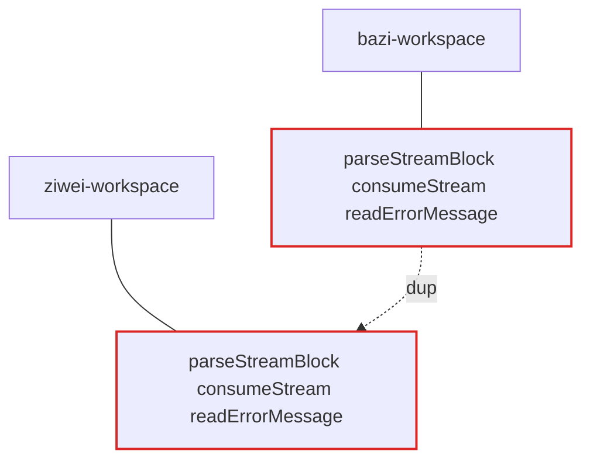
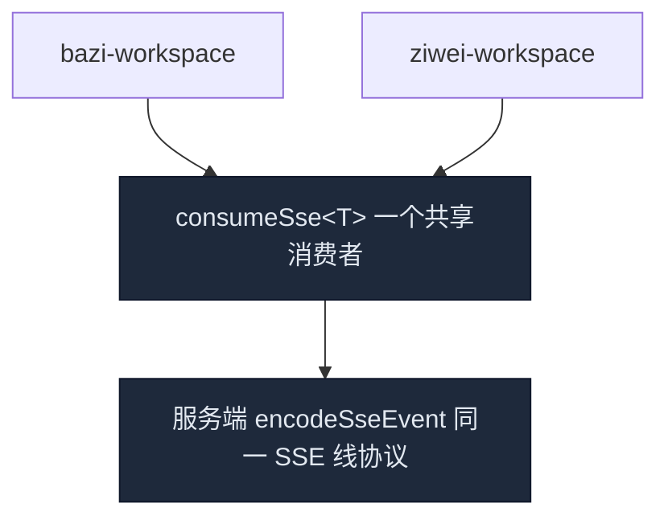

# 架构审查 — AI-Aggregation (destiny 术数模块)

- 日期：2026-08-12
- 热点：`apps/web/src/app/api/destiny/` 与 `app/destiny/_components/`（八字 / 奇门 / 紫微三套平行实现）
- 说明：无 `CONTEXT.md` 术语表；领域命名散落。参照系：relay 接力层（深注册表 + 纯函数）与 billing 配额收敛（唯一入口）是做得好的 seam。

> 术语约定（来自 /codebase-design 技能）：module、interface、implementation、depth、deep、shallow、seam、adapter、leverage、locality。

---

## 候选 1 · 移除 qimen/analyze/route.ts 遗留 SSE 死代码

- **强度**：`Strong` · 依赖分类：in-process
- **文件**：`apps/web/src/app/api/destiny/qimen/analyze/route.ts`（1288 行，建议删除）

### Before

奇门前端早已迁移到异步队列流：

```mermaid
flowchart TB
  QW[qimen-workspace]
  QW -->|fetch| S0[analyze/start]
  QW -->|poll| S1[analyze/status]
  QW -->|fetch| S2[analyze/sections/[key]]
  S0 --> BQ[(BullMQ)]
  BQ --> WK[Worker]
  WK --> S1
  QW -.no caller.-> DEAD[analyze/route.ts 1288 行 SSE 流]
  DEAD --> UP[UpstreamModelError]
  DEAD --> ME[mapStreamError]
  DEAD --> SS[SSE 编码样板]
  classDef dead stroke:#dc2626,stroke-width:2px;
  class DEAD dead
```

### After

```mermaid
flowchart TB
  QW[qimen-workspace]
  QW -->|fetch| S0[analyze/start]
  QW -->|poll| S1[analyze/status]
  QW -->|fetch| S2[analyze/sections/[key]]
  S0 --> BQ[(BullMQ)]
  BQ --> WK[Worker]
  WK --> S1
```

### Problem

此 SSE 路由无任何调用方——一整条平行 SSE 流、一套 `UpstreamModelError`、一份 `mapStreamError`、一份配额样板全部遗留。

### Solution

删除测试通过：删掉它复杂度集中而非挪动。git 历史确认可回滚。

### Wins

- 删除 1288 行死代码，去掉一条平行 SSE 流
- 并行实现从三条减到两条
- 顺带移除一份 `UpstreamModelError` 复制

---

## 候选 2 · 收敛 SSE 消费为共享深工具

- **强度**：`Strong` · 依赖分类：in-process
- **文件**：`bazi-workspace.tsx:262-308` · `ziwei-workspace.tsx:155-191`（逐字重复）· 后端 SSE 编码 5 处：chat / copilot / report / ziwei-report / qimen

### Before



### After



### Problem

两个 workspace 各自内嵌逐字相同的 SSE 消费循环；后端 `data: ${JSON.stringify}` 编码重复 5 处。接口几乎等于实现——浅。

### Solution

抽出客户端 `consumeSse(response, { onEvent })` 与服务端 `encodeSseEvent` 作为深模块；事件类型泛型化，线协议只此一份。

### Wins

- locality：SSE 边界逻辑集中在一个模块
- leverage：一个消费者，两处 workspace + 未来术数直接复用
- 测试只需打一个 interface 的桩，而非两套重复实现
- 删除 5 份后端编码样板

---

## 候选 3 · 合并两套领域校验为单一 schema 层

- **强度**：`Strong` · 依赖分类：in-process
- **文件**：`_lib/bazi-section-payload.ts`（667 行）· `_lib/report-normalizer.ts`（956 行）

### Before · 两个浅校验模块各自定义领域对象

```
bazi-section-payload.ts        report-normalizer.ts
┌─────────────────────┐        ┌─────────────────────┐
│ ProfileSectionSchema│        │ ProfileSchema       │
│ CoreToneSectionSchema│       │ CoreToneSchema      │
│ BalanceInsightSchema│        │ BalanceInsightSchema│
│ PillarSchema        │        │ PillarSchema        │
└─────────────────────┘        └─────────────────────┘
        同一批领域对象，两套定义——一处改动另一处漂移。
```

### After · 一个深 schema 模块

```
        destiny-domain-schema.ts   (深模块)
        Profile / CoreTone / Pillar / Balance / Timeline / ZiweiPalace …
              ▲ section              ▲ normalize
              │                      │
   bazi-section-payload.ts   report-normalizer.ts
   (只校验，不定义)           (只校验，不定义)
```

### Problem

对同一批领域对象（Profile / CoreTone / Pillar / Balance / LifeDimension / Timeline）存在两套 zod schema，互相漂移——领域校验被复制到两个浅模块。

### Solution

抽单一 `destiny-domain-schema` 模块，两个文件共享同一套 schema 定义。

### Wins

- 领域形状只有一个权威来源
- 删除测试通过：schema 集中在深模块，两文件变瘦
- 跨 bazi+ziwei 的字段演进不再需要双处同步

---

## 候选 4 · 深化命盘报告 handler

- **强度**：`Worth exploring` · 依赖分类：ports & adapters
- **文件**：`report/route.ts`（705 行）· `ziwei-report/route.ts`（826 行）

### Before · interface ≈ implementation（浅）

```
┌───────────┐  ┌──────────────────────────────────────────────┐
│  HTTP     │  │ withAuth 认证                                 │
│  POST     │  │ zod 校验 + provider 解析                      │
│ (接口面)  │  │ reserve / settle / release 配额               │
│           │  │ 60 行内嵌中文 prompt                           │
│           │  │ 流式解析 + 三级 fallback                      │
│           │  │ 计费结算                                      │
└───────────┘  └──────────────────────────────────────────────┘
一个 handler 承担 6 类职责；同型结构在 ziwei-report 再复制一遍。
```

### After · interface 收缩，实现被吸收（深）

```
┌───────────┐  ┌──────────────────────────────────────────────┐
│ request   │  │ report-generation 模块 (深)                  │
│ → stream  │  │  ├ prompt 构建（外部化）                     │
│ (接口面)  │  │  ├ section 编排                              │
│           │  │  ├ fallback 策略                             │
│           │  │  └ 配额结算                                  │
└───────────┘  └──────────────────────────────────────────────┘
bazi 与 ziwei 共享同一编排形状，只换 prompt 与 schema adapter。
```

### Problem

`report/route.ts` 接口只是一个 HTTP POST，实现却混排认证、校验、配额、prompt、流式解析、fallback、计费——浅模块，且 bazi / ziwei 各复制一遍同型 handler。

### Solution

抽出 `report-generation` 深模块：入参（请求 + 已认证用户）→ 输出流；prompt 与 schema 通过 adapter 注入，配额走既有 quota-service。

### Wins

- 报告编排逻辑只测一个 interface
- 两 adapter（bazi / ziwei）让 seam 名正言顺
- handler 变薄，prompt 不再内嵌
- 复用一个配额生命周期

> ⚠️ 注意：若先做候选 1（删死代码）与候选 2（共享 SSE），此处 handler 已借力变薄；本候选依赖前两者更划算。

---

## Top recommendation

**先做候选 1 与 2：删死代码，再收敛 SSE。**

候选 1 零风险直接删 1288 行（删除测试通过，git 可回滚）；候选 2 把两处 workspace 逐字重复的 SSE 消费收敛成一个深工具，并为未来的术数接入（如星座）提供唯一线协议。两者都是**删除测试**的教科书案例：删除/合并后复杂度集中，而非挪动。做完后，候选 3（schema 合并）与候选 4（handler 深化）的改造成本会显著下降。
