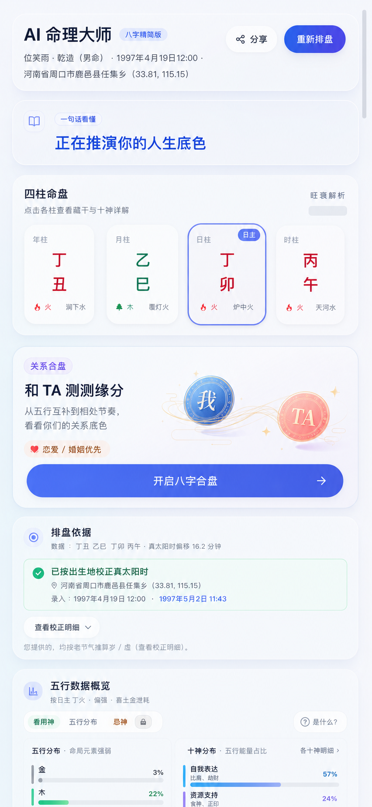
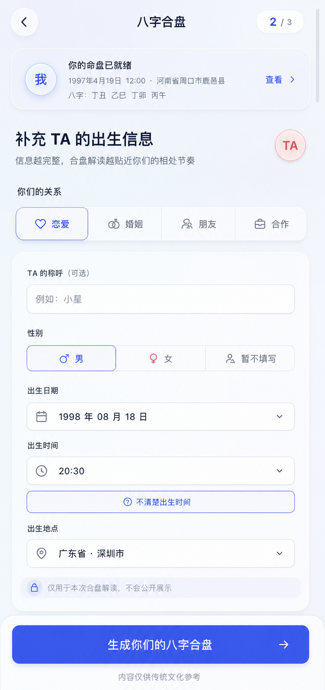
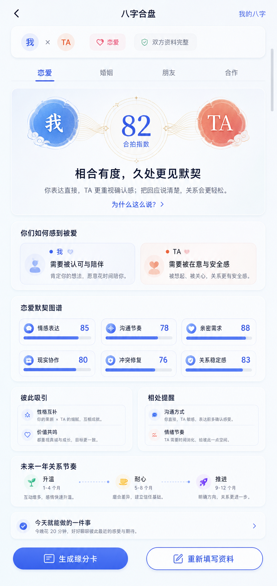

# 八字合盘功能设计文档

> 状态：已确认的产品与交互方案
> 适用范围：AI 命理大师的八字结果页、合盘信息引导页、合盘报告页；移动端优先，桌面端同步适配
> 设计图：
> - [入口位置效果图](./2026-07-25-bazi-compatibility-entry-mobile.png)
> - [补充 TA 信息引导图](./2026-07-25-bazi-compatibility-partner-info-mobile.png)
> - [独立合盘报告效果图](./2026-07-25-bazi-compatibility-result-mobile.png)

## 1. 设计目标

个人八字报告回答的是「我是什么样的人、我的节奏如何」；用户看完之后自然会继续追问：「我和这个人相处会怎样？」合盘功能应承接这个高意图时刻，帮助用户把抽象的命盘信息转化为**更好理解对方、减少误会、获得可执行相处建议**的关系观察。

本功能不是对关系下判决，也不把分数包装成命运结论。它应让用户在 30 秒内得到三个真正关心的答案：

1. 我们为什么会彼此吸引，或为什么容易觉得费力？
2. 最容易发生摩擦的场景是什么，我现在能怎么做？
3. 这段关系下一步更适合升温、磨合、协商，还是把边界讲清楚？

### 1.1 成功标准

- 已看完个人命盘的用户，可以在不离开阅读流的情况下发现合盘入口。
- 用户只需补充对方的必要出生资料，即可发起一次与当前关系类型匹配的解读。
- 首屏结论在不展开长文的前提下，能够说明「关系底色、彼此需求、一个最值得行动的建议」。
- 恋爱、婚姻、朋友、合作四个视角均有清晰且不同的内容重点，不能只是替换标题。
- 对方出生时间、性别或地点不完整时，用户仍能得到明确标注边界的基础解读，而不是被迫放弃。
- 全链路避免「注定」「绝配」「必然分开」等绝对化表达，并持续显示传统文化参考提示。

## 2. 产品定位与范围

### 2.1 定位

「八字合盘」是八字测算的**关系扩展能力**，不是与八字、紫微斗数、奇门遁甲并列的一级术数入口。

这样设计的原因：

- 合盘必须建立在双方出生资料和命盘之上，用户先完成个人排盘后再进入，心智最自然。
- 入口放在现有报告中，可以复用「我」的已验证资料，减少一次重复填写。
- 用户在个人命盘刚生成时的好奇心最高，入口的转化效率高于放在全局导航中等待发现。
- 关系报告会被多次回看，因此在历史档案中以独立的「合盘」记录保存，而不是把它埋回某一份个人报告。

### 2.2 首期范围

| 包含 | 不包含 |
| --- | --- |
| 个人八字结果页中的合盘入口 | 与紫微、奇门的跨术数合盘 |
| 双方出生信息录入、资料校验与隐私提示 | 真人咨询、婚恋撮合或社交匹配 |
| 恋爱、婚姻、朋友、合作四种关系视角 | 对双方未来作确定性承诺或预测 |
| 关系底色、互补关系、摩擦点、行动建议、关系节奏 | 医疗、法律、投资、婚姻决策建议 |
| 报告保存、再次查看、生成脱敏缘分卡 | 首期自动邀请对方填写资料的社交裂变链路 |

## 3. 目标用户与核心场景

| 用户场景 | 用户真正想确认的事 | 页面优先回答什么 | 不应该做什么 |
| --- | --- | --- | --- |
| 暧昧或刚恋爱 | 对方为什么忽冷忽热、该不该推进 | 吸引点、情感表达差异、推进节奏 | 用「适合结婚」替代当下建议 |
| 稳定恋爱 | 为什么总在同一件事上争执 | 冲突触发方式、修复动作、沟通句式 | 只给浪漫形容词，不给行动 |
| 已婚或准备结婚 | 日常、钱、家庭边界能否协同 | 家务与财务协作、家庭边界、共同目标 | 暗示婚姻成败不可改变 |
| 多年朋友 | 为什么亲近却偶尔消耗 | 支持方式、联系节奏、边界和互惠 | 把朋友关系强行浪漫化 |
| 合伙人或同事 | 是否能一起把事做成 | 角色分工、决策速度、风险偏好、反馈方式 | 将命理解读作为商业决策依据 |
| 出生资料不完整 | 还能不能测、结论可靠到什么程度 | 可看范围、缺失影响、如何补充 | 默默填入虚构时辰或显示虚假的精确分数 |

## 4. 整体体验路径

```text
个人八字报告完成
  ↓
四柱命盘后的「和 TA 测测缘分」入口
  ↓
确认关系类型与当前关心的问题
  ↓
补充 TA 的出生信息，并说明资料完整度
  ↓
合盘生成中的双命盘汇合动效
  ↓
默认关系视角的合盘报告
  ├─ 查看「彼此吸引 / 相处提醒 / 六维图谱 / 关系节奏」
  ├─ 切换至其它关系视角，按需生成该视角解读
  ├─ 保存至合盘档案
  └─ 生成脱敏缘分卡分享
```

全流程的核心规则：**命盘事实只计算一次，关系视角只改变解读重点，不改变双方命盘。**

### 4.1 个人报告与合盘报告的页面关系

个人八字报告和合盘报告属于同一个「AI 命理大师」工作区，但必须是**两张独立报告页**，不能在同一条长滚动页面中把个人报告和双方报告拼接、并排或互相替换布局。

| 页面 | 解决的问题 | 页面内容边界 | 可去往哪里 |
| --- | --- | --- | --- |
| 个人八字报告 | 我是什么样的人、我的人生节奏如何 | 只展示个人四柱、五行、十神、人生五维等个人内容；在四柱后提供合盘入口 | 开启合盘、历史档案 |
| 合盘报告 | 我们如何相处、下一步如何经营 | 只展示双方摘要与关系解读；不重复展示个人完整四柱、五行、十神或人生五维 | 返回、我的八字、合盘档案 |

合盘报告页的导航规则：

1. 左上角 `返回` 遵循用户的来源路径：从个人报告进入时，回到该份个人报告的原滚动位置；从合盘档案直接打开时，回到合盘档案列表。
2. 右上角 `我的八字` 是始终可见的明确跳转，直接打开本次合盘所关联的个人八字报告；移动端使用短文案，桌面端可写为 `查看我的八字报告`。
3. 合盘页顶部只保留一张紧凑的 `我 × TA` 资料摘要，作为上下文，不得嵌入或并排展示完整个人报告。
4. 两份报告分别保存为独立历史记录；切换页面不会重新排盘或丢失各自的阅读进度。

## 5. 信息架构

| 页面 | 用户任务 | 主要信息 | 主操作 |
| --- | --- | --- | --- |
| 个人八字结果页 | 读懂自己的命盘 | 四柱、排盘依据、五行、十神、人生五维 | 开启八字合盘 |
| 合盘信息引导页 | 告诉系统「我和谁、以什么关系」 | 我的资料摘要、关系类型、TA 的出生信息、资料完整度 | 生成你们的八字合盘 |
| 合盘生成页 | 等待并理解系统正在做什么 | 双方命盘计算状态、预计等待、可离开提示 | 留在当前页 / 后台查看 |
| 合盘结果页 | 获得关系观察与行动建议 | 共性首屏、关系类型专属模块、时间节奏、保存与分享 | 查看详情、切换视角、生成缘分卡 |
| 合盘档案详情 | 回看不同对象或关系的报告 | 报告摘要、生成时间、资料完整度、关系类型 | 继续查看、重测、删除 |

## 6. 页面一：个人八字结果页中的入口

### 6.1 入口位置

入口固定放在：**「四柱命盘」卡片之后，现有「排盘依据」卡片之前。**



这是整个长报告中最合适的位置，原因如下：

1. 用户刚看完四柱，已经知道个人命盘是合盘的基础；此时提出「加入另一人的资料」最容易理解。
2. 入口早于五行、十神等长数据区，避免用户滚动到报告底部才发现新能力。
3. 它不插入排盘依据和数据可视化内部，不会破坏原报告的阅读逻辑。
4. 对移动端而言，用户完成四柱卡阅读后自然继续向下滑，卡片进入拇指可触达区。

### 6.2 展示时机

| 当前状态 | 是否展示入口 | 展示内容 |
| --- | --- | --- |
| 尚未提交个人信息 | 否 | 个人资料表单保持聚焦，避免分散任务。 |
| 正在排盘或流式生成 | 否 | 不在「正在推演」阶段提前引导另一项任务。 |
| 四柱与排盘依据已完成 | 是 | 完整入口卡。 |
| 从历史恢复的个人报告 | 是 | 完整入口卡；点击后以该历史报告作为「我」。 |
| 已存在同一对象、同一关系类型的合盘报告 | 是 | 主按钮改为「查看上次合盘」，辅按钮「重新测算」。 |

> 设计图中的入口用于说明位置。真实产品中，入口只在个人排盘结果可用后出现；若仍在推演，卡位保持不渲染，不能把用户引到未完成的数据上。

### 6.3 入口卡内容与层级

| 层级 | 内容 | 目的 |
| --- | --- | --- |
| 身份标签 | `关系合盘` | 明确这是关系能力，不是又一份个人报告。 |
| 主标题 | `和 TA 测测缘分` | 用用户熟悉、低门槛的口语建立好奇。 |
| 说明 | `从五行互补到相处节奏，看见你们的关系底色` | 把「测」翻译成用户可以获得的价值。 |
| 关系图形 | 蓝色「我」与珊瑚色「TA」以金色细线连接 | 让用户一眼理解“双方命盘一起看”；仅作情绪点缀。 |
| 适用范围 | `恋爱 / 婚姻优先` | 告知主场景，同时不排除朋友和合作。 |
| 主按钮 | `开启八字合盘` | 进入信息引导页。 |
| 文化提示 | 不放在卡片首屏；在下一页和结果页固定呈现 | 不用免责声明打断点击意愿，但不省略提示。 |

### 6.4 入口交互

- 点击整张卡或主按钮，进入合盘信息引导页；按钮热区不小于 44 × 44px。
- 若用户当前个人资料来自临时表单，先保存为本次合盘的「我」资料；不强制创建历史记录。
- 若用户未登录或当前环境不支持保存，仍允许本次生成，并在结果页说明「离开后不会保留此报告」。
- 卡片首次进入视口时，连接双方的细线在 400–600ms 内轻微流动一次；用户滚动后不重复播放。
- 不使用角标闪烁、自动弹窗或悬浮拦截，避免破坏用户阅读个人报告。

## 7. 页面二：补充 TA 信息引导页

### 7.1 页面目标

此页只解决三件事：确认用户想看哪一种关系、说明为何需要资料、以尽量少的输入换取可信的结果。它不是一份冗长的第二张个人资料表。



### 7.2 顶部结构

| 区块 | 显示内容 | 用户价值 |
| --- | --- | --- |
| 顶栏 | 返回、`八字合盘`、进度 `2 / 3` | 说明用户正在进入一条短路径，且可安全返回。 |
| 我的命盘摘要 | 蓝色「我」标记、已脱敏的出生日期/地点、`查看` | 告知系统已复用个人资料，减少重复输入焦虑。 |
| 页面标题 | `补充 TA 的出生信息` | 直接说明下一步。 |
| 辅助说明 | `信息越完整，合盘解读越贴近你们的相处节奏` | 明确资料质量与解读颗粒度的关系，不制造恐吓。 |

### 7.3 关系类型与当前情境

关系类型位于表单之前，用户先选择情境，后填写资料。默认选中「恋爱」（与入口卡的主场景一致），但四个选项必须同时可见，用户可在提交前随时切换。

| 关系类型 | 标签说明 | 可选的「当前最关心」标签 | 结果页默认重点 |
| --- | --- | --- | --- |
| 恋爱 | 暧昧、恋爱、异地、关系修复 | 如何靠近、总是误会、该如何沟通、关系下一步 | 情感需求、吸引与冲突修复 |
| 婚姻 | 新婚、长期婚姻、共同生活 | 日常分工、财务协作、家庭边界、共同规划 | 家庭运行与长期协作 |
| 朋友 | 新朋友、老友、闺蜜/兄弟、疏远后重联 | 如何更亲近、联系节奏、避免内耗、修复尴尬 | 支持方式与边界感 |
| 合作 | 合伙人、同事、项目伙伴 | 如何分工、如何决策、如何反馈、风险怎么谈 | 角色分工与协作节奏 |

「当前最关心」为可选项，使用两行以内的可多选 Chip，默认收起为 `添加你想了解的事（可选）`。它用于让报告在同一关系类型下更贴近当下，而不是要求用户讲述隐私经历。

### 7.4 TA 的资料表单

| 字段 | 必填性 | 设计与校验 | 对结果的影响说明 |
| --- | --- | --- | --- |
| TA 的称呼 | 可选 | 仅本地显示为「小星」「同事 A」等；不要求真实姓名。 | 用于报告中的称呼替代，未填则统一显示「TA」。 |
| 性别 | 可选 | `男 / 女 / 暂不填写`；不以颜色区分性别。 | 未填时不生成依赖性别或大运方向的细化句子。 |
| 历法 | 必填 | 与个人表单一致，提供 `公历 / 农历` 切换；农历时显示闰月处理。 | 防止用户将农历日期按公历误填。 |
| 出生日期 | 必填 | 日期选择器加手动输入兜底；不接受未来日期或不存在的日期。 | 用于年、月、日柱与基础关系观察。 |
| 出生时间 | 推荐填写 | 时、分选择器；旁边常驻 `不清楚出生时间`。 | 影响时柱和细节解读，不影响基础报告生成。 |
| 出生地点 | 推荐填写 | 城市搜索、常用城市、手动输入；地址只到城市级，不要求具体住址。 | 用于时区、真太阳时和更精细排盘。 |
| 资料使用确认 | 必填确认 | 文案：`我确认已获得对方同意，仅将资料用于本次合盘解读。` | 使用户理解资料来源与使用边界。 |

#### 出生时间不清楚时的处理

- 用户点击后，不显示虚构的默认时刻，也不将 12:00 悄悄当作真实出生时间。
- 按钮下方立刻出现说明：`将不展示依赖时柱的细节，仍可生成基础关系解读。`
- 结果页在双方摘要下展示低干扰提示：`TA 未提供出生时间，本报告未纳入时柱相关信息。`
- 用户日后补充时间后，可用 `补充资料，更新报告` 重新生成；旧报告保留生成时间和资料完整度标记。

### 7.5 隐私与提交区

表单底部在主按钮上方放置一条浅色隐私提示：`仅用于本次合盘解读，不会公开展示。` 点击可展开三条具体说明：不在分享卡中展示精确出生资料、可随时删除报告、不会用资料自动联系对方。

底部固定操作区包含：

- 主按钮：`生成你们的八字合盘`。
- 按钮禁用条件：未选关系类型、日期无效、未确认资料使用、地点无法解析且用户未选择「暂不提供地点」。
- 安全区：底部加入 iPhone 安全区内边距，主按钮高度至少 48px。
- 提示语：`内容仅供传统文化参考`。它必须可见，但不能挤压主按钮。

## 8. 页面三：生成中的过渡状态

生成过程不是空白等待，也不应使用虚假的百分比。页面展示以下真实阶段：

| 阶段 | 文案 | 视觉反馈 | 可操作性 |
| --- | --- | --- | --- |
| 资料校验 | `正在核对双方出生资料` | 两个资料圆点依次点亮 | 返回修改 |
| 双方排盘 | `正在生成双方命盘` | 蓝色「我」与珊瑚色「TA」的四柱轮廓出现 | 可离开，后台继续 |
| 关系解读 | `正在整理你们的相处线索` | 两条细线在两张命盘之间缓慢连接 | 显示「约需片刻」而非倒计时承诺 |
| 完成 | `合盘报告已准备好` | 关系底色卡片淡入 | 自动进入结果页，支持减少动效 |

- 用户返回时提示：`报告会继续生成，完成后可在合盘档案查看。`
- 请求失败时保留已填写资料，给出 `重新生成` 和 `返回修改资料`；不要求用户重新填写。
- 动效必须可通过系统“减少动态效果”偏好关闭；关闭后改用静态状态点和骨架屏。

## 9. 页面四：合盘结果页



### 9.0 页面定位

本页是独立的合盘报告页，不是个人八字结果页的扩展区。它占满命理工作区的主内容区域，视觉上使用相同的浅冰蓝玻璃风格，但信息结构完全围绕「我 × TA」展开。

- 不显示个人报告的完整四柱、排盘依据、五行数据概览、十神能量结构或人生五维。
- 个人命盘只以页首 `我 × TA` 摘要出现：称呼、关系类型、资料完整度和必要的命盘摘要；精确出生资料默认隐藏。
- 左上角是返回操作，右上角是 `我的八字`；两者分别承担“回到刚才”与“直接查看我的个人报告”的不同任务，不能合并成同一个按钮。
- 用户需要深入理解某一结论时，才通过 `为什么这么说？` 进入命盘依据抽屉；依据以局部解释呈现，不跳回或铺开整份个人报告。

### 9.1 结果页的阅读顺序

用户不会先看完整命理术语；他们先看关系感受，再决定是否深入。因此页面按照「一句话结论 → 我们分别需要什么 → 容易发生什么 → 下一步怎么做 → 更长期的节奏」排序。

```text
页头与双方资料摘要
  ↓
关系类型 Tab + 当前情境
  ↓
关系底色首屏卡（合拍指数、结论、双方命盘连接）
  ↓
彼此吸引 / 相处提醒（双栏或上下卡）
  ↓
本关系类型的六维图谱
  ↓
五行互补与命盘依据（可展开）
  ↓
未来一年关系节奏
  ↓
本周可以做的一件事
  ↓
保存、生成脱敏缘分卡、重新填写资料
```

### 9.2 页头与双方资料摘要

| 元素 | 内容与规则 |
| --- | --- |
| 返回 | 从个人报告进入时，返回该报告的原滚动位置；从档案直接打开时，返回合盘档案。报告自动保存后，返回不丢结果。 |
| 标题 | `八字合盘`。 |
| 我的八字 | 右上角跳转操作；移动端文案为 `我的八字`，桌面端为 `查看我的八字报告`。不在本页直接展开个人报告。 |
| 双方摘要 | `我 × TA` 的称呼、关系类型、必要命盘摘要和资料完整度；默认不展示完整出生日期、精确地点。 |
| 资料完整度 | `双方资料完整`、`TA 未提供出生时间` 等可点击标签，解释报告边界并提供补充入口。 |
| 关系类型 Tab | `恋爱 / 婚姻 / 朋友 / 合作`，当前视角有宝蓝色下划线与文字高亮。 |
| 当前情境 | 若用户选择了关心标签，在 Tab 下显示为小字，例如 `当前关注：总是误会`；可编辑。 |

### 9.3 关于「合拍指数」

首屏保留易理解的 0–100 分圆环，但名称使用**「合拍指数」**，旁边必须有 `这不是关系好坏的判定` 说明入口。

| 区间 | 首屏语气 | 辅助解释 |
| --- | --- | --- |
| 75–100 | `默契基础较好` | 有自然顺畅之处，仍需把差异说清。 |
| 50–74 | `互补可经营` | 有吸引也有节奏差异，具体建议优先解决高频摩擦。 |
| 0–49 | `差异值得被看见` | 不以“低分”恐吓，强调双方需要更多协商与边界。 |

指数下面只能展示一条可验证的关系摘要，例如：`你偏向先表达再行动，TA 更习惯确认安全感后回应。` 禁止只写「天生一对」「缘分很深」等无法指导行动的语句。

### 9.4 全关系类型共用模块

| 模块 | 用户问题 | 页面显示内容 | 交互规则 |
| --- | --- | --- | --- |
| 关系底色 | 我们整体是什么感觉？ | 合拍指数、一句话关系摘要、双方连接图 | 首屏完整显示。 |
| 双向需求 | 我怎样会舒服，TA 怎样会舒服？ | 左右两张小卡：`我更在意…`、`TA 更需要…`；每张只给 1–2 条白话结论。 | 点击可查看命盘依据。 |
| 彼此吸引 | 为什么会靠近或欣赏对方？ | 2–3 条具体互补点，例如“你给方向，TA 帮你稳住节奏”。 | 不把吸引点等同于长期适配。 |
| 相处提醒 | 最容易卡在哪里？ | 2 条高优先级摩擦触发点，每条有「发生时怎么做」。 | 每条建议用 1 句可执行动作，非抽象说教。 |
| 六维图谱 | 哪些方面顺，哪些需要经营？ | 六个带文字和数值的维度，最高/最低项提供一句解释。 | 不能只显示进度条；点击打开对应说明。 |
| 五行互补 | 命盘层面的依据是什么？ | 双雷达/比例图、互补或偏强提示、术语解释。 | 默认折叠在行动建议之后，满足深读用户。 |
| 关系节奏 | 接下来何时更适合推进或耐心？ | 未来 12 个月的 3 个节奏节点：`升温 / 耐心 / 推进` 或更中性的对应文案。 | 用“适合关注”而不是保证发生。 |
| 本周行动 | 我现在能做什么？ | 1 个主动作、1 个备选动作，例如“约一次不讨论输赢的沟通”。 | 可勾选完成，完成不改变命盘或分数。 |

### 9.5 恋爱 Tab：内容定义

恋爱用户最关心的不是术语，而是“对方是不是在乎我”“为什么沟通对不上”“该怎样靠近”。默认进入此 Tab 的用户应先得到情绪与行动层面的回答。

| 区域 | 标题 | 显示内容 | 用户获得的答案 |
| --- | --- | --- | --- |
| 首屏摘要 | `相合有度，久处更见默契` | 合拍指数、当前情境、一句相处总结。 | 我们适合用什么节奏相处？ |
| 双向需求 | `你们如何感到被爱` | `我更容易在…感到安心`、`TA 更容易在…感到被在意`；各 1–2 条。 | 对方不是不在乎，可能只是表达方式不同吗？ |
| 六维图谱 | `恋爱默契图谱` | 情感表达、沟通节奏、亲密需求、现实协作、冲突修复、关系稳定感。 | 哪个环节最值得先经营？ |
| 吸引力 | `彼此容易被什么打动` | 2–3 条吸引来源；必须说明双方各自带来的价值。 | 我们为什么会靠近？ |
| 摩擦提醒 | `容易踩到的相处雷区` | 触发场景、双方惯性反应、一个替代动作。 | 下次争执时怎么避免升级？ |
| 节奏建议 | `未来一年的关系节奏` | 三个时间节点与建议，如“升温：适合增加共同体验”“耐心：少用沉默测试对方”。 | 何时适合推进，何时要放慢？ |
| 主行动 | `今天就能做的一件事` | 具体到行为，如“把你需要回应的方式说成一个请求，而不是猜测题”。 | 我现在能做什么？ |

恋爱 Tab 的语言边界：不输出“正缘”“劫缘”“一定会结婚/分手”；不鼓励用户以测试结果监控、控制或试探伴侣。

### 9.6 婚姻 Tab：内容定义

婚姻用户更关心长期生活如何运行。此 Tab 不应复用恋爱语汇，更要看见日常责任、金钱、家庭和共同目标。

| 区域 | 标题 | 显示内容 | 用户获得的答案 |
| --- | --- | --- | --- |
| 首屏摘要 | `把默契放进日常，关系才会更稳` | 合拍指数、共同生活提示、一句当前关系摘要。 | 生活在一起时，最需要先对齐什么？ |
| 日常协作 | `你们怎样把日子过顺` | 对家务、计划、时间安排的不同偏好；推荐分工方式。 | 为什么总觉得自己承担得更多？ |
| 六维图谱 | `婚姻协作图谱` | 情感连接、日常分工、财务协作、家庭边界、冲突修复、共同愿景。 | 哪种现实议题最可能影响亲密感？ |
| 财务与决定 | `钱怎么谈，决定怎么做` | 风险偏好、消费/储蓄节奏、重大决定的协商步骤；不提供投资建议。 | 如何谈钱才不伤感情？ |
| 家庭边界 | `外部关系里的同一阵线` | 对父母、孩子、亲友、个人空间的边界提醒。 | 遇到家庭压力时如何站在一起？ |
| 节奏建议 | `未来一年的共同生活节奏` | 适合共同规划、耐心磨合、明确规则的三个节点。 | 哪些时候更适合谈大事？ |
| 主行动 | `本周的伴侣会议` | 15 分钟固定议程：感谢一件事、协商一件事、确认一个共同安排。 | 怎样把建议变成持续习惯？ |

婚姻 Tab 必须增加提示：`关系困扰涉及安全、暴力、控制或严重心理压力时，请优先向可信赖的人和专业机构求助。` 该提示在帮助入口中常驻，不在首屏制造恐慌。

### 9.7 朋友 Tab：内容定义

朋友关系的价值在于支持、信任与不消耗。报告要避免把朋友解释为“爱情的低配版本”。

| 区域 | 标题 | 显示内容 | 用户获得的答案 |
| --- | --- | --- | --- |
| 首屏摘要 | `相处舒服，贵在彼此留有余地` | 合拍指数、朋友关系底色、一句相处总结。 | 这段友情的自然相处方式是什么？ |
| 彼此支持 | `你们怎样互相充电` | 一方擅长倾听/陪伴/给方向，另一方擅长行动/稳定/资源连接等。 | 我怎么支持 TA 才不会帮倒忙？ |
| 六维图谱 | `友谊默契图谱` | 信任感、联系节奏、情绪支持、共同兴趣、边界与互惠、分歧修复。 | 友情卡顿通常发生在哪一环？ |
| 关系温度 | `适合怎样保持联系` | 高频聊天、阶段性见面、遇事再联系等节奏建议。 | 不常联系是不是就代表疏远？ |
| 边界提醒 | `亲近也要有分寸` | 帮忙、倾诉、借钱、私密信息等情境的边界建议。 | 怎样避免关系变成单向消耗？ |
| 主行动 | `给友情留一个小约定` | 具体行动，如“约定每月一次不带目的的近况更新”。 | 如何让这段关系更长久？ |

### 9.8 合作 Tab：内容定义

合作关系最需要可执行的协作原则。命盘只能提供沟通风格观察，不能替代尽调、合同、财务审计或人事管理。

| 区域 | 标题 | 显示内容 | 用户获得的答案 |
| --- | --- | --- | --- |
| 首屏摘要 | `优势互补，规则先行` | 合拍指数、协作一句话、当前项目关注点。 | 我们一起做事最有优势的地方是什么？ |
| 角色分工 | `谁更适合负责什么` | 发起、决策、执行、复盘、对外沟通等角色倾向；用“更适合尝试”而非定性。 | 怎样减少责任不清和重复劳动？ |
| 六维图谱 | `协作默契图谱` | 目标对齐、决策节奏、执行推进、反馈方式、风险共识、利益与信用边界。 | 哪一项协作成本最高？ |
| 决策与反馈 | `先定规则，再谈效率` | 会议频率、谁拍板、分歧升级路径、反馈偏好。 | 意见不一致时怎么不伤关系？ |
| 风险边界 | `把关键问题说在前面` | 资金、客户、知识产权、退出机制等需要书面确认的清单。 | 哪些问题不能只靠默契？ |
| 节奏建议 | `未来一年的项目协同节奏` | 适合启动、复盘、收缩风险的三个关注节点；不对收益作预测。 | 什么时候适合推进，什么时候要复盘？ |
| 主行动 | `下一次协作会议的第一件事` | 建议创建一页“目标、负责人、截止日期、变更规则”共识卡。 | 明天如何更高效合作？ |

合作 Tab 的固定免责声明：`本页仅提供相处与协作风格参考，不构成投资、用工、法律或商业决策建议。`

### 9.9 Tab 切换与按需生成规则

四个 Tab 不是只换一套配色和标题。每种关系需要不同的提示词、六维定义、时间节奏语汇和行动建议。

为避免首次生成过慢、为用户生成不需要的内容，以及在额度上制造意外，采用以下规则：

1. 用户在信息引导页选择的关系类型为**默认且立即生成的视角**。
2. 五行互补、双方资料完整度、基础命盘事实为共用内容，切换 Tab 不重新排盘。
3. 其它三个 Tab 初始显示可点击标签；首次点击时弹出轻量确认层：`以「朋友」视角重新组织你们已有命盘，不会改变双方命盘。`
4. 若平台对额外解读计费，确认层必须在按钮旁展示准确额度；若不计费，则明确写 `不额外扣费`。不能在用户点击后才提示。
5. 用户确认后，只在内容区展示 3–5 行骨架屏；页头和已生成的共用内容保持可读。
6. 已生成的视角缓存进同一份合盘档案；以后切换无需再次等待或扣费。
7. 切换视角后，页头 Tab、六维标题、行动建议和关系节奏一起更新；页面滚动回「关系底色」锚点。

## 10. 内容生成与表达规范

### 10.1 结论的固定结构

每条重要结论都应包含三个部分，避免只给玄学标签：

```text
观察：你更倾向先说出感受，TA 更习惯先独自消化。
可能场景：争执后你期待立即回应，TA 的沉默会被你理解为疏远。
可做动作：约定“需要冷静时说一句我晚点回复”，再给彼此明确的回话时间。
```

### 10.2 文案原则

- 先用白话，再按需展示五行、十神、合冲等依据；术语必须有可点击解释。
- 每个模块主结论不超过两句，每页最多三条高优先级建议，防止用户被“命理长文”淹没。
- 建议必须是双方可执行的行为，避免只要求单方忍让或改变。
- 对分数低、差异大的情形使用中性语言，如「需要更多协商」「节奏不同」，不使用「相克」「不宜来往」。
- 如果用户选择「关系修复」「总是误会」等敏感情境，优先提供边界、倾听、暂停冲突的建议，不能煽动试探、冷处理或操控。
- 不生成涉及自伤、暴力、控制、胁迫的具体关系判断；显示帮助与专业支持入口。

### 10.3 命盘依据的透明度

用户可以点击任意结论旁的 `为什么这么说？` 查看：

- 该结论参考了双方哪些五行强弱、十神或柱位关系。
- 若 TA 未提供出生时间，哪些时柱相关因素没有纳入。
- 依据是「命盘事实」还是「针对当前关系类型的解释」。

这层说明默认折叠，避免干扰想先看实用建议的用户，同时让深度用户能够验证内容不是无依据的泛泛文案。

## 11. 空状态、异常与边界状态

| 场景 | 页面反馈 | 可执行下一步 |
| --- | --- | --- |
| TA 未填称呼 | 结果中统一显示 `TA` | 在资料页补充称呼。 |
| TA 未填出生时间 | 显示资料完整度提示，相关细节降级 | `补充出生时间，更新报告`。 |
| 城市未找到 | 不显示错误后继续生成 | 推荐搜索城市、选择附近城市或标记“暂不提供地点”。 |
| 农历日期无效/闰月不匹配 | 字段下即时红字说明具体错误 | 保留已选日期，要求仅修改冲突项。 |
| 生成失败 | 保留双方资料与关系类型 | `重新生成`、`返回修改资料`。 |
| 未生成某个关系 Tab | 显示该视角能回答的问题和生成按钮 | `查看此视角`，并按计费规则确认。 |
| 无合盘档案 | 历史页显示“从一份个人八字报告开始” | 返回八字测算。 |
| 用户删除报告 | 二次确认说明将同时删除 TA 资料与该报告 | `删除` / `取消`，删除后可恢复入口卡。 |

## 12. 视觉与动效规范

### 12.1 视觉延续

- 继承现有命理页的浅冰蓝环境光、白色半透明玻璃卡、圆角、细边框和宝蓝色主操作。
- 「我」使用宝蓝色；「TA」使用低饱和珊瑚粉；两者之间的连线使用克制的暖金色。颜色只用于身份与关系提示，不能成为高饱和装饰。
- 命理图形维持信息可视化风格，不使用传统红金、符箓、神像、生肖插画或暗黑星盘，保证产品仍像一个可靠的分析工具。
- 移动端卡片内部左右留白不少于 16px，页面外边距不少于 16px；所有关键点击热区不小于 44 × 44px。

### 12.2 动效

| 场景 | 动效 | 时长与限制 |
| --- | --- | --- |
| 入口卡进入视口 | 双方连接线缓慢流过一次 | 400–600ms；仅首次。 |
| 打开引导页 | 当前个人命盘摘要由底部轻微上移 | 200ms；不使用整页大幅转场。 |
| 生成中 | 两张命盘轮廓逐步点亮，再出现细线连接 | 循环但低对比度；支持减少动效。 |
| 合拍指数出现 | 圆环从 0 平滑绘制至结果值 | 500ms；数字同时淡入，不制造“打分仪式感”。 |
| Tab 切换 | 内容区交叉淡入，保留页头 | 180–220ms；加载时改用骨架屏。 |
| 行动建议勾选 | 勾选图标与一行轻微反馈 | 150ms；不重算分数，避免游戏化操纵。 |

## 13. 隐私、分享与记录

### 13.1 最小化收集

- TA 的真实姓名不是必填项；称呼仅用于当前报告显示。
- 出生地点只收集到城市级；不请求详细住址。
- 资料使用前提供明确确认；不能把 TA 信息默认为用户已授权。
- 合盘档案中可单独删除某一位 TA 的全部相关报告与资料。

### 13.2 分享规则

`生成缘分卡` 默认生成脱敏内容：双方只显示昵称/「我」/「TA」、关系类型、简短关系底色和一个行动建议。默认不展示精确出生日期、时间、地点、四柱全量信息或具体低分维度。

分享前提供三档可见范围：

| 选项 | 可见内容 |
| --- | --- |
| 默认脱敏 | 关系底色、关系类型、双方昵称、文化参考提示。 |
| 仅自己保存 | 生成图片到本地，不含任何跳转或邀请。 |
| 邀请对方一起看 | 二期能力；需在发送前明确说明将创建带参链接。 |

## 14. 移动端与无障碍要求

- 表单不采用嵌套滚动；底部主按钮固定，输入焦点时随键盘上移且不遮挡当前字段。
- 关系类型四个 Tab 在窄屏保持单行等宽；图标不能替代中文标签。
- 长称呼和长地点允许两行截断，不挤压主操作按钮。
- 进度条、雷达图和分数不能只靠颜色表达；必须有文字标签、数值和具体解释。
- 所有图标按钮提供可读标签，例如「返回」「查看我的资料」「为什么这么说」。
- 低分或异常提醒不只用红色，需使用中性图标和可执行文案。
- 支持系统的“减少动态效果”和字号放大；关键内容在 200% 放大时保持顺序与可操作性。

## 15. 埋点与效果评估

埋点只记录操作与匿名化状态，不记录姓名、出生日期、地点、报告全文等敏感资料。

| 事件 | 触发时机 | 核心字段 |
| --- | --- | --- |
| `bazi_compatibility_entry_exposed` | 合盘入口进入可视区域 | 个人报告来源：新生成/历史。 |
| `bazi_compatibility_entry_clicked` | 点击入口 | 入口位置、是否已有历史合盘。 |
| `bazi_compatibility_form_started` | 进入引导页 | 默认关系类型。 |
| `bazi_compatibility_relation_selected` | 选择关系类型 | 类型：恋爱/婚姻/朋友/合作。 |
| `bazi_compatibility_partial_profile` | 选择未知出生时间或地点 | 缺失字段类型，不含实际资料。 |
| `bazi_compatibility_submitted` | 提交生成 | 关系类型、资料完整度级别。 |
| `bazi_compatibility_report_ready` | 报告完成 | 生成耗时、默认关系类型。 |
| `bazi_compatibility_tab_requested` | 请求其它 Tab 解读 | 从哪个 Tab 到哪个 Tab、是否需要确认。 |
| `bazi_compatibility_action_checked` | 勾选本周行动 | 关系类型、行动模块。 |
| `bazi_compatibility_share_started` | 点击生成缘分卡 | 分享范围选择。 |

首期重点观察：入口曝光到点击率、表单完成率、因出生时间未知而放弃的比例、报告首屏停留、行动建议点击率、各关系类型的选择占比、额外 Tab 的请求率，以及删除报告的比例。

## 16. 验收清单

### 16.1 入口与路径

- [ ] 入口只在个人八字报告可用后出现，位置固定在四柱命盘与排盘依据之间。
- [ ] 入口点击后自动带入「我」的资料，不要求用户重新填写。
- [ ] 用户能在一个页面内清楚看到并选择恋爱、婚姻、朋友、合作。
- [ ] 进入、返回、失败重试均不会丢失已填写的 TA 资料。

### 16.2 信息输入与隐私

- [ ] TA 称呼可选，真实姓名非必填。
- [ ] 公历/农历、闰月、出生地点与原八字输入逻辑一致。
- [ ] 不清楚出生时间可继续生成，结果页准确说明未覆盖的内容。
- [ ] 提交前有资料用途确认和隐私说明，分享默认脱敏。

### 16.3 结果内容

- [ ] 每个关系 Tab 有不同的六维名称、结论结构、节奏文案和行动建议。
- [ ] 恋爱 Tab 覆盖情感表达、亲密需求、冲突修复与关系推进。
- [ ] 婚姻 Tab 覆盖日常分工、财务协作、家庭边界与共同愿景。
- [ ] 朋友 Tab 覆盖信任、联系节奏、情绪支持、边界与互惠。
- [ ] 合作 Tab 覆盖角色分工、决策、执行、风险共识和利益边界，并含商业决策免责声明。
- [ ] 每条高优先级建议都能说明「观察—可能场景—可做动作」。
- [ ] 不出现绝对化关系结论、歧视性描述、操控性建议或不当医疗/法律/投资建议。

### 16.4 移动端体验

- [ ] 390px 宽度下关系 Tab、底部按钮、长文案和图谱不产生横向滚动。
- [ ] 所有主操作热区至少 44 × 44px，并适配底部安全区。
- [ ] 表单输入时键盘不遮挡当前字段和提交按钮。
- [ ] 减少动效模式下，所有状态仍可被文本和静态视觉识别。

## 17. 后续迭代方向

1. **双人邀请链路**：用户只输入自己的资料后生成带参邀请，由对方自己补充资料并同意合盘；首期不默认收集或分享对方资料。
2. **关系复盘**：允许用户记录一次冲突或事件，以当前报告为背景获得沟通提示；不自动读取聊天记录。
3. **行动提醒**：由用户主动开启每周行动提醒，默认关闭，且不将命理结论推送给对方。
4. **多术数交叉解读**：仅在用户明确选择时加入紫微或奇门，保持八字合盘的基础链路独立、可理解。
