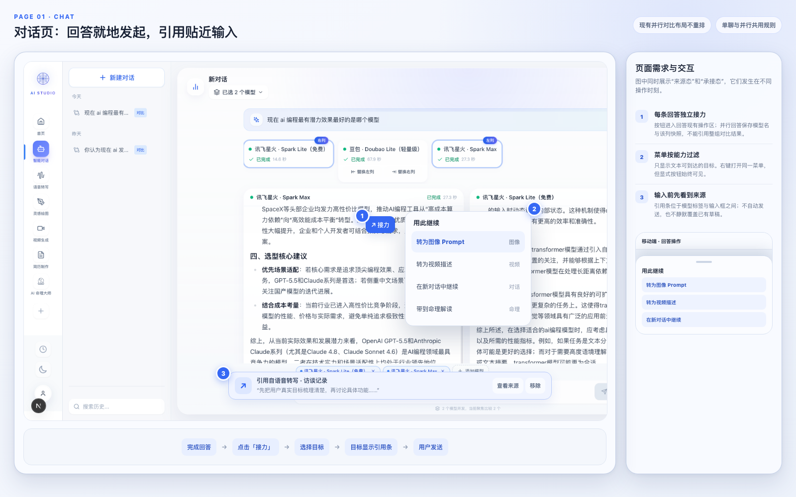
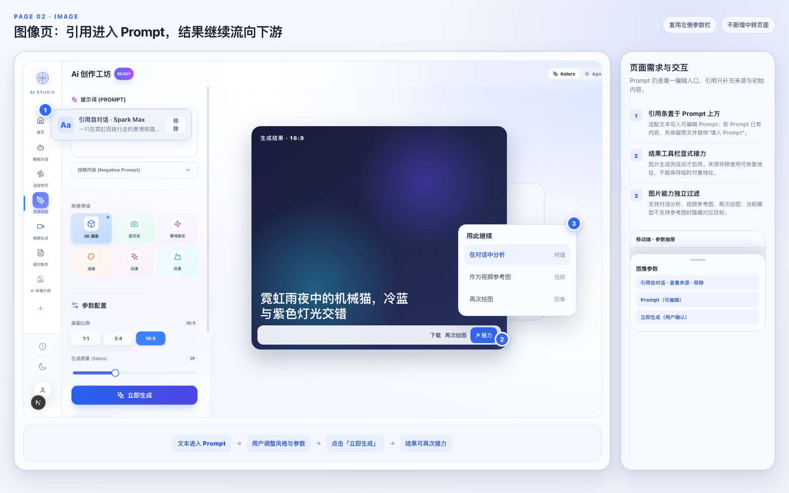
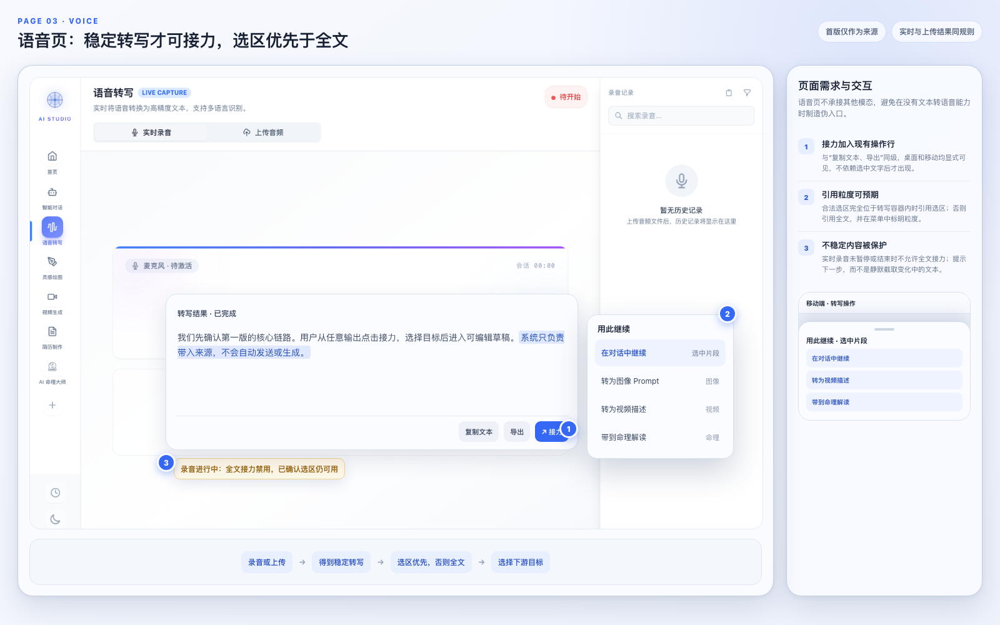
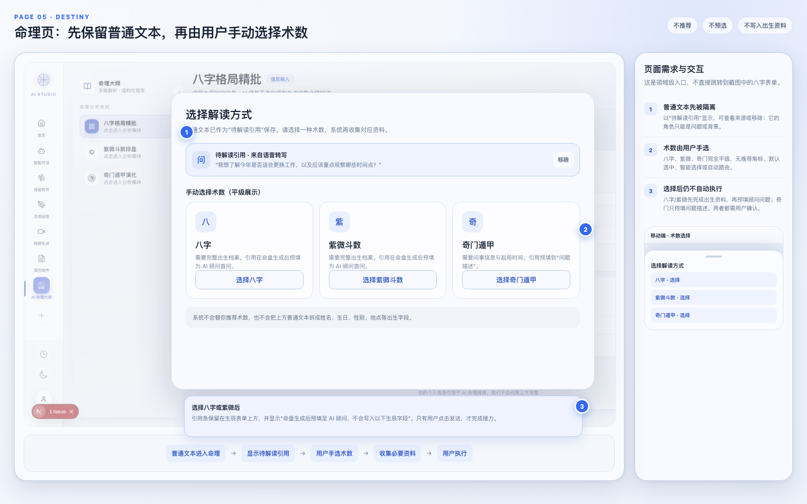

# 跨模态单引用接力需求说明书

> Feature：`2026-07-14-cross-modal-reference-relay`
> 级别：标准 L
> 来源设计：`docs/plans/2026-07-14-cross-modal-reference-relay-design.md`
> 状态：需求已确认

## 1. 目标

在对话、图像、语音、视频和命理之间建立轻量的内容接力能力。用户从一条具体输出发起，手动选择目标，目标页恢复来源快照并生成可编辑草稿；只有用户再次确认后，系统才调用模型或执行测算。

## 2. 首版范围

### 2.1 包含

- 单条引用的创建、持久化、恢复、查看来源、移除和替换。
- 桌面显式「接力」按钮与右键快捷入口。
- 移动显式「接力」按钮与长按快捷入口。
- 根据来源类型过滤目标菜单。
- 对话、图像、语音、视频和命理的来源与目标接入。
- 命理手动选择八字、紫微斗数、奇门遁甲，并支持后续术数注册。
- 历史记录补齐视频类型和派生来源元数据。
- 移动端底部抽屉、安全区、44×44 像素热区和单主滚动容器。

### 2.2 不包含

- 工作流画布、节点连线、批量执行、自动触发。
- 两条或更多引用同时进入目标。
- 永久素材篮、标签、文件夹和跨项目素材管理。
- 调用模型自动优化接力内容。
- 自动推荐或选择命理术数。
- 视频自动抽帧和视频转图片。
- 新增文本转语音、配音等语音目标能力。
- 新建独立埋点基础设施；仅为未来埋点保留事件调用边界。

## 3. 功能需求

### REQ-001：统一引用协议

- 引用项必须记录稳定标识、来源模块、来源类型、来源对象标识、标题、创建时间和内容快照。
- 文本快照与媒体快照至少存在一种。
- 引用包使用 `items[]` 保存引用项，首版通过常量限制为一条。
- 新生成结果可以记录 `derivedFromRelayId` 与 `derivedFromReferenceIds`。

### REQ-002：显式发起入口

- 支持接力的输出必须在现有操作栏中显示中文「接力」动作。
- 桌面右键和移动长按只能复用同一菜单，不能成为唯一入口。
- 输出为空、仍在不稳定生成阶段或没有可用目标时，动作必须禁用并说明原因。

### REQ-003：能力过滤菜单

- 菜单标题固定为「用此继续」。
- 菜单根据来源类型和目标能力过滤选项，不展示不支持的目标。
- 首版目标适配为确定性函数，不调用模型。
- 选择目标后只在 URL 中携带 `relayId`，不得携带正文或媒体地址。

### REQ-004：目标页承接

- 目标页必须显示引用来源摘要、查看来源和移除操作。
- 目标草稿可以编辑，来源快照不可直接修改。
- 到达目标页后不得自动发送、生成、转写、测算或产生模型费用。
- 目标页面刷新后引用和草稿仍能恢复。

### REQ-005：单引用替换与移除

- 目标已有引用时，新引用必须先显示替换确认。
- 替换引用不得删除用户已经编辑的目标草稿。
- 移除引用只解除来源关系，不清空输入框、Prompt、视频描述或问事文本。
- 替换完成后提供显式「填入输入框」操作，用户决定是否重新应用适配文本。

### REQ-006：来源失效与恢复

- 来源记录删除后，引用快照仍可使用。
- 来源失效时隐藏查看来源，并显示「原始记录已不存在，当前快照仍可使用」。
- 媒体快照失效时保留元信息，提供重新选择来源。
- 跳转后接力包不存在时，不修改目标草稿，并提示重新发起接力。

### REQ-007：对话接入

- 助手消息操作栏可以发起接力。
- 并行对比中每个模型回答可以独立发起，来源记录模型名称和该回答快照。
- 对话作为目标时，引用条位于模型标签与输入框之间。
- 单聊和并行对比都能接收文本引用。
- 已有草稿不得被静默覆盖。

### REQ-008：图像接入

- 文本进入图像时，引用条位于 Prompt 上方，适配文本进入可编辑 Prompt。
- 图片结果可以发起「在对话中分析」「作为视频参考图」「再次绘图」。
- 接力图片快照必须使用可恢复地址，不能只保存当前页面的临时对象地址。
- 移动端沿用现有参数抽屉，不新增中转页面。

### REQ-009：语音接入

- 实时录音和上传音频的稳定转写结果都能发起接力。
- 默认引用全文；用户选中转写文本后发起时，引用选中片段。
- 实时转写尚未停止时，不允许全文接力；已经确认的选中片段可以接力。
- 接力动作加入现有复制和导出操作行。

### REQ-010：视频接入

- 文本进入视频时，适配到视频描述字段。
- 图片进入视频时，适配到参考图字段。
- 移动端收到引用后自动打开现有配置抽屉并定位到对应字段。
- 视频结果提供「在对话中分析」和「再次创作」。
- 不实现自动抽帧。

### REQ-011：命理中立承接

- 普通文本进入命理后先显示「待解读引用」。
- 八字、紫微斗数、奇门遁甲平级展示，无推荐、无预选、无自动路由。
- 用户手动选择术数后，系统才收集该术数需要的资料。
- 普通文本只能作为问题或背景，绝不能进入出生资料字段。
- 八字与紫微生成报告后，引用文本预填为命理顾问首个问题，但不自动发送。
- 奇门将引用文本预填到「问题描述」，用户确认后起局。

### REQ-012：命理能力注册

- 每个术数声明标识、名称、支持的引用类型、必要输入和引用角色。
- 界面根据能力计算 `ready`、`needs_input`、`unsupported`。
- `unsupported` 不出现在选择界面。
- 新增术数不得要求修改接力核心协议。

### REQ-013：历史和派生关系

- `HistoryType` 增加 `video`，历史页增加视频筛选、统计和卡片。
- 图像、视频、对话和命理等新结果可以记录派生来源元数据。
- 历史详情或卡片可展示「由某来源接力生成」并查看来源。
- 首版不展示完整关系图。

### REQ-014：移动端

- 接力底部抽屉最大高度不超过视口 85%。
- 抽屉打开时锁定背景滚动，关闭后恢复原位置。
- 操作项最小高度 50 像素，关键热区不小于 44×44 像素。
- 底部抽屉、输入框和生成按钮适配系统安全区。
- 目标字段滚动到可见位置，但不自动唤起软键盘。

### REQ-015：可访问性与中文一致性

- 接力动作、菜单、引用条和错误状态具有可访问名称。
- 菜单支持 `Esc`、方向键、回车和焦点返回。
- 状态不能只依赖颜色传达。
- 所有新增 UI 文案、提示、错误和代码注释使用中文。
- 修改含英文注释的文件时，同步把相关英文注释翻译为中文。

### REQ-016：执行和失败状态

- 目标执行成功后，新结果记录派生关系，输入区恢复无引用状态。
- 执行失败时保留引用和草稿，允许原地重试。
- 用户离开目标页再返回时，未执行引用仍可恢复。
- 网络离线不阻止本地接力和编辑，只在真正执行时提示网络错误。

### REQ-017：后续扩展兼容

- 首版界面限制为一条引用，但协议和组件不得假设 `items` 永远只有一个元素。
- 第二阶段提高引用上限时，不迁移首版引用数据。
- 永久素材篮上线时，临时接力包和永久素材必须使用不同生命周期与入口。

## 4. 页面级设计与交互规格

本节是 REQ-002、REQ-004、REQ-007 至 REQ-016 的页面级细化，属于验收依据。设计图以当前真实界面为底，蓝色标注和浮层表示本次新增的接力交互；图中同时出现来源态与目标态时，它们代表同一页面在不同操作时刻的状态，不要求同时显示。

### 4.1 五个页面的统一规则

| 元素 | 统一要求 |
| --- | --- |
| 来源入口 | 必须进入当前输出的既有操作区，显示「接力」文字和图标；右键、长按只能打开同一菜单，不能成为唯一入口 |
| 目标菜单 | 标题为「用此继续」，只显示当前内容真正支持的目标；不支持项直接隐藏，不堆叠灰色选项 |
| 引用条 | 紧贴目标字段上方，显示来源类型、标题、摘要或缩略图、查看来源和移除；不能新建永久侧栏 |
| 草稿写入 | 目标字段为空时可以写入确定性适配内容；目标已有草稿时不得覆盖，只显示引用并提供显式「填入输入框/Prompt/描述」 |
| 单引用替换 | 新引用先进入候选状态，用户确认后才替换活动引用；取消替换后，原引用和目标草稿都保持不变 |
| 执行边界 | 页面跳转、引用恢复、草稿写入和编辑阶段均不得调用模型；用户点击页面原有发送、生成、转写或测算按钮后才执行 |
| 完成边界 | 只有目标结果成功产生后才完成接力并记录派生关系；失败时保留引用和草稿，支持原地重试 |
| 移动端 | 使用底部抽屉展示目标，操作项最小高度 50 像素，关键热区不小于 44×44 像素，并适配底部安全区 |

### 4.2 对话页

#### 4.2.1 页面角色

- 对话页既是文本输出来源，也是文本引用目标。
- 单聊中的助手回答和并行对比中的每个模型回答都是独立来源。
- 并行模式收到引用后，引用只进入底部共享输入区，不复制到每个回答面板；用户仍通过现有「同时发送」逻辑请求多个模型。

#### 4.2.2 来源态

1. 只有已完成且正文非空的助手回答显示「接力」。流式生成、错误占位和空回答保持禁用，并显示中文原因。
2. 「接力」加入复制、重新生成、反馈等既有操作区。移动端不允许依赖 `hover` 才显示。
3. 并行回答的引用快照必须记录当前回答 ID、模型名称和当前列正文，不能引用整组对比结果。
4. 文本回答的目标至少包括：
   - 在当前对话中继续；
   - 在新对话中继续；
   - 转为图像 Prompt；
   - 转为视频描述；
   - 带到命理解读。
5. 从一条回答右键或长按时，打开与显式按钮完全相同的菜单。

#### 4.2.3 目标态

1. 引用条位于模型标签或模型选择区与输入框之间，不插入消息列表，也不占用对话侧栏。
2. 输入框为空时，引用文本作为可编辑草稿写入输入框；输入框已有文字时，先保留原草稿，并提供「填入输入框」。
3. 用户移除引用后，已经写入或编辑的输入文本继续保留，只解除来源关系。
4. 单聊点击发送、并行点击同时发送后才调用模型。页面加载、刷新恢复和草稿编辑阶段不得请求 `/api/chat`。
5. 助手回答成功完成后记录派生关系并清除活动引用；请求失败、用户取消或流式中断时保留引用。

#### 4.2.4 移动端与异常状态

- 点击显式「接力」后，从底部抽屉显示目标；长按只是快捷方式。
- 引用条允许摘要截断，但「查看来源」与「移除」热区均不小于 44×44 像素。
- `relayId` 不存在或恢复失败时，保留当前输入草稿并提示「引用已失效，请重新发起接力」。
- 来源消息被删除时，引用快照仍可使用，但不再显示「查看来源」。

#### 4.2.5 页面验收

- 单聊回答和并行模式任一模型回答都能独立发起接力。
- 不使用右键或长按也能完成接力。
- 输入框已有草稿时，新引用不会静默覆盖。
- 到达对话页、刷新和编辑均不自动发送。

### 4.3 图像页

#### 4.3.1 页面角色

- 图像页接收文本作为 Prompt。
- 图像生成结果可以作为图片来源继续到对话、视频或再次绘图。
- 当前图像模型没有参考图能力时，「再次绘图」只带入原 Prompt 和来源关系，不把图片伪装成模型参考图。

#### 4.3.2 目标态

1. 文本引用条位于「提示词（PROMPT）」标签与 Prompt 输入框之间，不放入右侧灵感舱。
2. Prompt 为空时写入原始文本，不自动添加画质、风格、镜头、构图或负面词。
3. Prompt 已有文字时不覆盖，显示「填入 Prompt」；用户确认后再替换或插入适配文本。
4. 引用只影响 Prompt 或能力声明支持的参考图字段，不修改模型、风格、比例、步数、种子等参数。
5. 用户点击现有「立即生成」后才发起图像请求。

#### 4.3.3 来源态

1. 每一张已完成生成的图片都可以独立发起接力；批量结果不能只提供一个含义不明的总入口。
2. 「接力」位于当前图片的结果工具栏，和下载、再次绘图等操作并列。
3. 图片目标至少包括：
   - 在对话中分析；
   - 作为视频参考图；
   - 再次绘图。
4. 图片快照必须使用可恢复地址或持久化数据，禁止保存 `URL.createObjectURL()` 生成的临时地址。
5. 图片过大、快照写入失败或媒体已失效时，保留标题、模型、尺寸等元信息，并提供「重新选择来源」，不能把失败状态当作已成功接力。

#### 4.3.4 完成、失败与移动端

- 图像成功生成并写入历史后才完成接力；生成失败时保留 Prompt 和引用条。
- 移动端继续使用现有参数抽屉，引用条固定在 Prompt 上方，不新建中转页。
- 结果页移动端必须有显式操作行，不能把「接力」只放入图片悬停工具栏。
- 图片作为视频参考图时，目标页刷新后仍能恢复缩略图和引用关系。

#### 4.3.5 页面验收

- 对话文本进入图像页后，用户能先编辑 Prompt，再手动生成。
- Prompt 已有内容时不被覆盖。
- 图片结果可分别去对话、视频和再次绘图，并按模型能力过滤。
- 刷新目标页后，图片引用不会因临时对象地址失效。

### 4.4 语音页

#### 4.4.1 页面角色

- 首版语音页仅作为转写文本来源，不作为其他内容的目标。
- 实时录音和上传音频使用同一套接力规则。
- 不新增文本转语音、配音或音色选择入口。

#### 4.4.2 来源态

1. 「接力」加入转写结果已有的复制、导出操作行，桌面和移动端均显式可见。
2. 上传音频只有在转写成功且结果非空时允许接力。
3. 实时录音默认引用已经确认的最终分段，不把仍在变化的临时识别文本写入快照。
4. 用户存在合法文本选区时优先引用选中片段。合法选区必须完全位于当前转写容器，并且去除空白后非空。
5. 没有合法选区时引用全文，并在菜单中明确标注「完整转写」。

#### 4.4.3 录音中的限制

1. 实时录音处于运行状态时，全文接力禁用，提示「请先暂停或结束录音，再接力完整转写」。
2. 录音中只有完全落在已确认分段内的选区可以接力；临时分段中的选区不能使用。
3. 暂停或结束录音后，稳定全文立即恢复可用，无需重新打开页面。

#### 4.4.4 目标、历史与移动端

- 转写文本可到对话、图像、视频和命理，均按文本能力适配。
- 从语音历史恢复的转写结果与刚完成的转写具有相同接力入口。
- 移动端保留「复制、导出、接力」三个高频动作；其他低频操作进入现有溢出区域，不能遮挡录音主按钮。
- 长按转写文本只作为快捷入口；用户不选择文字也能通过显式按钮引用全文。

#### 4.4.5 页面验收

- 实时结束后的全文、实时已确认选区、上传转写全文、上传转写选区均可发起接力。
- 录音进行中不能误把变化中的全文保存为快照。
- 选区超出转写容器时回退到全文，而不是引用页面其他文字。
- 语音页不出现在任何目标菜单中。

### 4.5 视频页

#### 4.5.1 页面角色

- 视频页接收文本作为视频描述，接收图片作为参考图。
- 视频生成结果可以进入对话分析或再次创作。
- 首版不提供视频自动抽帧、视频转图片或从视频中提取 Prompt。

#### 4.5.2 文本目标态

1. 文本引用条位于「视频描述」标签下方、输入框上方。
2. 视频描述为空时写入原始文本；已有描述时不覆盖，并提供「填入视频描述」。
3. 适配器不得自动添加时长、镜头运动、比例、帧率或模型专属质量词。
4. 用户移除引用后，已经编辑的视频描述继续保留。

#### 4.5.3 图片目标态

1. 图片引用条和缩略图位于参考图字段上方。
2. 当前没有手动参考图时可以填入引用图片；已有手动参考图时必须先由用户确认替换。
3. 当前模型不支持图片输入时，不写入字段、不切换模型，显示中文错误并提供重新选择目标。
4. 媒体地址失效时保留来源元信息，不阻塞用户继续编辑视频描述。

#### 4.5.4 来源态、执行与移动端

1. 视频完成后，结果工具栏显示「接力/继续创作」，目标仅包括：
   - 在对话中分析；
   - 再次创作视频。
2. 再次创作带入原视频描述、来源标识和可用媒体地址，不自动发起新任务。
3. 移动端收到合法引用后自动打开现有配置抽屉，并滚动到视频描述或参考图字段。
4. 自动展开后不得调用 `focus()`，避免未经用户操作弹出软键盘。
5. 用户点击原有「生成视频」后才执行；轮询失败、任务失败或媒体过期时保留引用与草稿。

#### 4.5.5 页面验收

- 文本与图片分别进入正确字段，不互相覆盖。
- 移动端能自动看到目标字段，但不会自动弹出键盘或提交任务。
- 视频结果只能去对话或再次创作，不出现图像抽帧入口。
- 生成失败后，用户无需重新发起接力即可重试。

### 4.6 命理页

#### 4.6.1 页面角色与入口原则

- 普通访问命理页时，保留现有八字、紫微斗数、奇门遁甲页面行为。
- 携带普通文本引用进入命理时，不直接落到当前默认的八字表单，而是先进入领域级「待解读引用」状态。
- 普通文本只能是问题或背景，绝不能被解析、拆分或映射为姓名、性别、生日、时辰、地点等出生资料。

#### 4.6.2 待解读引用

1. 页面先显示来源模块、标题、文本摘要、查看来源和移除操作。
2. 引用文本保持原样，不在进入命理阶段调用模型做摘要、改写或术数推荐。
3. 移除引用后退出接力状态，命理页恢复正常入口，不清除用户已经填写的术数表单。
4. 来源失效时继续显示快照，并提示「原始记录已不存在，当前快照仍可使用」。

#### 4.6.3 手动选择术数

1. 八字、紫微斗数、奇门遁甲必须平级展示，视觉尺寸、按钮权重和排序层级一致。
2. 首次出现时不得默认选中任何术数。
3. 页面不得出现「推荐」「更适合」「智能选择」「帮我选择」等文案，也不得根据引用内容自动路由。
4. 用户点击明确的「选择八字」「选择紫微斗数」「选择奇门遁甲」后，才进入相应工作区。
5. 选择界面由术数能力注册生成。未来新增术数只需声明标识、名称、支持内容类型、必要输入和引用角色，不修改接力核心协议。

#### 4.6.4 选择八字或紫微斗数后

1. 引用条保留在生辰资料表单上方，并固定说明「命盘生成后预填至 AI 顾问，不会写入以下生辰字段」。
2. 引用文本不得修改任何出生资料字段，用户必须按现有流程手动填写资料并生成命盘。
3. 命盘成功生成后，引用文本只预填到 AI 顾问输入框，不得复用会立即发送的快捷问题机制。
4. 顾问输入框已有用户草稿时不得覆盖，显示「填入顾问问题」供用户确认。
5. 只有用户点击顾问「发送」且问题成功提交后才完成接力。仅生成命盘不算完成。

#### 4.6.5 选择奇门遁甲后

1. 引用文本只预填到「问题描述/所问之事」。
2. 起局时间、地点、方式等字段继续使用现有表单值，系统不得从普通文本推断或自动填写。
3. 问题描述已有草稿时不得覆盖，显示「填入问题描述」。
4. 用户可以编辑问题，只有点击现有起局按钮后才执行；起局成功后完成接力。

#### 4.6.6 命理报告作为来源

1. 八字与紫微报告中已经稳定完成的模块摘要、建议段落和展开后的流年段落可以独立发起接力。
2. 奇门中已经完成的综合评估、行动建议、关键时间窗口和盘局摘要可以独立发起接力。
3. 尚在流式生成、加载失败或为空的报告区块不得发起接力。
4. 报告段落目标可以包括对话、图像 Prompt、视频描述和命理追问，并记录术数类型、报告记录 ID 与段落标识。
5. 命理追问仍只预填顾问输入框，不自动发送。

#### 4.6.7 移动端与异常状态

- 移动端使用底部抽屉纵向展示术数，三项保持平级，不通过颜色或置顶暗示推荐。
- 「待解读引用」在抽屉上方保持可见，用户选择术数前可以查看来源或移除。
- 切换术数时保留引用和各工作区已有草稿，不把一个术数的结构化字段复制到另一个术数。
- 某术数不支持当前引用类型时不显示该项；如果全部不支持，保留引用并提示重新选择目标。

#### 4.6.8 页面验收

- 携带普通文本进入命理时，首先看到无推荐、无预选的三术数手动选择。
- 选择八字或紫微后，普通文本不出现在任何出生资料字段。
- 选择奇门后，普通文本只进入问题描述，且不会自动起局。
- 八字与紫微顾问只预填、不自动发送；命理报告稳定段落可以反向发起接力。

### 4.7 页面间状态切换

| 场景 | 页面行为 |
| --- | --- |
| 目标无活动引用、字段为空 | 接受引用并写入确定性草稿，显示引用条 |
| 目标无活动引用、字段已有草稿 | 接受引用但不覆盖字段，显示「填入…」 |
| 目标已有活动引用 | 显示替换确认；确认后换引用但保留草稿，取消后状态不变 |
| 用户移除引用 | 只解除来源关系，目标字段和参数保持不变 |
| 来源记录被删除 | 使用快照继续，隐藏查看来源并显示失效说明 |
| 媒体快照失效 | 保留元信息，不写入媒体字段，提供重新选择来源 |
| 目标执行成功 | 新结果记录派生关系，活动引用清除 |
| 目标执行失败 | 引用、草稿和参数全部保留，允许原地重试 |
| 页面刷新或离开后返回 | 恢复未完成引用和目标草稿，不自动执行 |

## 5. 非功能约束

- 客户端持久化使用现有 Zustand 与 Dexie 适配器，不把快照正文放进 URL。
- 接力创建、目标过滤和确定性适配不得依赖网络。
- 来源操作与目标恢复在移动端保持单主滚动容器。
- 不重构无关页面和现有模型调用接口。
- 模块接入必须能独立验证和独立回撤。
- 共享类型和注册表需要自动化测试；核心共享组件需要交互测试。

## 6. 验收场景

1. 从一条对话回答选择「转为图像 Prompt」，图像页恢复引用和可编辑 Prompt，未自动生成。
2. 从语音转写选择「转为视频描述」，移动视频页自动打开配置抽屉，未自动生成。
3. 从图片结果选择「作为视频参考图」，刷新视频页后参考图仍然存在。
4. 从普通文本进入命理，界面无推荐和预选，用户可以手动选择三种术数。
5. 选择八字或紫微后，普通文本不出现在任何出生字段。
6. 选择奇门后，普通文本进入可编辑问题描述，未自动起局。
7. 目标已有引用时，新接力显示替换确认，取消后原引用和草稿保持不变。
8. 移除引用后，已经编辑的目标草稿仍然存在。
9. 删除来源历史后，引用快照仍可继续使用。
10. 桌面不用右键、移动不用长按也能发现接力。
11. 并行对比中，任一模型回答可单独接力，引用不会错误包含另一列回答。
12. 图像页 Prompt 已有文字时，文本引用不会静默覆盖；生成图片可继续到对话或视频。
13. 实时录音进行中，全文接力被禁用，但最终分段内的合法选区可以接力。
14. 图片进入视频时只写入参考图，文本进入视频时只写入视频描述。
15. 携带普通文本进入命理时先出现三术数平级选择，不直接进入八字表单。
16. 八字或紫微生成命盘后，引用只预填顾问输入框，并且没有自动发出网络请求。
17. 命理报告稳定段落可以发起接力，仍在生成或失败的区块不能发起。

## 7. 确认依据

- 用户确认首版先做单引用，后续扩展多引用和永久素材篮。
- 用户确认命理不保留「帮我选择」入口，由用户手动选择术数。
- 用户在完整方案确认后回复「下一步」，授权进入设计落盘与实现计划阶段。
