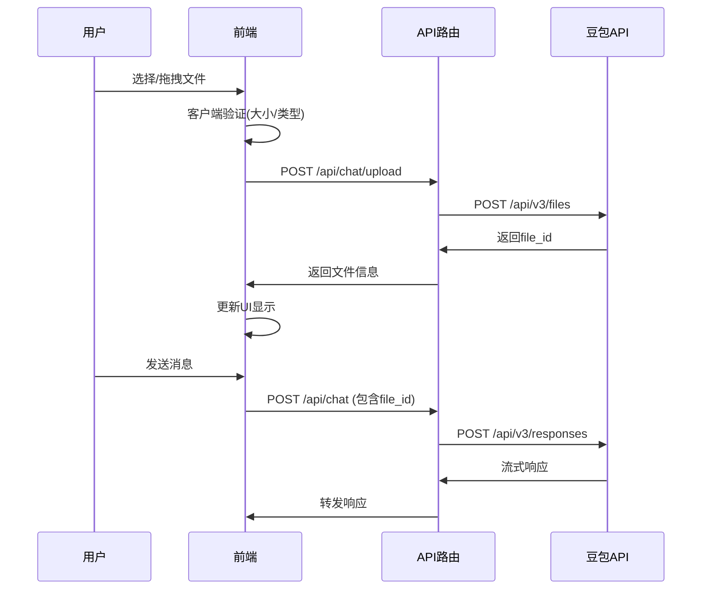

# 智能对话页面图片和文件上传功能设计

## 项目概述

为智能对话页面添加完整的图片和文件上传功能，支持多种文件类型，并利用豆包 AI 的原生文件分析能力，提供智能的内容理解和建议。

## 功能需求

### 文件上传支持

- **图片文件**：PNG、JPG、GIF 等格式，在聊天界面中直接显示
- **文档文件**：PDF、Word、Excel 等格式，显示为卡片形式带预览缩略图
- **代码文件**：JS、Python、JSON 等格式，支持语法高亮预览
- **文件限制**：单个文件 5MB 以内，总共 50MB

### AI 分析能力

- 图片内容识别和描述
- 文档内容提取和总结
- 代码审查和优化建议
- 跨文件类型的综合分析

### 用户体验

- 支持拖拽上传和点击上传
- 实时上传进度显示
- 文件预览和移除功能
- 错误提示和重试机制

## 技术架构

### 核心方案：豆包原生文件处理 + 前端优化体验

**优势：**

- 利用豆包原生的文件上传 API (`https://ark.cn-beijing.volces.com/api/v3/files`)
- 图片使用 base64 直接发送，无需额外存储
- 文件通过 file_id 引用，AI 可直接分析
- 与现有豆包集成完美兼容

### 数据结构设计

```typescript
// 扩展消息类型
interface Message {
  id: string;
  role: 'user' | 'assistant' | 'system';
  content: string | MessageContent[]; // 支持混合内容
  isStreaming?: boolean;
  attachments?: Attachment[]; // 附件信息（用于UI展示）
}

interface MessageContent {
  type: 'input_text' | 'input_image' | 'input_file';
  text?: string;
  image_url?: string; // base64格式
  file_id?: string; // 豆包文件ID
}

interface Attachment {
  id: string;
  name: string;
  size: number;
  type: 'image' | 'document' | 'code';
  mimeType: string;
  url?: string; // 预览URL
  fileId?: string; // 豆包文件ID
}
```

### 组件架构

```
ChatInput (聊天输入组件)
├── FileUploadArea (文件上传区域)
│   ├── DropZone (拖拽区域)
│   ├── FileSelector (文件选择器)
│   └── UploadProgress (上传进度)
├── AttachmentPreview (附件预览)
│   ├── ImagePreview (图片预览)
│   ├── FileCard (文件卡片)
│   └── RemoveButton (移除按钮)
└── SendButton (发送按钮)

MessageItem (消息展示组件)
├── TextContent (文本内容)
├── ImageDisplay (图片展示)
└── FileAttachment (文件附件)
    ├── FileIcon (文件图标)
    ├── FileInfo (文件信息)
    └── DownloadButton (下载按钮)
```

### API 设计

#### 文件上传路由 (`/api/chat/upload`)

- **功能**：上传文件到豆包并返回文件信息
- **输入**：FormData 格式的文件
- **输出**：文件信息和 file_id
- **流程**：
  1. 接收文件并验证
  2. 调用豆包文件上传 API
  3. 返回文件元信息

#### 聊天路由扩展 (`/api/chat`)

- **功能**：支持混合内容消息格式
- **扩展**：
  - 图片转换为 base64 格式
  - 文件使用 file_id 引用
  - 支持豆包的 content 数组格式

### 文件处理流程



## 实现细节

### 前端实现

#### 文件上传组件

- 使用 HTML5 拖拽 API
- 支持多文件选择
- 实时进度显示
- 文件类型和大小验证

#### 消息展示组件

- 图片直接内嵌显示，支持点击放大
- 文件显示为卡片形式，包含缩略图
- 支持文件下载和预览

#### 状态管理

- 扩展 chat-store 支持附件
- 添加上传状态管理
- 错误处理和重试逻辑

### 后端实现

#### 文件上传处理

- 集成豆包文件上传 API
- 文件类型检测和验证
- 错误处理和日志记录

#### 消息格式转换

- 支持豆包的混合内容格式
- 图片 base64 编码处理
- 文件 ID 引用管理

## 用户体验设计

### 上传交互

- **拖拽上传**：支持直接拖拽文件到聊天区域
- **点击上传**：点击附件按钮选择文件
- **进度显示**：实时显示上传进度和状态
- **预览功能**：上传后立即显示文件预览

### 消息展示

- **图片展示**：直接内嵌显示，支持点击放大查看
- **文件卡片**：显示文件图标、名称、大小和类型
- **下载功能**：支持文件下载和在线预览
- **响应式设计**：适配不同屏幕尺寸

### 错误处理

- **文件过大**：提示文件大小限制并建议压缩
- **格式不支持**：显示支持的文件格式列表
- **上传失败**：提供重试按钮和错误详情
- **网络问题**：自动重试和离线提示

## 安全考虑

### 文件验证

- 客户端和服务端双重验证
- 文件类型白名单机制
- 文件大小限制检查
- 恶意文件检测

### 数据安全

- 利用豆包的企业级安全保障
- 文件传输加密
- 访问权限控制
- 数据隐私保护

## 性能优化

### 上传优化

- 大文件分片上传
- 并发上传控制
- 上传队列管理
- 断点续传支持

### 显示优化

- 图片懒加载
- 缩略图生成
- 内存使用优化
- 缓存策略

## 测试策略

### 功能测试

- 各种文件类型上传测试
- 文件大小边界测试
- 网络异常情况测试
- AI 分析准确性测试

### 性能测试

- 大文件上传性能测试
- 并发上传压力测试
- 内存使用监控
- 响应时间测试

### 兼容性测试

- 不同浏览器兼容性
- 移动端适配测试
- 不同文件格式支持
- 网络环境适应性

## 部署计划

### 开发阶段

1. 扩展数据结构和类型定义
2. 实现文件上传 API 路由
3. 开发前端上传组件
4. 扩展消息展示组件
5. 集成测试和调试

### 测试阶段

1. 单元测试和集成测试
2. 用户体验测试
3. 性能和安全测试
4. 兼容性测试

### 发布阶段

1. 生产环境部署
2. 监控和日志配置
3. 用户反馈收集
4. 持续优化改进

## 后续扩展

### 功能扩展

- 支持更多文件格式
- 批量文件处理
- 文件版本管理
- 协作编辑功能

### AI 能力扩展

- 更精准的内容分析
- 跨模态理解能力
- 个性化推荐
- 智能摘要生成

---

**设计日期**：2026年3月10日  
**设计版本**：v1.0  
**技术栈**：Next.js + TypeScript + 豆包 API + Tailwind CSS
