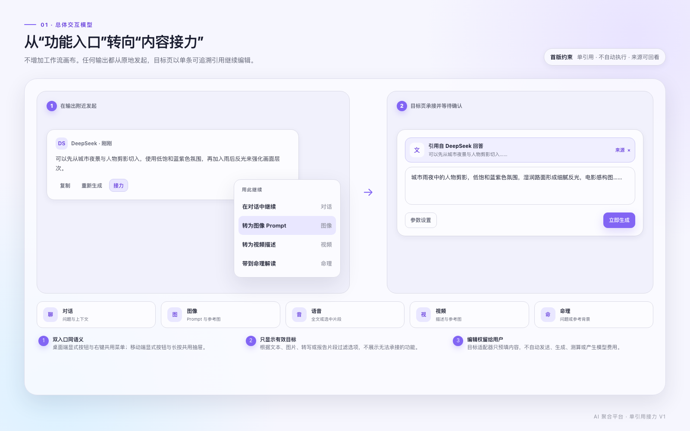
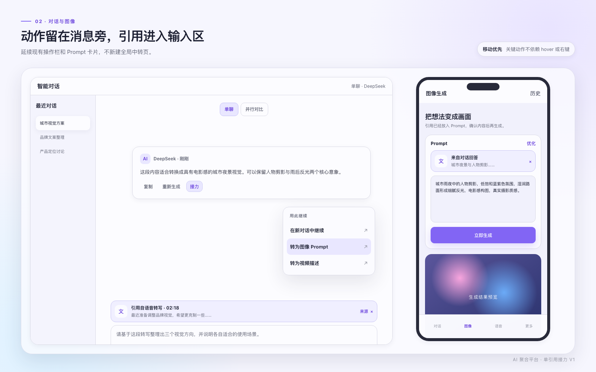
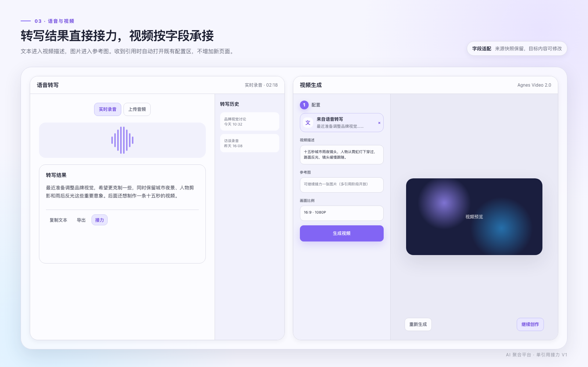
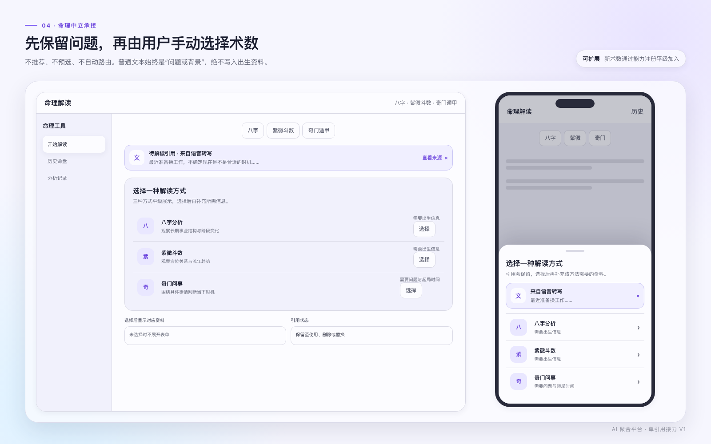
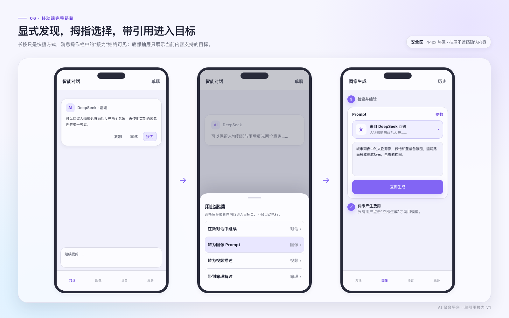
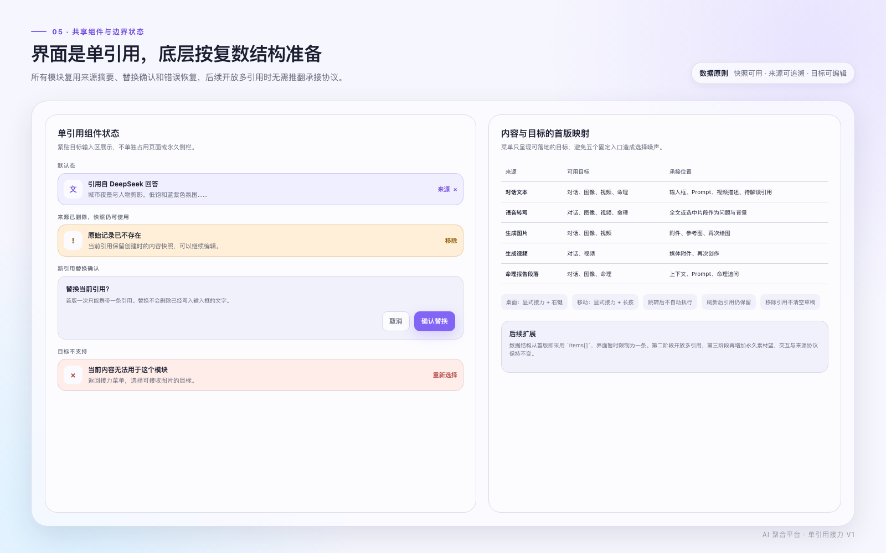

# 跨模态单引用接力设计

**日期：** 2026-07-14
**状态：** 已确认设计
**适用范围：** 对话、图像、语音、视频、命理
**首版边界：** 单引用、手动选择目标、不自动执行

## 1. 背景

当前系统已经具备对话、图像、语音、视频和命理能力，但每个模块独立保存输入与结果。用户把一处输出带到另一处时，只能手动复制、切换页面、重新整理内容，来源关系也会丢失。

本设计不引入节点画布、连线、步骤编排和运行状态管理等工作流能力，而是在现有内容操作区增加轻量的「接力」动作：

```text
选择一条输出 → 选择目标 → 携带引用进入目标输入区 → 用户编辑并确认执行
```

## 2. 设计目标

1. 用户能从任意可用输出原地发起接力。
2. 目标页明确展示来源、内容快照和移除能力。
3. 接力不会自动发送、生成、转写、测算或产生模型费用。
4. 桌面端和移动端都具有显式可发现入口。
5. 首版只展示一条引用，但数据协议能够继续扩展多引用和永久素材篮。
6. 命理模块能够扩展新术数，不把普通文本错误映射为出生资料。

## 3. 非目标

- 不建设工作流画布、节点连线、批量执行或自动触发。
- 不建设永久素材篮、素材标签、文件夹和跨项目资产管理。
- 不在首版组合两条或多条引用。
- 不让系统自动替用户选择八字、紫微斗数、奇门遁甲或未来术数。
- 不在接力过程中调用模型自动改写内容。
- 不借本次改动重构各业务模块无关状态和页面结构。

## 4. 已确认决策

| 决策 | 首版结论 |
| --- | --- |
| 产品心智 | 「引用接力」，不是「工作流」或「发送到」 |
| 引用数量 | 一次一条，新引用需要替换当前引用 |
| 目标执行 | 只预填，用户必须再次确认 |
| 桌面入口 | 显式「接力」按钮，右键为快捷入口 |
| 移动入口 | 显式「接力」按钮，长按为快捷入口 |
| 目标菜单 | 按内容能力过滤，不固定展示五个模块 |
| 命理路由 | 用户手动选择术数，不推荐、不预选、不自动路由 |
| 来源删除 | 保留创建接力时的快照，来源链接变为不可用 |
| 后续扩展 | 底层使用复数集合，界面首版限制一条 |

## 5. 方案比较

### 5.1 采用方案：上下文接力

操作入口留在内容附近，目标页在既有输入区承接引用。它与当前页面结构兼容，认知成本低，也能自然扩展更多模块。

### 5.2 未采用方案：全局中转站

所有输出先进入统一中转页面，再从中转页选择目标。它能集中管理内容，但首版会额外增加页面、导航层级和素材管理心智，接近永久素材篮。

### 5.3 未采用方案：模块间固定快捷按钮

每个模块写死若干「去画图」「去视频」按钮。实现较快，但内容类型、目标数量和后续模块增加后会形成大量不一致分支。

## 6. 总体交互模型



### 6.1 发起层

输出对象提供统一接力能力：

- 桌面端：操作栏中的「接力」按钮；右键打开同一菜单。
- 移动端：操作栏中的「接力」按钮；长按打开同一底部抽屉。
- 键盘用户：聚焦输出后可通过操作栏进入，菜单支持方向键和回车。

右键和长按只能作为效率入口，不能承担功能发现。

### 6.2 选择层

菜单标题固定为「用此继续」。菜单只展示当前内容能够落地的目标，并按用户当前所在模块和常用创作方向排序。

首版不需要让用户选择目标字段。目标适配器根据内容类型放入正确位置，例如文本进入视频描述，图片进入视频参考图。

### 6.3 承接层

目标页展示两类信息：

1. 不可直接修改的来源快照，用于识别和追溯。
2. 可自由修改的目标草稿，用于真正发送或生成。

引用条固定包含：

- 来源模块与内容类型。
- 来源标题、模型或时间信息。
- 一行内容摘要或媒体缩略图。
- 「查看来源」操作。
- 「移除引用」操作。

## 7. 共享组件

### 7.1 接力动作 `RelayAction`

**位置：** 加入现有输出操作栏，不使用独立悬浮按钮。
**文案：** 「接力」。
**图标：** 链接或转向语义，不能只显示图标。
**热区：** 移动端不小于 44×44 像素。
**禁用：** 内容仍在生成、输出为空或缺少可用目标时禁用，并提供原因。

### 7.2 接力菜单 `RelayMenu`

桌面使用与动作按钮对齐的轻量菜单；移动使用底部抽屉。

每一项包含：

- 动作名称，例如「转为图像 Prompt」。
- 目标模块名称或图标。
- 可选的必要状态，例如「需要命盘」。

不展示当前内容无法承接的目标，不使用灰色选项堆满菜单。

### 7.3 引用条 `ReferenceBar`

引用条紧贴目标输入区，不能成为新的永久侧栏或页面卡片。

状态包括：

- 默认：来源存在，支持查看和移除。
- 来源删除：保留快照，隐藏查看来源，说明仍可继续编辑。
- 替换确认：解释新引用会替换当前引用，但不会清除已经写入的草稿。
- 目标不支持：保留当前页面状态，提供「重新选择」入口。
- 恢复中：使用骨架状态，恢复完成后显示引用内容。

### 7.4 来源预览 `ReferenceSourcePreview`

桌面优先使用轻量浮层或侧边抽屉，移动使用底部抽屉。预览只用于核对来源，不允许在预览中继续编辑目标草稿。

## 8. 五个模块的界面落点

### 8.1 对话



**发起位置：** 助手消息现有复制、重新生成、点赞操作附近。用户消息首版不必开放接力，避免与编辑、重发重复。
**并行对比：** 每个模型回答独立接力，引用保存模型名称和单条回答快照。
**接收位置：** 模型选择标签和消息输入框之间。
**草稿行为：** 被引用文本不直接覆盖用户已有草稿；若输入框已有内容，在光标位置前插入目标适配后的文本，并保留原草稿。

对话目标菜单示例：

- 在当前对话中继续。
- 在新对话中继续。
- 转为图像 Prompt。
- 转为视频描述。
- 带到命理解读。

### 8.2 图像

**发起位置：** 生成图片的结果工具栏；移动端放入结果下方显式操作行。
**接收文本：** 引用条进入 Prompt 区域顶部，适配后的文本进入可编辑 Prompt。
**接收图片：** 图片作为参考图或再次绘图来源；如果当前模型不支持参考图，只提供再次绘图。
**移动端：** 沿用现有 Prompt 卡片和「参数设置」抽屉，不增加独立中转弹窗。

图像结果目标菜单示例：

- 在对话中分析。
- 作为视频参考图。
- 再次绘图。

### 8.3 语音



**发起位置：** 转写结果现有复制和导出操作旁。
**引用粒度：** 默认引用全文；用户选择文字后发起时，引用选中片段。
**生成中：** 实时转写尚未停止时不允许全文接力，避免快照持续变化。用户可以接力已经确认的选中片段。
**移动端：** 操作行使用「复制」「导出」「接力」，更多低频操作进入溢出菜单，避免与录音控制栏争夺空间。

### 8.4 视频

**发起位置：** 生成结果下方工具栏中的「继续创作」。
**接收文本：** 自动打开现有配置区，引用条位于视频描述上方，适配内容进入视频描述。
**接收图片：** 自动打开配置区，图片进入参考图字段。
**接收视频：** 首版只提供在对话中分析和再次创作，不实现自动抽帧。
**移动端：** 收到引用后直接打开现有配置底部抽屉，并定位到对应字段。

### 8.5 命理



命理使用领域级承接，不直接绑定八字、紫微斗数或奇门遁甲。

普通文本进入命理后的流程：

1. 文本以「待解读引用」保留在命理页。
2. 八字、紫微斗数、奇门遁甲平级展示。
3. 用户手动选择一种术数。
4. 系统再收集该术数要求的资料。
5. 引用文本始终作为问题或背景，不进入出生资料字段。

不同术数的承接：

| 术数 | 必要输入 | 引用文本用途 |
| --- | --- | --- |
| 八字 | 出生档案 | 命盘生成后的首个追问或分析背景 |
| 紫微斗数 | 出生档案 | 命盘生成后的首个追问或分析背景 |
| 奇门遁甲 | 所问之事、起局时间 | 预填「所问之事」，用户确认后起局 |
| 未来术数 | 由模块能力注册声明 | 根据声明映射为问题、背景或参考材料 |

命理选择界面不得出现「推荐」「更适合」「智能选择」和默认选中状态。

## 9. 移动端完整路径



1. 用户在消息操作栏点击「接力」。
2. 底部抽屉显示可用目标。
3. 用户选择目标，系统跳转并恢复引用。
4. 目标页将引用条放在输入字段上方。
5. 用户编辑目标草稿。
6. 用户点击原有主操作按钮后才调用模型。

移动端要求：

- 抽屉最大高度不超过视口的 85%。
- 底部操作区增加安全区内边距。
- 抽屉打开时锁定背景滚动，关闭后恢复原滚动位置。
- 菜单项最小高度 50 像素，标题和必要状态允许换行。
- 页面跳转后目标字段滚动到可见位置，但不自动唤起软键盘。

## 10. 内容与目标映射



| 来源类型 | 对话 | 图像 | 语音 | 视频 | 命理 |
| --- | --- | --- | --- | --- | --- |
| 对话文本 | 上下文 | Prompt | 不支持 | 视频描述 | 问题或背景 |
| 语音转写 | 上下文 | Prompt | 不支持 | 视频描述 | 问题或背景 |
| 生成图片 | 图片附件 | 参考图或再次绘图 | 不支持 | 参考图 | 首版不支持 |
| 生成视频 | 视频附件 | 首版不支持 | 不支持 | 再次创作 | 首版不支持 |
| 命理报告段落 | 上下文 | Prompt | 不支持 | 视频描述 | 命理追问 |

语音模块首版仅作为来源，不作为其他内容的目标。后续如增加文本转语音或配音功能，再通过能力注册开放目标。

## 11. 目标适配规则

目标适配器执行确定性转换，不调用模型：

- 文本到对话：保留原文，作为引用上下文；输入框只加入用户可编辑的引导句。
- 文本到图像：原文进入 Prompt，不自动添加风格、镜头或质量词。
- 文本到视频：原文进入视频描述，不自动添加时长、镜头运动和比例。
- 图片到视频：图片进入参考图字段，视频描述保持原状态。
- 文本到命理：标记为问题或背景，等待用户手动选择术数。
- 报告段落到命理：标记为命理追问上下文，绑定原报告标识。

各目标现有的「优化 Prompt」或「优化描述」能力可以由用户随后主动触发。

## 12. 数据协议

虽然首版界面只允许一条引用，数据结构从第一天采用集合：

```ts
type RelayContentType =
  | "text"
  | "transcript"
  | "image"
  | "video"
  | "destiny_report_section";

type RelayModule = "chat" | "image" | "voice" | "video" | "destiny";

interface RelayReferenceItem {
  id: string;
  sourceModule: RelayModule;
  sourceType: RelayContentType;
  sourceId: string;
  sourceSubId?: string;
  sourceTitle: string;
  sourceModel?: string;
  snapshotText?: string;
  snapshotMediaUrl?: string;
  createdAt: string;
}

interface RelayBundle {
  id: string;
  items: RelayReferenceItem[];
  targetModule: RelayModule;
  targetRole: "context" | "prompt" | "reference_image" | "question" | "background";
  createdAt: string;
}
```

首版约束：

```ts
const MAX_RELAY_ITEMS = 1;
```

来源对象在生成新结果时可记录：

```ts
interface DerivationMetadata {
  derivedFromRelayId?: string;
  derivedFromReferenceIds?: string[];
}
```

这样可以在历史记录中恢复「由什么生成」，并为后续多引用关系图和素材篮提供基础。

## 13. 命理能力注册

命理接力层不写死术数列表。每个术数声明自己支持的引用类型和必要输入：

```ts
interface DestinyMethodCapability {
  id: string;
  label: string;
  acceptedReferenceTypes: RelayContentType[];
  requiredInputs: Array<"birth_profile" | "question" | "cast_time">;
  referenceRole: "question" | "background";
}
```

界面根据能力计算三种状态：

- `ready`：现有信息足够，可以进入确认页。
- `needs_input`：需要出生档案、问题或起局时间。
- `unsupported`：不在选择界面展示。

这套注册只描述能力，不提供智能推荐和自动排序。

## 14. 路由与持久化

### 14.1 跳转方式

跨模块跳转只在 URL 中携带短标识：

```text
/image?relayId=<id>
```

完整快照不进入 URL，避免长文本、媒体地址和隐私内容暴露在浏览器历史中。

### 14.2 首版持久化

- 接力包保存在客户端持久化存储中，与现有 Zustand 和 Dexie 使用方式保持一致。
- 刷新目标页后引用仍然存在。
- 用户明确移除、成功生成后主动清理，或被新引用替换。
- 不设置短时间自动过期，避免用户填写复杂参数时内容消失。
- 永久素材篮上线前，接力包不出现在独立素材列表中。

### 14.3 成功执行后的状态

用户发送或生成成功后：

- 新结果记录派生关系。
- 当前引用条默认收起为「由一条引用生成」，不继续占用输入区。
- 输入区恢复无引用状态。
- 如果执行失败，引用和草稿都保留。

## 15. 替换与移除规则

### 15.1 替换

目标页已经有引用时再次接力：

```text
替换当前引用？
首版一次只能携带一条引用。替换不会删除已经写入输入框的文字。
```

用户确认后只替换引用条和来源关系。目标草稿是否重新适配由用户选择；首版默认保留已有草稿，并在新引用摘要旁提供「填入输入框」。

### 15.2 移除

移除引用只解除来源关系，不清空输入框、Prompt、视频描述和问事文本。操作完成后显示短暂提示：

```text
已移除引用，已编辑内容仍然保留
```

## 16. 错误与恢复

| 场景 | 处理 |
| --- | --- |
| 来源记录被删除 | 使用快照继续，隐藏查看来源 |
| 媒体地址失效 | 保留元信息，提示重新选择来源 |
| 目标能力变化 | 保留当前页面，打开可用目标菜单 |
| 跳转后接力包不存在 | 不写入输入区，提示接力内容已失效 |
| 目标草稿已有内容 | 保留草稿，不静默覆盖 |
| 网络不可用 | 本地完成接力与编辑，执行时再提示网络错误 |
| 模型执行失败 | 保留引用和草稿，提供重试 |
| 命理尚未选择术数 | 引用持续保留，不展开任何资料表单 |

## 17. 文案规范

统一文案：

| 场景 | 文案 |
| --- | --- |
| 输出动作 | 接力 |
| 目标菜单标题 | 用此继续 |
| 来源查看 | 查看来源 |
| 移除动作 | 移除引用 |
| 替换标题 | 替换当前引用？ |
| 接力恢复失败 | 接力内容已失效，请重新选择来源 |
| 来源删除 | 原始记录已不存在，当前快照仍可使用 |
| 命理选择标题 | 选择一种解读方式 |

避免使用「工作流」「节点」「运行」「素材篮」「AI 推荐术数」等超出首版心智的词语。

## 18. 视觉与动效

- 沿用现有浅色底板、实体内容面和紫色主强调色。
- 引用条只使用淡紫色底和 1 像素描边，不使用高饱和大面积填充。
- 桌面菜单进入和退出为 150 至 200 毫秒透明度与轻微位移动效。
- 移动抽屉为 220 至 300 毫秒纵向位移，使用快速缓出曲线。
- 不对高度、宽度等布局属性做持续动画。
- 遵循减少动态效果设置，关闭位移，仅保留即时显隐。

## 19. 可访问性

- 所有显式接力动作提供文字标签和可访问名称。
- 菜单打开后焦点进入第一项，关闭后返回触发按钮。
- `Esc` 关闭菜单或抽屉，方向键移动选项，回车确认。
- 不使用颜色作为来源失效或错误的唯一信号。
- 引用摘要允许屏幕阅读器读取完整内容，但视觉上保持单行截断。
- 移动端热区不小于 44×44 像素，底部抽屉适配安全区。
- 长内容只保留一个页面级滚动容器，避免消息列表、抽屉和页面形成嵌套滚动。

## 20. 历史记录

首版需要补齐视频历史类型，使五类结果都能成为可追溯来源。历史卡片可以提供「继续」入口，但优先级低于结果页面的就地接力。

生成结果在历史详情中展示：

```text
由「DeepSeek 回答」接力生成 · 查看来源
```

历史列表不展示完整引用链，避免首版演变为关系图。

## 21. 埋点与成功指标

建议记录：

- `relay_menu_opened`：来源模块、来源类型、触发方式。
- `relay_target_selected`：来源模块、目标模块、内容类型。
- `relay_arrived`：目标页是否成功恢复引用。
- `relay_removed`：到达后是否移除引用。
- `relay_replaced`：是否发生单引用替换。
- `relay_executed`：接力后是否完成发送或生成。
- `relay_abandoned`：到达目标后未执行并离开。

首版核心指标：

1. 接力到达成功率。
2. 接力后完成发送或生成的比例。
3. 到达后立即移除引用的比例。
4. 从打开菜单到目标页可编辑状态的耗时。

## 22. 验收标准

### 22.1 核心链路

- 用户能从对话回答、转写结果、图片结果、视频结果和命理报告段落发起接力。
- 菜单只显示当前来源支持的目标。
- 目标页能恢复引用条和可编辑草稿。
- 接力不会自动触发任何模型。
- 刷新目标页后引用仍然存在。
- 用户可以查看来源、移除引用和替换引用。

### 22.2 命理

- 普通文本进入命理后不自动选择术数。
- 八字、紫微斗数和奇门遁甲平级展示，无推荐和默认选中。
- 八字、紫微要求出生档案；引用文本不进入出生字段。
- 奇门将引用文本放入可编辑的所问之事。
- 新增术数可以通过能力注册进入选择界面。

### 22.3 移动端

- 不依赖长按才能发现接力。
- 抽屉操作项热区和安全区符合规范。
- 目标输入、生成按钮和全局底部导航不互相遮挡。
- 软键盘弹出后引用条和输入区仍能稳定滚动。

## 23. 分阶段扩展

### 第一阶段：单引用接力

- 一个来源、一个目标。
- 来源快照、目标适配、查看来源、移除和替换。
- 五模块接入，命理手动选择术数。

### 第二阶段：多引用

- `items[]` 上限提高。
- 目标页引用条升级为紧凑引用组。
- 支持文字加图片进入视频等组合输入。
- 增加排序、单条移除和冲突提示。

### 第三阶段：永久素材篮

- 用户主动收藏接力内容为永久素材。
- 增加标签、搜索、批量选择和跨会话复用。
- 素材篮与临时接力包保持不同的生命周期和界面入口。

## 24. 设计资产

- [总体交互模型](../designs/cross-modal-relay-overview.png)
- [对话与图像](../designs/cross-modal-relay-chat-image.png)
- [语音与视频](../designs/cross-modal-relay-voice-video.png)
- [命理中立承接](../designs/cross-modal-relay-destiny.png)
- [共享组件与边界状态](../designs/cross-modal-relay-states.png)
- [移动端完整链路](../designs/cross-modal-relay-mobile-flow.png)

## 25. 实现前约束

- 实现必须以移动端影响检查为前置条件。
- 不修改用户当前正在开发的并行对比功能，接力动作通过现有消息操作接口增量接入。
- 所有新 UI 文案、错误和提示使用中文。
- 所有新增代码注释使用中文，并同步翻译改动文件中的英文注释。
- 实现计划需要把共享协议、模块接入和历史追溯拆成可独立验证与回撤的任务。
